# Oracle Cloud Infrastructure (OCI) 学習ガイドブック

## 第10章 ベストプラクティス

### はじめに

第9章で分析・AI/MLサービスについて学習しました。本章では、これまでの章で学習した内容を統合し、OCIを活用したシステム設計・運用のベストプラクティスについて詳しく解説します。ベストプラクティスは、多くの企業の成功事例と失敗事例から導き出された実証済みの手法であり、効率的で安全、かつ持続可能なクラウドシステムの構築・運用を実現するための指針となります。

### ベストプラクティスの重要性

#### なぜベストプラクティスが必要なのか

クラウドシステムの設計・運用において、ベストプラクティスを無視すると以下のような問題が発生する可能性があります：

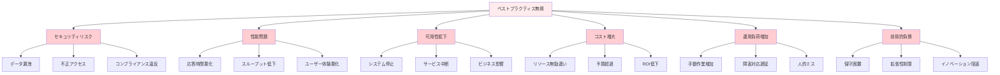

#### ベストプラクティスの効果

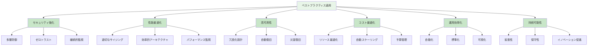

### 10.1 Well-Architected Framework

#### Well-Architected Frameworkとは

Well-Architected Frameworkは、クラウドアーキテクチャの設計・評価のための包括的なフレームワークです。6つの柱（Pillar）から構成され、それぞれが重要な設計原則を提供します。

```mermaid
graph TB
    A[Well-Architected Framework] --> B[運用上の優秀性<br/>Operational Excellence]
    A --> C[セキュリティ<br/>Security]
    A --> D[信頼性<br/>Reliability]
    A --> E[パフォーマンス効率<br/>Performance Efficiency]
    A --> F[コスト最適化<br/>Cost Optimization]
    A --> G[持続可能性<br/>Sustainability]
    
    B --> B1[運用の自動化]
    B --> B2[継続的改善]
    B --> B3[障害からの学習]
    
    C --> C1[多層防御]
    C --> C2[最小権限原則]
    C --> C3[継続的監視]
    
    D --> D1[障害からの復旧]
    D --> D2[需要変化への対応]
    D --> D3[自動スケーリング]
    
    E --> E1[適切なリソース選択]
    E --> E2[継続的監視]
    E --> E3[新技術の活用]
    
    F --> F1[不要リソース削除]
    F --> F2[適切なサイジング]
    F --> F3[予約インスタンス活用]
    
    G --> G1[環境負荷軽減]
    G --> G2[エネルギー効率]
    G --> G3[リソース最適化]
    
    style A fill:#e3f2fd
    style B fill:#e8f5e8
    style C fill:#fff3e0
    style D fill:#fce4ec
    style E fill:#f1f8e9
    style F fill:#e1f5fe
    style G fill:#f3e5f5
```

#### 運用上の優秀性（Operational Excellence）

**1. 設計原則**

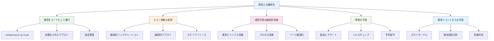

**2. 実装例：運用自動化**

```yaml
# 運用自動化のAnsibleプレイブック例
---
- name: Automated Operations Playbook
  hosts: all
  become: yes
  vars:
    app_name: "myapp"
    log_retention_days: 30
    
  tasks:
    - name: Health Check
      uri:
        url: "http://{{ inventory_hostname }}:8080/health"
        method: GET
        status_code: 200
      register: health_check
      failed_when: false
      
    - name: Log Rotation
      cron:
        name: "{{ app_name }} log rotation"
        minute: "0"
        hour: "2"
        job: "find /var/log/{{ app_name }}/ -name '*.log' -mtime +{{ log_retention_days }} -delete"
        
    - name: Disk Usage Check
      shell: df -h / | awk 'NR==2 {print $5}' | sed 's/%//'
      register: disk_usage
      
    - name: Alert on High Disk Usage
      mail:
        to: "ops-team@company.com"
        subject: "High Disk Usage Alert - {{ inventory_hostname }}"
        body: "Disk usage is {{ disk_usage.stdout }}% on {{ inventory_hostname }}"
      when: disk_usage.stdout|int > 80
      
    - name: Performance Metrics Collection
      shell: |
        echo "timestamp,cpu_usage,memory_usage,disk_usage" > /tmp/metrics.csv
        echo "$(date '+%Y-%m-%d %H:%M:%S'),$(top -bn1 | grep 'Cpu(s)' | awk '{print $2}' | sed 's/%us,//'),$(free | grep Mem | awk '{printf "%.2f", $3/$2 * 100.0}'),{{ disk_usage.stdout }}" >> /tmp/metrics.csv
```

#### セキュリティ（Security）

**1. セキュリティ設計原則**

```mermaid
graph TB
    A[セキュリティ] --> B[強固なアイデンティティ基盤]
    A --> C[多層防御]
    A --> D[すべてのレイヤーでセキュリティ適用]
    A --> E[セキュリティの自動化]
    A --> F[転送中・保存時データ保護]
    A --> G[データへの人的アクセス最小化]
    A --> H[セキュリティイベントへの準備]
    
    B --> B1[IAM統合]
    B --> B2[多要素認証]
    B --> B3[最小権限原則]
    
    C --> C1[ネットワークセキュリティ]
    C --> C2[アプリケーションセキュリティ]
    C --> C3[データセキュリティ]
    
    D --> D1[WAF]
    D --> D2[暗号化]
    D --> D3[アクセス制御]
    
    E --> E1[自動脆弱性スキャン]
    E --> E2[自動パッチ適用]
    E --> E3[自動コンプライアンスチェック]
    
    F --> F1[TLS/SSL]
    F --> F2[データベース暗号化]
    F --> F3[ストレージ暗号化]
    
    G --> G1[サービスアカウント使用]
    G --> G2[自動化されたアクセス]
    G --> G3[監査ログ]
    
    H --> H1[インシデント対応計画]
    H --> H2[セキュリティ監視]
    H --> H3[フォレンジック準備]
    
    style A fill:#e3f2fd
    style B fill:#e8f5e8
    style C fill:#fff3e0
    style D fill:#fce4ec
    style E fill:#f1f8e9
    style F fill:#e1f5fe
    style G fill:#f3e5f5
    style H fill:#fef7ff
```

**2. セキュリティチェックリスト**

| カテゴリ | チェック項目 | 実装方法 |
|---------|-------------|----------|
| **IAM** | 最小権限原則適用 | IAMポリシーの定期見直し |
| **IAM** | MFA有効化 | 管理者アカウントでMFA必須 |
| **ネットワーク** | VCN分離 | 環境別VCN構成 |
| **ネットワーク** | セキュリティリスト最適化 | 必要最小限のポート開放 |
| **データ** | 保存時暗号化 | 全ストレージで暗号化有効 |
| **データ** | 転送時暗号化 | HTTPS/TLS強制 |
| **監視** | ログ収集 | 包括的ログ収集設定 |
| **監視** | 異常検知 | Cloud Guard有効化 |

#### 信頼性（Reliability）

**1. 信頼性設計原則**

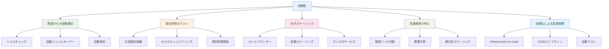

**2. 高可用性アーキテクチャ例**

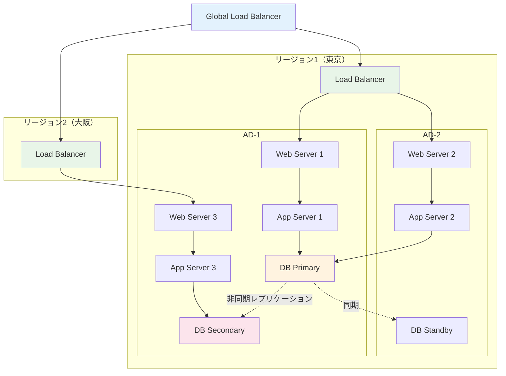

### 10.2 可用性・災害復旧設計

#### 可用性レベルの定義

**1. 可用性の計算**

```mermaid
graph TB
    A[可用性 = MTBF / (MTBF + MTTR)] --> B[MTBF<br/>Mean Time Between Failures]
    A --> C[MTTR<br/>Mean Time To Recovery]
    
    D[可用性レベル] --> E[99.9% = 8.77時間/年]
    D --> F[99.95% = 4.38時間/年]
    D --> G[99.99% = 52.6分/年]
    D --> H[99.999% = 5.26分/年]
    
    style A fill:#e3f2fd
    style D fill:#e8f5e8
```

**2. 可用性設計パターン**

| 可用性レベル | 年間ダウンタイム | 設計パターン | 実装例 |
|-------------|----------------|-------------|--------|
| **99.9%** | 8.77時間 | 単一インスタンス + バックアップ | 開発・テスト環境 |
| **99.95%** | 4.38時間 | 複数AD配置 | 一般的な本番環境 |
| **99.99%** | 52.6分 | 複数リージョン + 自動フェイルオーバー | ミッションクリティカル |
| **99.999%** | 5.26分 | アクティブ・アクティブ構成 | 金融・医療システム |

#### 災害復旧戦略

**1. 災害復旧の分類**

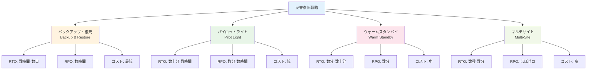

**2. 災害復旧実装例**

```yaml
# 災害復旧自動化スクリプト例
apiVersion: v1
kind: ConfigMap
metadata:
  name: dr-automation
data:
  dr-failover.sh: |
    #!/bin/bash
    
    # 災害復旧フェイルオーバー手順
    echo "Starting disaster recovery failover..."
    
    # 1. プライマリサイトの状態確認
    if ! curl -f http://primary-site/health; then
        echo "Primary site is down. Initiating failover..."
        
        # 2. セカンダリサイトでのデータベース昇格
        kubectl exec -it db-secondary -- mysql -e "STOP SLAVE; RESET SLAVE ALL;"
        
        # 3. アプリケーションの切り替え
        kubectl patch service app-service -p '{"spec":{"selector":{"site":"secondary"}}}'
        
        # 4. DNS切り替え
        oci dns record update \
          --zone-name-or-id "example.com" \
          --domain "app.example.com" \
          --rtype "A" \
          --rdata "secondary-site-ip"
        
        # 5. 監視アラート送信
        curl -X POST https://hooks.slack.com/webhook \
          -d '{"text":"Disaster recovery failover completed to secondary site"}'
        
        echo "Failover completed successfully"
    else
        echo "Primary site is healthy. No action required."
    fi
```

#### バックアップ戦略

**1. 3-2-1バックアップルール**

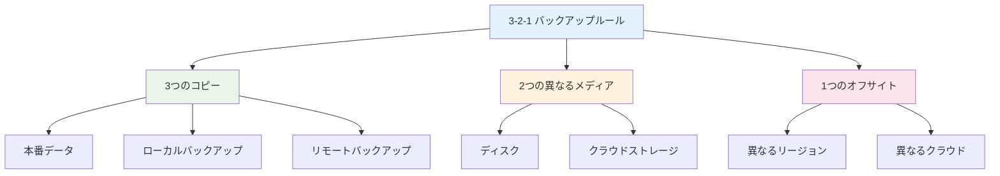

**2. バックアップ自動化**

```python
import oci
import datetime
import logging

class BackupAutomation:
    def __init__(self, config):
        self.compute_client = oci.core.ComputeClient(config)
        self.blockstorage_client = oci.core.BlockstorageClient(config)
        self.database_client = oci.database.DatabaseClient(config)
        
    def create_instance_backup(self, instance_id, compartment_id):
        """インスタンスのバックアップ作成"""
        try:
            # ブートボリュームのバックアップ
            instance = self.compute_client.get_instance(instance_id)
            boot_volume_attachments = self.compute_client.list_boot_volume_attachments(
                availability_domain=instance.data.availability_domain,
                compartment_id=compartment_id,
                instance_id=instance_id
            )
            
            for attachment in boot_volume_attachments.data:
                backup_name = f"backup-{attachment.boot_volume_id}-{datetime.datetime.now().strftime('%Y%m%d-%H%M%S')}"
                
                create_backup_details = oci.core.models.CreateBootVolumeBackupDetails(
                    boot_volume_id=attachment.boot_volume_id,
                    display_name=backup_name,
                    type="INCREMENTAL"
                )
                
                backup_response = self.blockstorage_client.create_boot_volume_backup(
                    create_backup_details
                )
                
                logging.info(f"Created backup: {backup_response.data.id}")
                
        except Exception as e:
            logging.error(f"Backup failed: {str(e)}")
            
    def cleanup_old_backups(self, compartment_id, retention_days=30):
        """古いバックアップの削除"""
        try:
            cutoff_date = datetime.datetime.now() - datetime.timedelta(days=retention_days)
            
            backups = self.blockstorage_client.list_boot_volume_backups(
                compartment_id=compartment_id
            )
            
            for backup in backups.data:
                if backup.time_created < cutoff_date:
                    self.blockstorage_client.delete_boot_volume_backup(backup.id)
                    logging.info(f"Deleted old backup: {backup.id}")
                    
        except Exception as e:
            logging.error(f"Cleanup failed: {str(e)}")

# 使用例
if __name__ == "__main__":
    config = oci.config.from_file()
    backup_automation = BackupAutomation(config)
    
    # 日次バックアップ実行
    backup_automation.create_instance_backup(
        instance_id="ocid1.instance.oc1...",
        compartment_id="ocid1.compartment.oc1..."
    )
    
    # 古いバックアップ削除
    backup_automation.cleanup_old_backups(
        compartment_id="ocid1.compartment.oc1...",
        retention_days=30
    )
```

### 10.3 パフォーマンス最適化

#### パフォーマンス最適化の原則

**1. パフォーマンス最適化サイクル**

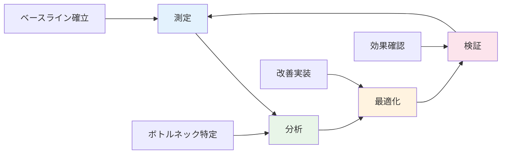

**2. パフォーマンス指標**

| 層 | 主要指標 | 目標値例 | 測定方法 |
|----|---------|----------|----------|
| **アプリケーション** | 応答時間 | <200ms | APM |
| **アプリケーション** | スループット | >1000 req/s | ロードテスト |
| **データベース** | クエリ実行時間 | <100ms | DB監視 |
| **インフラ** | CPU使用率 | <70% | システム監視 |
| **ネットワーク** | レイテンシ | <50ms | ネットワーク監視 |

#### アプリケーション最適化

**1. キャッシュ戦略**

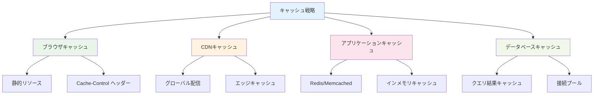

**2. データベース最適化**

```sql
-- インデックス最適化例
-- 1. 実行計画の確認
EXPLAIN PLAN FOR
SELECT customer_id, order_date, total_amount
FROM orders 
WHERE order_date BETWEEN '2023-01-01' AND '2023-12-31'
  AND status = 'completed';

-- 2. 複合インデックス作成
CREATE INDEX idx_orders_date_status 
ON orders (order_date, status);

-- 3. 統計情報更新
EXEC DBMS_STATS.GATHER_TABLE_STATS('SCHEMA', 'ORDERS');

-- 4. パーティション化
ALTER TABLE orders 
PARTITION BY RANGE (order_date) (
  PARTITION p2023q1 VALUES LESS THAN (DATE '2023-04-01'),
  PARTITION p2023q2 VALUES LESS THAN (DATE '2023-07-01'),
  PARTITION p2023q3 VALUES LESS THAN (DATE '2023-10-01'),
  PARTITION p2023q4 VALUES LESS THAN (DATE '2024-01-01')
);
```

#### インフラストラクチャ最適化

**1. 自動スケーリング設定**

```yaml
# Kubernetes HPA設定例
apiVersion: autoscaling/v2
kind: HorizontalPodAutoscaler
metadata:
  name: app-hpa
spec:
  scaleTargetRef:
    apiVersion: apps/v1
    kind: Deployment
    name: myapp
  minReplicas: 2
  maxReplicas: 10
  metrics:
  - type: Resource
    resource:
      name: cpu
      target:
        type: Utilization
        averageUtilization: 70
  - type: Resource
    resource:
      name: memory
      target:
        type: Utilization
        averageUtilization: 80
  behavior:
    scaleDown:
      stabilizationWindowSeconds: 300
      policies:
      - type: Percent
        value: 50
        periodSeconds: 60
    scaleUp:
      stabilizationWindowSeconds: 60
      policies:
      - type: Percent
        value: 100
        periodSeconds: 60
```

### 10.4 コスト最適化戦略

#### コスト最適化の原則

**1. コスト最適化フレームワーク**

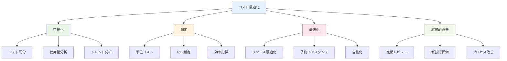

**2. コスト最適化手法**

| 手法 | 効果 | 実装難易度 | 期待削減率 |
|------|------|-----------|-----------|
| **リソースサイジング** | 高 | 低 | 20-30% |
| **予約インスタンス** | 高 | 低 | 30-50% |
| **自動スケーリング** | 中 | 中 | 15-25% |
| **ストレージ最適化** | 中 | 低 | 10-20% |
| **ネットワーク最適化** | 低 | 高 | 5-15% |

#### 実装例：コスト監視自動化

```python
import oci
import pandas as pd
from datetime import datetime, timedelta

class CostOptimization:
    def __init__(self, config):
        self.usage_api_client = oci.usage_api.UsageapiClient(config)
        self.compute_client = oci.core.ComputeClient(config)
        self.monitoring_client = oci.monitoring.MonitoringClient(config)
        
    def analyze_compute_utilization(self, compartment_id, days=7):
        """コンピュートリソースの使用率分析"""
        end_time = datetime.now()
        start_time = end_time - timedelta(days=days)
        
        # インスタンス一覧取得
        instances = self.compute_client.list_instances(
            compartment_id=compartment_id,
            lifecycle_state="RUNNING"
        )
        
        underutilized_instances = []
        
        for instance in instances.data:
            # CPU使用率取得
            cpu_metrics = self.monitoring_client.summarize_metrics_data(
                compartment_id=compartment_id,
                query_details=oci.monitoring.models.SummarizeMetricsDataDetails(
                    namespace="oci_computeagent",
                    query="CpuUtilization[1h].mean()",
                    start_time=start_time,
                    end_time=end_time,
                    resolution="1h"
                )
            )
            
            avg_cpu = sum([point.value for point in cpu_metrics.data[0].aggregated_datapoints]) / len(cpu_metrics.data[0].aggregated_datapoints)
            
            if avg_cpu < 20:  # 20%未満の場合
                underutilized_instances.append({
                    'instance_id': instance.id,
                    'display_name': instance.display_name,
                    'shape': instance.shape,
                    'avg_cpu_utilization': avg_cpu,
                    'recommendation': 'Downsize or terminate'
                })
                
        return underutilized_instances
    
    def generate_cost_report(self, tenant_id, time_usage_started, time_usage_ended):
        """コストレポート生成"""
        request_summarized_usages_details = oci.usage_api.models.RequestSummarizedUsagesDetails(
            tenant_id=tenant_id,
            time_usage_started=time_usage_started,
            time_usage_ended=time_usage_ended,
            granularity="DAILY",
            group_by=["service", "compartmentName"]
        )
        
        usage_data = self.usage_api_client.request_summarized_usages(
            request_summarized_usages_details
        )
        
        # データフレーム作成
        df = pd.DataFrame([{
            'date': item.time_usage_started,
            'service': item.service,
            'compartment': item.compartment_name,
            'cost': item.computed_amount,
            'currency': item.currency
        } for item in usage_data.data.items])
        
        # サービス別コスト集計
        service_costs = df.groupby('service')['cost'].sum().sort_values(ascending=False)
        
        # 部門別コスト集計
        compartment_costs = df.groupby('compartment')['cost'].sum().sort_values(ascending=False)
        
        return {
            'total_cost': df['cost'].sum(),
            'service_breakdown': service_costs.to_dict(),
            'compartment_breakdown': compartment_costs.to_dict(),
            'daily_trend': df.groupby('date')['cost'].sum().to_dict()
        }

# 使用例
if __name__ == "__main__":
    config = oci.config.from_file()
    cost_optimizer = CostOptimization(config)
    
    # 使用率分析
    underutilized = cost_optimizer.analyze_compute_utilization(
        compartment_id="ocid1.compartment.oc1...",
        days=7
    )
    
    print("使用率の低いインスタンス:")
    for instance in underutilized:
        print(f"- {instance['display_name']}: CPU {instance['avg_cpu_utilization']:.1f}%")
```

### 10.5 運用効率化のポイント

#### 運用自動化戦略

**1. 自動化の段階**

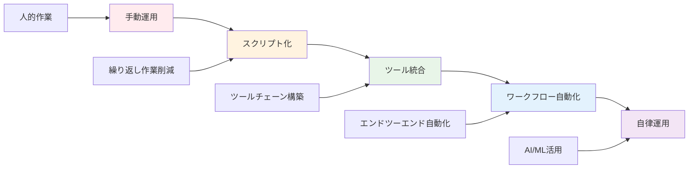

**2. 運用自動化の優先順位**

| 作業カテゴリ | 自動化優先度 | 理由 |
|-------------|-------------|------|
| **デプロイメント** | 最高 | 頻度高、ミス影響大 |
| **バックアップ** | 高 | 重要、定期実行 |
| **監視・アラート** | 高 | 24/7対応必要 |
| **パッチ適用** | 中 | セキュリティ重要 |
| **レポート作成** | 中 | 定期作業 |
| **障害対応** | 低 | 判断要素多い |

#### Infrastructure as Code実践

**1. IaCの成熟度モデル**

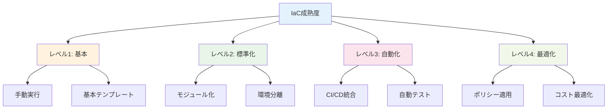

#### 運用効率化ツールチェーン

**1. 統合運用プラットフォーム**

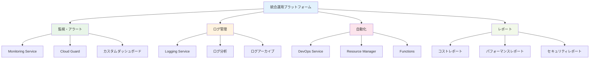

### まとめ

第10章では、OCIを活用したシステム設計・運用のベストプラクティスについて詳しく解説しました。ベストプラクティスの適用により、安全で効率的、かつ持続可能なクラウドシステムを構築・運用できます。

**重要ポイント：**
1. **Well-Architected Framework**: 6つの柱に基づく包括的設計
2. **可用性・災害復旧**: 要件に応じた適切な可用性レベル設計
3. **パフォーマンス最適化**: 継続的な測定・分析・改善サイクル
4. **コスト最適化**: 可視化・測定・最適化の継続的実施
5. **運用効率化**: 自動化による運用負荷軽減と品質向上
6. **継続的改善**: 技術進歩に合わせた継続的な見直し

これまでの10章を通じて、OCIの基礎概念から実践的な活用方法まで、包括的に学習しました。これらの知識を活用して、効果的なクラウドシステムの構築・運用を実現してください。