# Oracle Cloud Infrastructure (OCI) 学習ガイドブック

## 第1章 OCI基礎概念

### はじめに

Oracle Cloud Infrastructure（OCI）は、Oracleが提供するエンタープライズグレードのクラウドプラットフォームです。この章では、OCIを理解するための基礎概念について、クラウド初心者でも理解できるよう詳しく解説します。

#### なぜクラウドが必要なのか

従来のIT環境では、企業は自社でサーバーやネットワーク機器を購入し、データセンターを構築・運用していました。しかし、この方式には以下のような課題がありました：

**従来のオンプレミス環境の課題とクラウドによる解決：**

## オンプレミスとクラウドの比較表

| 比較カテゴリ | オンプレミスの課題 | クラウドの利点 |
| :--- | :--- | :--- |
| **初期投資** | • 高額なサーバー購入<br>• ソフトウェアライセンス<br>• データセンター構築 | • 設備投資が不要<br>• 従量課金制<br>• 予測可能なコスト |
| **迅速性** | • 長期調達プロセス<br>• 数週間の設置・設定<br>• テスト・検証に時間 | • 数分でリソース調達<br>• 自動化された設定<br>• 即座のテスト環境 |
| **運用負荷** | • 24/7の自己監視<br>• 保守・メンテナンス<br>• セキュリティ対策<br>• バックアップ管理 | • プロバイダーが管理<br>• 自動パッチ適用<br>• 組み込みセキュリティ<br>• 自動バックアップ |
| **スケーラビリティ** | • ピーク時の性能不足<br>• 閑散期のリソース無駄<br>• 需要増への対応困難 | • 需要に応じた自動拡張・縮小<br>• グローバル展開 |
| **災害復旧** | • 複数拠点の構築・管理<br>• 複雑なデータ同期<br>• 複雑な復旧手順 | • 複数リージョンを容易に活用<br>• 自動レプリケーション<br>• ワンクリック復旧 |


#### クラウドサービスモデル

クラウドサービスは、提供される機能レベルによって3つの主要なモデルに分類されます：

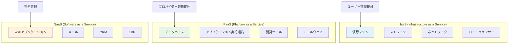

**各モデルの詳細比較：**

| 項目 | IaaS | PaaS | SaaS |
|------|------|------|------|
| **ユーザー管理** | OS、ミドルウェア、アプリ | アプリケーション | 設定のみ |
| **プロバイダー管理** | ハードウェア、仮想化 | OS、ミドルウェア、ランタイム | 全て |
| **柔軟性** | 最高 | 中 | 最低 |
| **管理負荷** | 最高 | 中 | 最低 |
| **導入速度** | 中 | 高 | 最高 |
| **カスタマイズ性** | 最高 | 中 | 最低 |

#### OCIの市場ポジション

OCIは、エンタープライズ向けクラウドサービス市場において独自のポジションを確立しています：

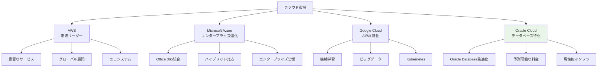

**OCIの差別化要因：**

1. **Oracle Database最適化**
   - Exadata Cloud Service
   - Autonomous Database
   - 既存Oracle環境からの移行容易性

2. **予測可能な料金体系**
   - 複雑な料金計算なし
   - データ転送料金の大幅削減
   - 透明性の高い課金

3. **高性能インフラ**
   - ベアメタルインスタンス
   - 高速ネットワーク
   - NVMe SSDストレージ

### 1.1 OCIアーキテクチャ概要

#### クラウドコンピューティングとは

クラウドコンピューティングとは、インターネット経由でコンピューティングリソース（サーバー、ストレージ、データベース、ネットワーク、ソフトウェアなど）を提供するサービスモデルです。従来のオンプレミス（自社内設置）環境と比較して、以下のメリットがあります：

- **初期投資の削減**: 物理的なハードウェア購入が不要
- **スケーラビリティ**: 需要に応じてリソースを柔軟に増減
- **運用負荷の軽減**: インフラの保守・管理をクラウドプロバイダーが担当
- **高可用性**: 複数のデータセンターによる冗長化

#### OCIの特徴

OCIは以下の特徴を持つクラウドプラットフォームです：

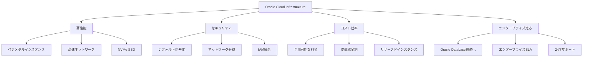

#### OCIアーキテクチャの階層構造

OCIは以下の階層構造で構成されています：

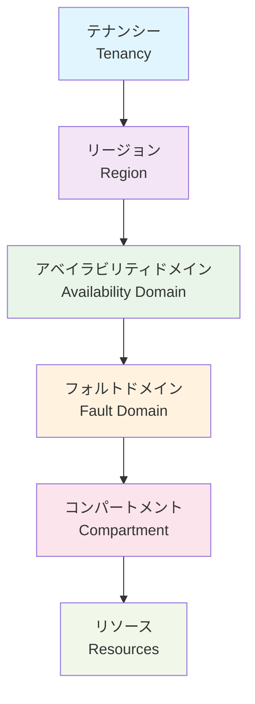

### 1.2 リージョンとアベイラビリティドメイン

#### リージョン（Region）

リージョンは、地理的に分散した独立したデータセンターの集合体です。各リージョンは以下の特徴を持ちます：

**主要パラメータ：**
- **地理的位置**: 東京、大阪、シンガポール、フランクフルトなど
- **レイテンシ**: ユーザーとの物理的距離による通信遅延
- **データ主権**: 各国の法規制への対応
- **災害復旧**: 地理的分散による災害対策

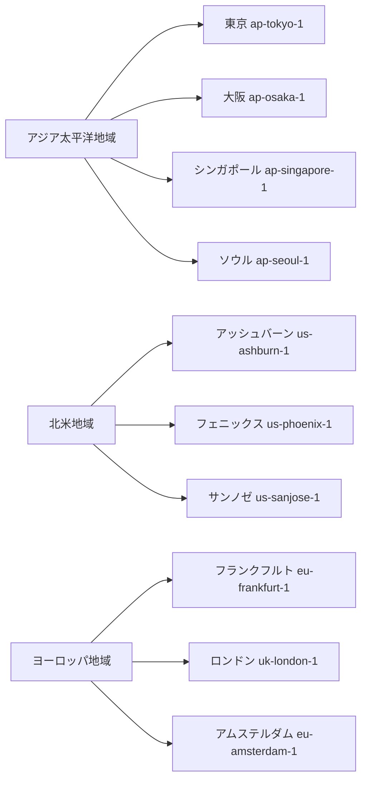

**リージョン選択の判断基準：**

**1. レイテンシ要件**
   - エンドユーザーに最も近いリージョンを選択
   - 一般的に100ms以下が推奨
   - リアルタイム処理では50ms以下が理想

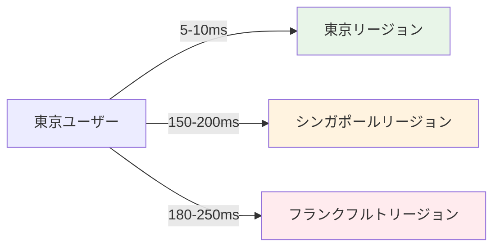

**2. データ主権・コンプライアンス**
   - **個人情報保護法**: 日本の個人情報は日本国内保管が推奨
   - **GDPR**: EU市民のデータはEU内保管が必要
   - **業界固有規制**: 金融、医療、政府系の特別要件
   - **データローカライゼーション**: 各国の法的要求事項

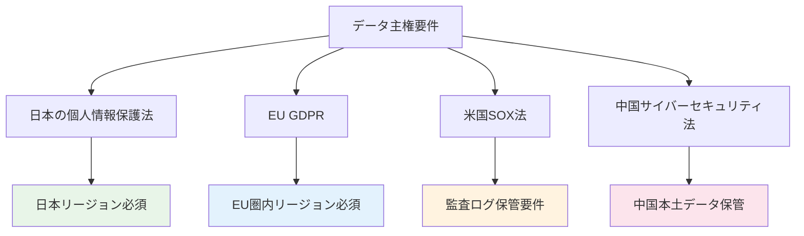

**3. 災害復旧要件**
   - プライマリとセカンダリリージョンの組み合わせ
   - 地理的分散による自然災害対策
   - RTO（Recovery Time Objective）とRPO（Recovery Point Objective）の要件

**災害復旧設計パターン：**

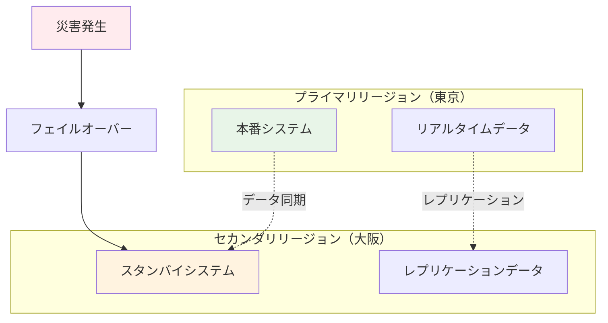

**4. サービス可用性**
   - 利用したいサービスがリージョンで提供されているか
   - 新サービスの展開タイミング
   - 特殊なハードウェア要件（GPU、高メモリなど）

**5. コスト要件**
   - リージョンごとの料金差異
   - データ転送コスト
   - 為替レートの影響

**リージョン選択マトリックス例：**

| 要件 | 東京 | 大阪 | シンガポール | フランクフルト |
|------|------|------|-------------|---------------|
| **日本ユーザー向けレイテンシ** | ◎ | ◎ | △ | × |
| **日本の法規制対応** | ◎ | ◎ | × | × |
| **災害復旧ペア** | 大阪 | 東京 | 東京 | ロンドン |
| **サービス豊富さ** | ◎ | ○ | ◎ | ◎ |
| **コスト** | 標準 | 標準 | やや高 | やや高 |

#### アベイラビリティドメイン（Availability Domain: AD）

アベイラビリティドメインは、リージョン内の独立したデータセンターです。

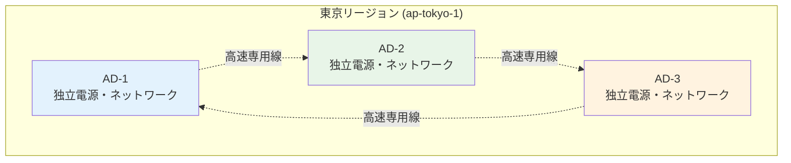

**設計要素：**
- **独立性**: 電源、冷却、ネットワークが完全に独立
- **低レイテンシ**: AD間の通信は2ms以下
- **高可用性**: 単一ADの障害が他ADに影響しない設計

#### フォルトドメイン（Fault Domain）

フォルトドメインは、AD内のさらに細かい障害分離単位です。

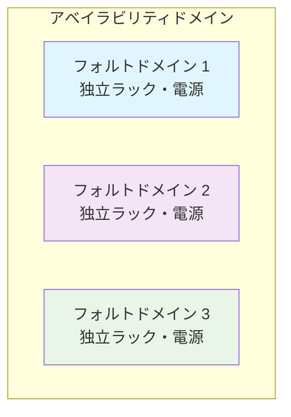

### 1.3 コンパートメント設計

#### コンパートメントとは

コンパートメントは、OCIリソースを論理的に分離・整理するための仕組みです。セキュリティ、管理、課金の観点から重要な概念です。

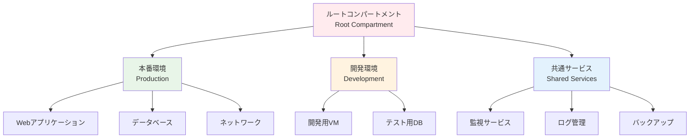

#### コンパートメント設計パターン

**1. 環境別分離パターン**
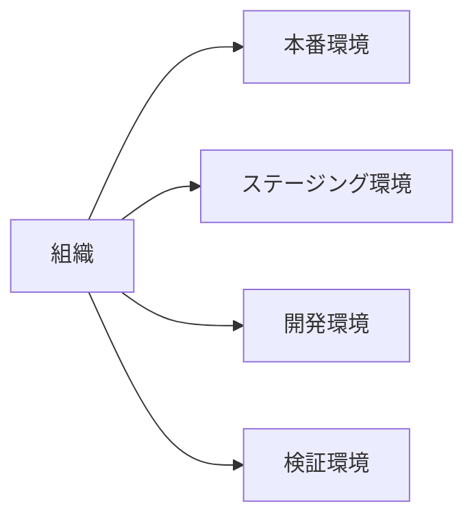

**2. 部門別分離パターン**
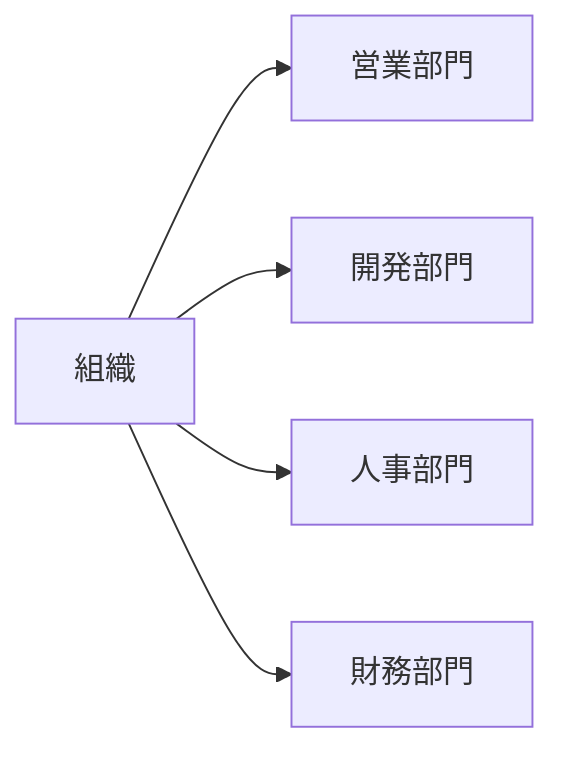

**3. プロジェクト別分離パターン**
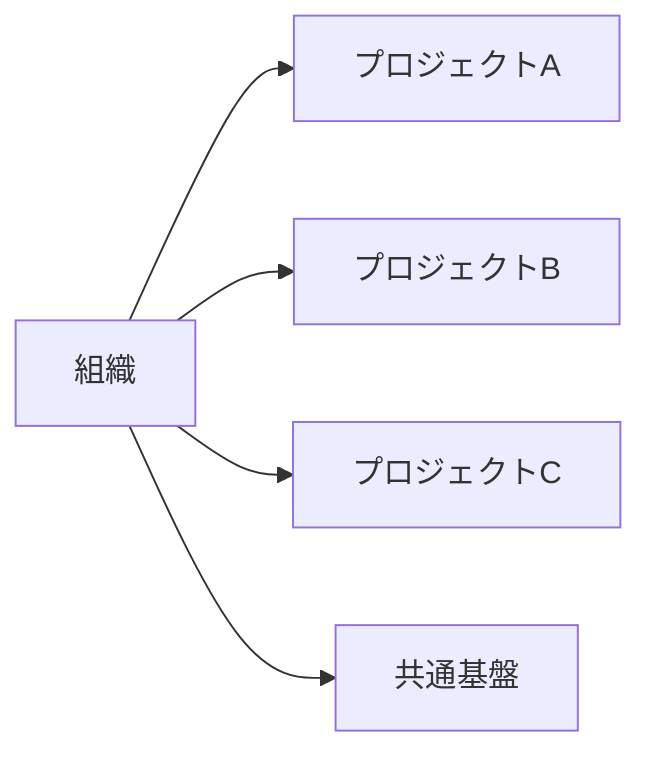

#### コンパートメント設計のベストプラクティス

**主要パラメータ：**
- **階層の深さ**: 最大6階層まで（推奨は3-4階層）
- **命名規則**: 一貫性のある命名パターン
- **アクセス制御**: 最小権限の原則
- **課金管理**: コスト配分とチャージバック

**設計要素：**

1. **セキュリティ境界**
   - 機密度レベルによる分離
   - アクセス権限の最小化
   - 監査ログの分離

2. **運用管理**
   - 責任範囲の明確化
   - 変更管理プロセス
   - 障害対応の分離

3. **コスト管理**
   - 部門別コスト配分
   - プロジェクト別予算管理
   - リソース使用量の可視化

### 1.4 IAM（Identity and Access Management）

#### IAMの基本概念

IAMは、OCIリソースへのアクセスを制御するセキュリティサービスです。「誰が」「何に」「どのような操作を」行えるかを定義します。

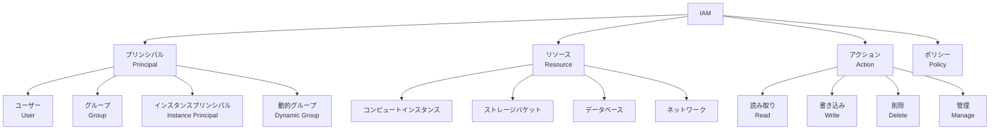

#### IAMコンポーネント詳細

**1. ユーザー（User）**
- 個人または外部システムを表すエンティティ
- 認証情報（パスワード、APIキー）を持つ
- 直接的な権限付与は非推奨

**2. グループ（Group）**
- 複数ユーザーをまとめる論理的な集合
- 役割ベースのアクセス制御（RBAC）を実現
- 権限管理の簡素化

**3. ポリシー（Policy）**
- アクセス権限を定義するルール
- 自然言語に近い構文で記述

```
Allow group <group_name> to <verb> <resource_type> in compartment <compartment_name>
```

#### ポリシー構文の詳細

**基本構文：**
```
Allow <subject> to <verb> <resource-type> in <location> where <conditions>
```

**主要パラメータ：**

1. **Subject（主体）**
   - `user <user_name>`
   - `group <group_name>`
   - `dynamic-group <dynamic_group_name>`
   - `any-user`

2. **Verb（動詞）**
   - `inspect`: リソースの一覧表示
   - `read`: リソースの詳細情報取得
   - `use`: リソースの使用
   - `manage`: 全ての操作（作成、更新、削除）

3. **Resource-type（リソースタイプ）**
   - `instances`: コンピュートインスタンス
   - `buckets`: オブジェクトストレージ
   - `databases`: データベース
   - `all-resources`: 全リソース

4. **Location（場所）**
   - `tenancy`: テナンシー全体
   - `compartment <name>`: 特定コンパートメント

#### IAM設計パターン

**1. 役割ベースアクセス制御（RBAC）**

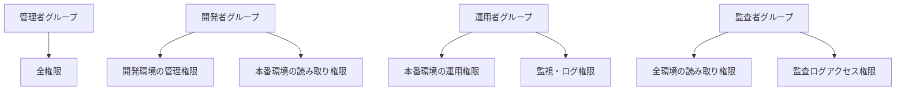

**2. 最小権限の原則**

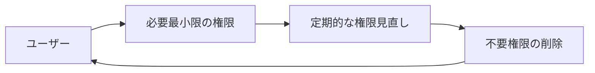

#### セキュリティベストプラクティス

**認証強化：**
1. **多要素認証（MFA）**
   - 管理者アカウントは必須
   - TOTP（Time-based One-Time Password）
   - SMS認証（非推奨）

2. **フェデレーション**
   - Active Directory統合
   - SAML 2.0対応
   - シングルサインオン（SSO）

**アクセス制御：**
1. **ネットワーク制限**
   - 許可IPアドレスからのみアクセス
   - VPN経由のアクセス強制

2. **時間制限**
   - 業務時間内のみアクセス許可
   - 定期的なパスワード変更

### 1.5 課金体系とコスト管理

#### OCIの課金モデル

OCIは従量課金制を基本とし、使用した分だけ支払う仕組みです。

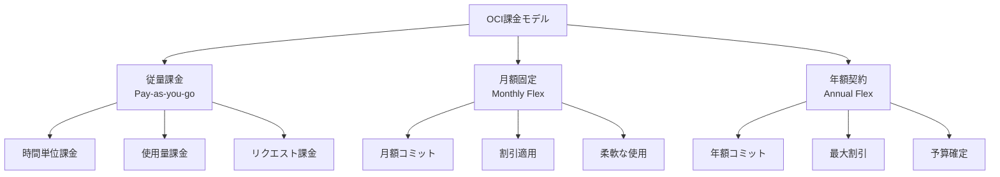

#### 主要サービスの課金体系

**1. コンピュート（Compute）**
- **課金単位**: 時間単位（秒単位で計算）
- **課金要素**: 
  - CPU数（OCPU: Oracle CPU）
  - メモリ容量（GB）
  - インスタンス稼働時間

**2. ストレージ（Storage）**
- **Block Storage**: 容量（GB/月）+ IOPS
- **Object Storage**: 容量（GB/月）+ リクエスト数
- **File Storage**: 容量（GB/月）

**3. ネットワーク（Network）**
- **アウトバウンド転送**: 月10TBまで無料、以降従量課金
- **インバウンド転送**: 無料
- **リージョン間転送**: 従量課金

#### コスト最適化戦略

**1. リソースサイジング**

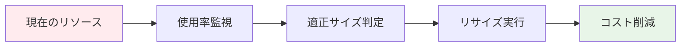

**主要パラメータ：**
- **CPU使用率**: 平均70-80%が目安
- **メモリ使用率**: 平均80-90%が目安
- **ストレージ使用率**: 80%以下を維持

**2. 自動スケーリング**

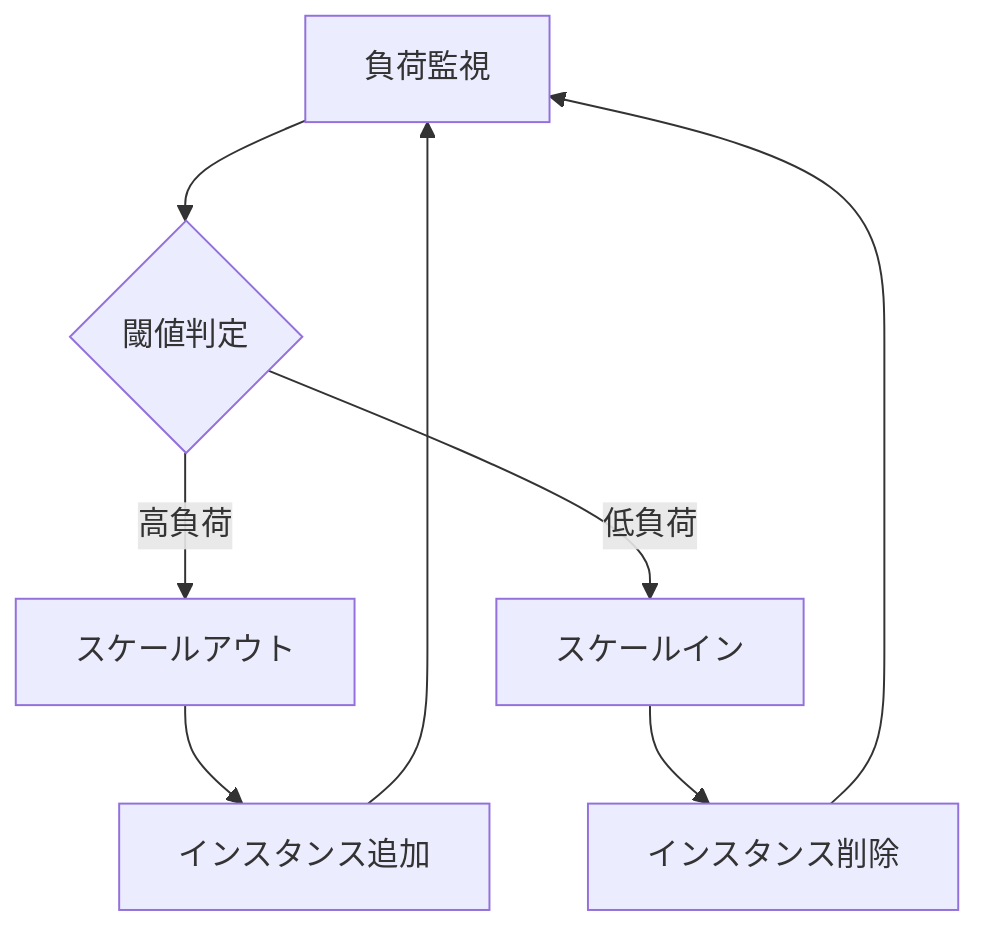

**3. 予約インスタンス**

| 契約期間 | 割引率 | 適用シーン |
|---------|--------|-----------|
| 1年 | 20-30% | 安定稼働システム |
| 3年 | 40-50% | 長期運用システム |

**4. スケジューリング**

```mermaid
gantt
    title リソーススケジューリング例
    dateFormat HH:mm
    axisFormat %H:%M
    
    section 開発環境
    稼働時間    :active, dev, 09:00, 18:00
    停止時間    :done, 18:00, 09:00
    
    section 検証環境
    稼働時間    :active, test, 08:00, 20:00
    停止時間    :done, 20:00, 08:00
```

#### コスト監視とアラート

**1. 予算設定**
- 月額予算の設定
- 閾値アラート（80%, 100%, 120%）
- 部門別予算配分

**2. コスト分析**
- サービス別コスト内訳
- 時系列でのコスト推移
- 予実管理とレポート

**3. タグ戦略**

```mermaid
graph TB
    A[リソースタグ] --> B[環境タグ]
    A --> C[プロジェクトタグ]
    A --> D[所有者タグ]
    A --> E[コストセンタータグ]
    
    B --> B1[Production]
    B --> B2[Development]
    B --> B3[Staging]
    
    C --> C1[Project-A]
    C --> C2[Project-B]
    
    D --> D1[team-web]
    D --> D2[team-db]
    
    E --> E1[CC-001]
    E --> E2[CC-002]
```

#### 他クラウドとの比較

**主要クラウドプロバイダー比較：**

| 項目 | OCI | AWS | Azure | GCP |
|------|-----|-----|-------|-----|
| 課金単位 | 秒 | 秒 | 分 | 秒 |
| 無料枠 | Always Free | 12ヶ月 | 12ヶ月 | 12ヶ月 |
| 予約割引 | 最大50% | 最大75% | 最大72% | 最大57% |
| データ転送 | 10TB/月無料 | 1GB/月無料 | 5GB/月無料 | 1GB/月無料 |

**選定判断基準：**

1. **既存システム連携**
   - Oracle Database使用 → OCI有利
   - Microsoft製品中心 → Azure有利
   - オープンソース中心 → GCP有利

2. **コスト要件**
   - 予測可能な料金 → OCI
   - 最安値重視 → 各社比較必要
   - 複雑な割引体系 → AWS

3. **技術要件**
   - ベアメタル性能 → OCI
   - 豊富なサービス → AWS
   - AI/ML重視 → GCP

### まとめ

第1章では、OCIの基礎概念について詳しく解説しました。次章では、これらの基礎知識を踏まえて、具体的なコンピュートサービスについて学習していきます。

**重要ポイント：**
1. リージョン・AD・コンパートメントの階層構造理解
2. IAMによる適切なアクセス制御設計
3. コスト最適化を考慮した運用計画
4. セキュリティベストプラクティスの実装

次章では、OCIの中核となるコンピュートサービスについて、サービス選定基準や設計パターンを含めて詳しく解説します。