# Oracle Cloud Infrastructure (OCI) 学習ガイドブック

## 第2章 コンピュートサービス

### はじめに

第1章でOCIの基礎概念を学習しました。本章では、OCIの中核となるコンピュートサービスについて詳しく解説します。コンピュートサービスは、アプリケーションを実行するための計算リソースを提供するサービスです。従来の物理サーバーに代わり、仮想化技術やコンテナ技術、サーバーレス技術を活用して、柔軟で効率的な計算環境を提供します。

### 2.1 Compute Instances（仮想マシン）

#### 仮想マシンとは

仮想マシン（Virtual Machine: VM）は、物理サーバー上でソフトウェアによって作られる仮想的なコンピューターです。1台の物理サーバー上で複数の仮想マシンを同時に稼働させることができ、リソースの有効活用とコスト削減を実現します。

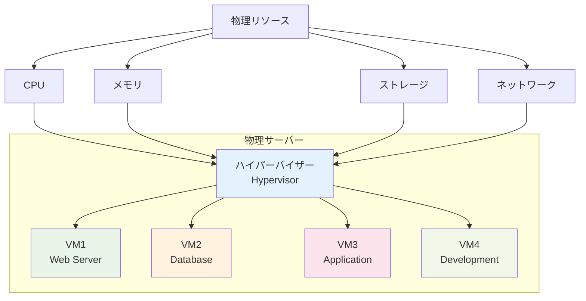

#### OCIコンピュートインスタンスの特徴

OCIのコンピュートインスタンスは以下の特徴を持ちます：

1. **高性能**: 最新のIntel/AMD CPUを使用
2. **柔軟性**: CPUとメモリを独立してスケーリング
3. **セキュリティ**: ハードウェアレベルでの分離
4. **可用性**: 複数ADでの冗長化

#### インスタンスシェイプ（Instance Shape）

インスタンスシェイプは、CPUとメモリの組み合わせを定義したテンプレートです。

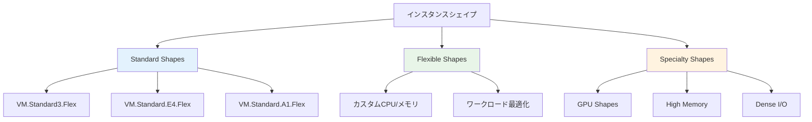

#### 主要インスタンスシェイプの詳細

**1. Standard Shapes（汎用）**

| シェイプ | CPU | メモリ | 用途 | 時間単価（目安） |
|---------|-----|--------|------|----------------|
| VM.Standard3.Flex | 1-128 OCPU | 1-2048 GB | 汎用ワークロード | $0.01-1.28/時間 |
| VM.Standard.E4.Flex | 1-64 OCPU | 1-1024 GB | コスト重視 | $0.008-0.512/時間 |
| VM.Standard.A1.Flex | 1-80 OCPU | 1-512 GB | Arm CPU | $0.006-0.48/時間 |

**2. Specialty Shapes（特殊用途）**

| シェイプ | 特徴 | 用途 | 主要パラメータ |
|---------|------|------|---------------|
| VM.GPU3.* | NVIDIA V100 | AI/ML、HPC | GPU数: 1-4 |
| VM.DenseIO2.* | NVMe SSD | 高IOPS要求 | ローカルSSD: 最大51.2TB |
| VM.HM1.* | 大容量メモリ | インメモリDB | メモリ: 最大6TB |

#### インスタンス作成の主要パラメータ

**1. 基本設定**
- **名前**: インスタンスの識別名
- **コンパートメント**: 配置先コンパートメント
- **アベイラビリティドメイン**: 配置先AD
- **フォルトドメイン**: 障害分離単位

**2. イメージ設定**
- **OS種別**: Oracle Linux, Ubuntu, Windows Server, CentOS
- **バージョン**: 各OSの対応バージョン
- **カスタムイメージ**: 独自作成のイメージ

**3. ネットワーク設定**
- **VCN**: 仮想クラウドネットワーク
- **サブネット**: パブリック/プライベート
- **セキュリティリスト**: ファイアウォールルール

#### インスタンス設計パターン

**1. 単一インスタンス構成**
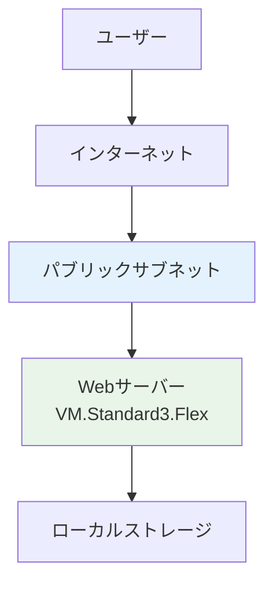

**適用シーン**: 小規模サイト、開発環境、プロトタイプ

**2. 多層構成**
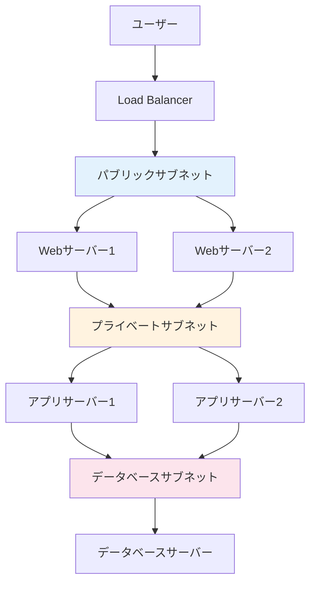

**適用シーン**: 本番環境、高可用性要求、セキュリティ重視

#### 運用管理機能

**1. 自動スケーリング**

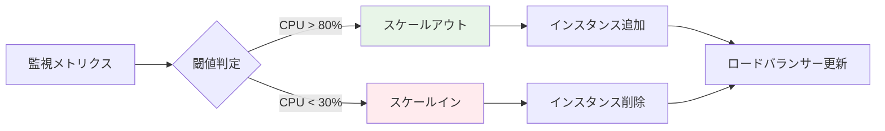

**主要パラメータ**:
- **最小インスタンス数**: 常時稼働する最小台数
- **最大インスタンス数**: スケールアウト上限
- **スケールアウト閾値**: CPU使用率80%など
- **スケールイン閾値**: CPU使用率30%など
- **クールダウン時間**: スケーリング後の待機時間

**2. インスタンス管理**

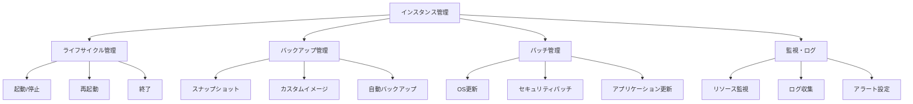

### 2.2 Bare Metal Instances（ベアメタルインスタンス）

#### ベアメタルとは

ベアメタルインスタンスは、仮想化レイヤーを介さずに物理サーバーを直接利用するサービスです。ハイパーバイザーによるオーバーヘッドがないため、最高レベルの性能を実現できます。

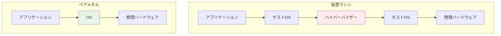

#### ベアメタルの特徴と利点

**1. 性能面の利点**
- **CPU性能**: 仮想化オーバーヘッドなし
- **メモリ性能**: 直接メモリアクセス
- **I/O性能**: ハードウェア直接制御
- **ネットワーク性能**: 専用ネットワークリソース

**2. セキュリティ面の利点**
- **物理分離**: 他テナントとの完全分離
- **コンプライアンス**: 厳格な規制要件対応
- **カスタマイズ**: ハードウェアレベルの制御

#### ベアメタルシェイプ

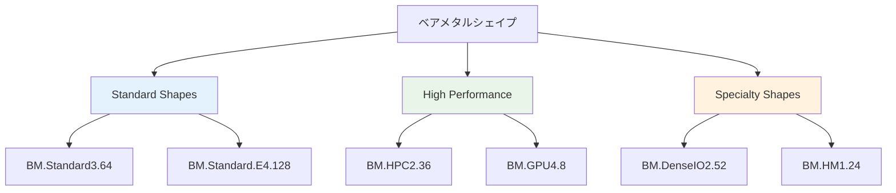

#### 主要ベアメタルシェイプ詳細

| シェイプ | CPU | メモリ | ストレージ | 用途 |
|---------|-----|--------|-----------|------|
| BM.Standard3.64 | 64 OCPU | 1024 GB | - | 汎用高性能 |
| BM.GPU4.8 | 64 OCPU | 1024 GB | 8x A100 GPU | AI/ML |
| BM.DenseIO2.52 | 52 OCPU | 768 GB | 51.2TB NVMe | 高IOPS |
| BM.HPC2.36 | 36 OCPU | 384 GB | 100Gbps網 | HPC |

#### 適用シーン

**1. 高性能コンピューティング（HPC）**
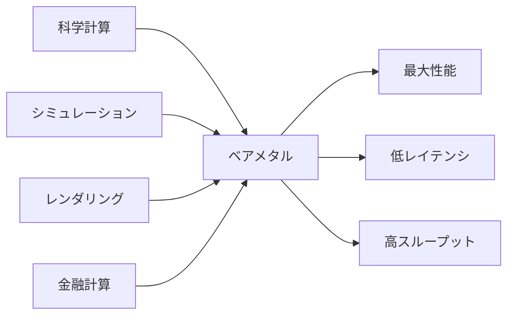

**2. データベースワークロード**
- Oracle Database（特にExadata互換性）
- SAP HANA
- 大規模データウェアハウス

**3. コンプライアンス要件**
- 金融業界の規制対応
- 医療データの取り扱い
- 政府系システム

#### 設計考慮事項

**1. 可用性設計**
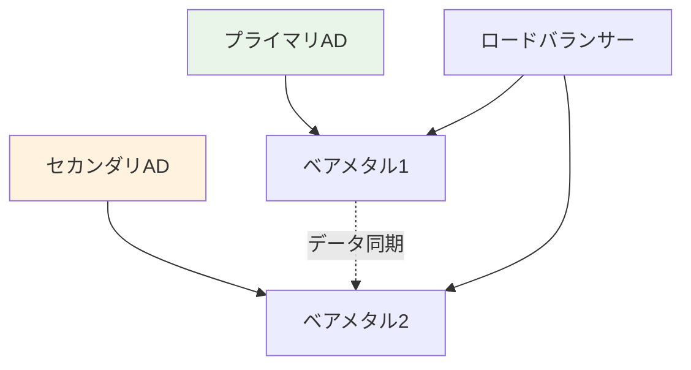

**2. バックアップ戦略**
- **ブートボリューム**: 自動バックアップ
- **データボリューム**: スナップショット
- **アプリケーション**: 専用バックアップツール

### 2.3 Container Engine for Kubernetes (OKE)

#### Kubernetesとは

Kubernetes（K8s）は、コンテナ化されたアプリケーションの展開、スケーリング、管理を自動化するオープンソースプラットフォームです。Googleが開発し、現在はCloud Native Computing Foundation（CNCF）が管理しています。

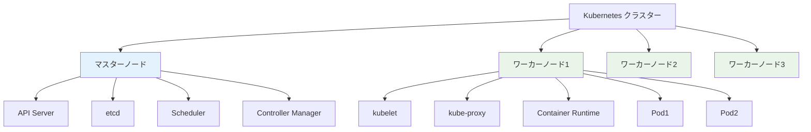

#### コンテナ技術の背景

**従来の仮想化 vs コンテナ**

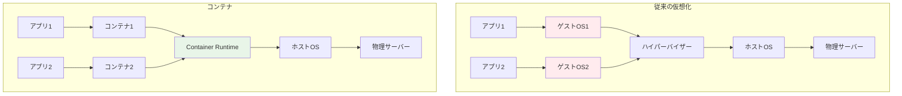

**コンテナの利点**:
1. **軽量**: OSカーネルを共有
2. **高速起動**: 秒単位での起動
3. **ポータビリティ**: 環境間での一貫性
4. **効率性**: リソース使用量の最適化

#### OKEの特徴

Oracle Container Engine for Kubernetes（OKE）は、OCIが提供するマネージドKubernetesサービスです。

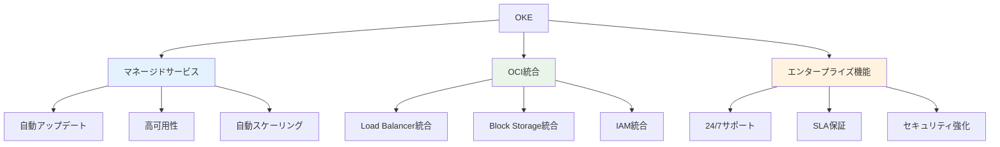

#### OKEクラスター構成

**1. クラスター作成パラメータ**

| パラメータ | 説明 | 選択肢 |
|-----------|------|--------|
| Kubernetesバージョン | K8sのバージョン | v1.24, v1.25, v1.26 |
| VCN | 仮想ネットワーク | 既存/新規作成 |
| ノードプール | ワーカーノード群 | 複数プール可能 |
| ノードシェイプ | インスタンスタイプ | VM/ベアメタル |

**2. ノードプール設定**

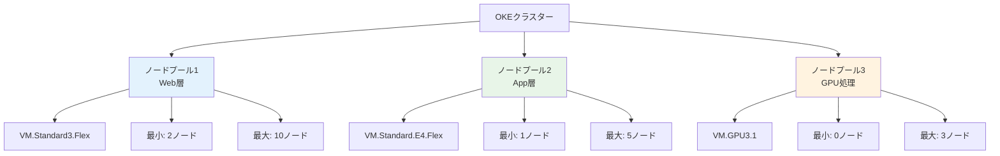

#### Kubernetesの主要概念

**1. Pod（ポッド）**
- 最小デプロイ単位
- 1つ以上のコンテナを含む
- 同一Pod内のコンテナは同じノードで実行

**2. Service（サービス）**
- Podへのアクセスを抽象化
- ロードバランシング機能
- サービスディスカバリ

**3. Deployment（デプロイメント）**
- Podの宣言的管理
- ローリングアップデート
- ロールバック機能

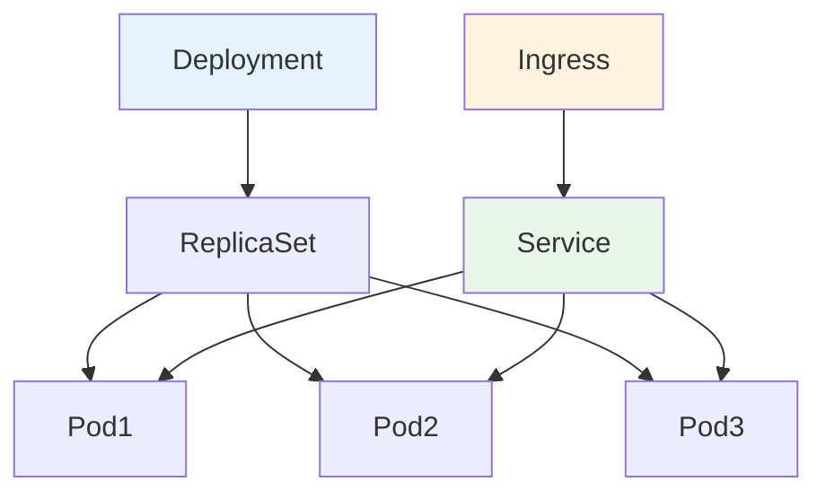

#### アプリケーション展開パターン

**1. マイクロサービスアーキテクチャ**

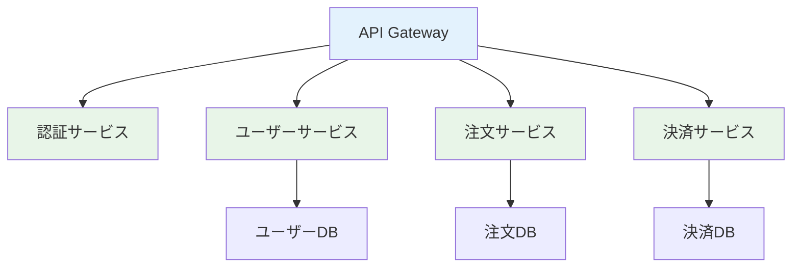

**2. CI/CDパイプライン**

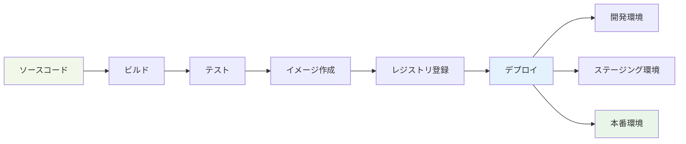

#### 運用管理

**1. 監視とログ**
- **メトリクス**: CPU、メモリ、ネットワーク使用率
- **ログ**: アプリケーションログ、システムログ
- **トレーシング**: 分散トレーシング

**2. 自動スケーリング**

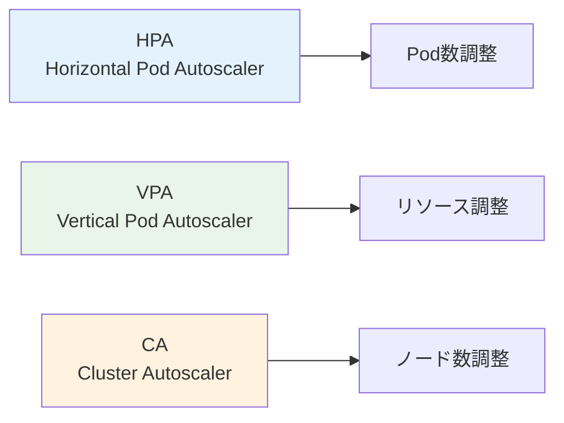

### 2.4 Container Instances

#### Container Instancesとは

Container Instancesは、Kubernetesの複雑さを排除し、単純にコンテナを実行したい場合に適したサーバーレスコンテナサービスです。

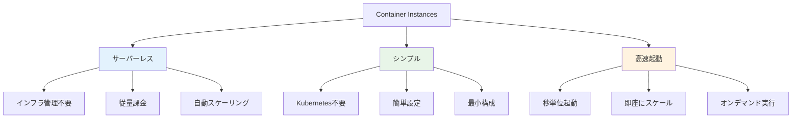

#### 適用シーン

**1. バッチ処理**
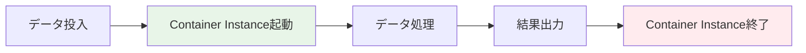

**2. イベント駆動処理**
- ファイルアップロード時の画像変換
- ログ解析処理
- 定期的なデータ同期

#### 主要パラメータ

| パラメータ | 説明 | 設定値例 |
|-----------|------|----------|
| CPU | vCPU数 | 0.125-64 vCPU |
| メモリ | メモリ容量 | 1-1024 GB |
| 実行時間 | 最大実行時間 | 最大24時間 |
| 環境変数 | アプリケーション設定 | KEY=VALUE |

### 2.5 Functions（サーバーレス）

#### サーバーレスとは

サーバーレスコンピューティングは、開発者がサーバーの管理を意識することなく、コードの実行に集中できるコンピューティングモデルです。「サーバーレス」という名前ですが、実際にはサーバーが存在しないわけではなく、サーバーの管理をクラウドプロバイダーが完全に担当します。

```mermaid
graph TB
    subgraph "従来のサーバー管理"
        A1[アプリケーション開発]
        A2[サーバー調達]
        A3[OS設定]
        A4[ミドルウェア設定]
        A5[スケーリング設定]
        A6[監視設定]
        A7[セキュリティ設定]
    end
    
    subgraph "サーバーレス"
        B1[アプリケーション開発]
        B2[関数デプロイ]
    end
    
    style A2 fill:#ffebee
    style A3 fill:#ffebee
    style A4 fill:#ffebee
    style A5 fill:#ffebee
    style A6 fill:#ffebee
    style A7 fill:#ffebee
    style B1 fill:#e8f5e8
    style B2 fill:#e8f5e8
```

#### サーバーレスの特徴

**1. イベント駆動**
- 特定のイベントが発生した時のみ実行
- 実行時間のみ課金
- アイドル時間のコストなし

**2. 自動スケーリング**
- 同時実行数に応じて自動拡張
- ゼロスケール対応
- 無制限スケールアップ

**3. 運用負荷軽減**
- インフラ管理不要
- 自動パッチ適用
- 高可用性保証

#### OCI Functionsの特徴

```mermaid
graph TB
    A[OCI Functions] --> B[Fn Project基盤]
    A --> C[多言語サポート]
    A --> D[OCI統合]
    
    B --> B1[オープンソース]
    B --> B2[Docker互換]
    B --> B3[ポータブル]
    
    C --> C1[Java]
    C --> C2[Python]
    C --> C3[Node.js]
    C --> C4[Go]
    C --> C5[Ruby]
    
    D --> D1[API Gateway]
    D --> D2[Object Storage]
    D --> D3[Autonomous DB]
    D --> D4[Streaming]
    
    style B fill:#e3f2fd
    style C fill:#e8f5e8
    style D fill:#fff3e0
```

#### Functions開発ライフサイクル

```mermaid
graph LR
    A[開発] --> B[テスト]
    B --> C[ビルド]
    C --> D[デプロイ]
    D --> E[実行]
    E --> F[監視]
    
    F --> A
    
    A1[ローカル開発] --> A
    B1[ユニットテスト] --> B
    C1[Dockerイメージ] --> C
    D1[Function作成] --> D
    E1[イベント処理] --> E
    F1[ログ・メトリクス] --> F
    
    style A fill:#f1f8e9
    style E fill:#e8f5e8
```

#### 実装例

**1. HTTP API**
```python
import io
import json
from fdk import response

def handler(ctx, data: io.BytesIO=None):
    try:
        body = json.loads(data.getvalue())
        name = body.get("name", "World")
        return response.Response(
            ctx, 
            response_data=json.dumps({"message": f"Hello {name}!"}),
            headers={"Content-Type": "application/json"}
        )
    except Exception as ex:
        return response.Response(
            ctx,
            response_data=json.dumps({"error": str(ex)}),
            headers={"Content-Type": "application/json"},
            status_code=500
        )
```

**2. Object Storage連携**
```python
import oci
from fdk import response

def handler(ctx, data: io.BytesIO=None):
    # Object Storageクライアント作成
    signer = oci.auth.signers.get_resource_principals_signer()
    client = oci.object_storage.ObjectStorageClient(config={}, signer=signer)
    
    # ファイル処理
    namespace = "your-namespace"
    bucket = "input-bucket"
    object_name = "data.csv"
    
    # ファイル読み込み
    obj = client.get_object(namespace, bucket, object_name)
    
    # データ処理
    processed_data = process_data(obj.data.content)
    
    # 結果保存
    client.put_object(
        namespace, 
        "output-bucket", 
        "processed-data.json",
        processed_data
    )
    
    return response.Response(ctx, response_data="Processing completed")
```

#### イベントソース

```mermaid
graph TB
    A[イベントソース] --> B[HTTP Request]
    A --> C[Object Storage]
    A --> D[Streaming]
    A --> E[Notifications]
    A --> F[Scheduled Events]
    
    B --> G[API Gateway]
    C --> H[ファイルアップロード]
    D --> I[リアルタイムデータ]
    E --> J[アラート通知]
    F --> K[定期実行]
    
    G --> L[Function実行]
    H --> L
    I --> L
    J --> L
    K --> L
    
    style L fill:#e8f5e8
```

#### パフォーマンス考慮事項

**1. コールドスタート**
- 初回実行時の起動時間
- 言語による差異（Java > Python > Node.js）
- 最適化手法

**2. メモリ設定**
- 128MB - 1024MB
- CPU性能に比例
- コスト影響

**3. タイムアウト設定**
- デフォルト: 30秒
- 最大: 300秒（5分）
- 処理時間に応じた調整

### 2.6 サービス選定基準と比較

#### 選定フローチャート

```mermaid
graph TD
    A[ワークロード分析] --> B{実行パターン}
    
    B -->|常時稼働| C{カスタマイズ要件}
    B -->|イベント駆動| D{実行時間}
    B -->|バッチ処理| E{処理頻度}
    
    C -->|高| F[Bare Metal]
    C -->|中| G[VM Instances]
    C -->|低| H[Container Instances]
    
    D -->|短時間<5分| I[Functions]
    D -->|長時間| J[Container Instances]
    
    E -->|高頻度| K[OKE]
    E -->|低頻度| L[Functions]
    
    style F fill:#e3f2fd
    style G fill:#e8f5e8
    style H fill:#fff3e0
    style I fill:#fce4ec
    style J fill:#f1f8e9
    style K fill:#e1f5fe
    style L fill:#fce4ec
```

#### 詳細比較表

| 項目 | VM Instances | Bare Metal | OKE | Container Instances | Functions |
|------|-------------|------------|-----|-------------------|-----------|
| **起動時間** | 1-2分 | 5-10分 | 3-5分 | 10-30秒 | 1-5秒 |
| **最小課金単位** | 1分 | 1分 | 1分 | 1秒 | 100ms |
| **スケーリング** | 手動/自動 | 手動 | 自動 | 自動 | 自動 |
| **管理負荷** | 中 | 高 | 中 | 低 | 最低 |
| **カスタマイズ性** | 高 | 最高 | 中 | 低 | 最低 |
| **コスト効率** | 中 | 低 | 高 | 高 | 最高 |

#### 用途別推奨サービス

**1. Webアプリケーション**

| 要件 | 推奨サービス | 理由 |
|------|-------------|------|
| 小規模サイト | VM Instances | シンプル、コスト効率 |
| 中規模サイト | OKE | スケーラビリティ、運用効率 |
| 大規模サイト | OKE + Functions | マイクロサービス、イベント処理 |
| 高性能要求 | Bare Metal | 最大性能 |

**2. データ処理**

| 処理タイプ | 推奨サービス | 設計パターン |
|-----------|-------------|-------------|
| リアルタイム処理 | Functions | イベント駆動 |
| バッチ処理 | Container Instances | スケジュール実行 |
| 大容量処理 | OKE | 分散処理 |
| 高性能計算 | Bare Metal | 専用リソース |

**3. 開発・テスト環境**

```mermaid
graph TB
    A[開発段階] --> B[プロトタイプ]
    A --> C[開発環境]
    A --> D[テスト環境]
    A --> E[本番環境]
    
    B --> B1[Functions<br/>迅速検証]
    C --> C1[VM Instances<br/>柔軟性重視]
    D --> D1[OKE<br/>本番同等環境]
    E --> E1[要件に応じて選択]
    
    style B1 fill:#fce4ec
    style C1 fill:#e8f5e8
    style D1 fill:#e1f5fe
    style E1 fill:#fff3e0
```

#### コスト比較シミュレーション

**シナリオ: 中規模Webアプリケーション**
- CPU: 4 vCPU
- メモリ: 16GB
- 稼働時間: 24時間/日

| サービス | 月額コスト | 特徴 |
|---------|-----------|------|
| VM.Standard3.Flex | $200 | 固定コスト |
| OKE (3ノード) | $180 | 自動スケーリング |
| Container Instances | $150 | 使用量課金 |
| Functions | $50 | イベント駆動 |

#### 移行戦略

**1. リフト&シフト**
```mermaid
graph LR
    A[オンプレミス] --> B[VM Instances]
    B --> C[最適化]
    C --> D[モダナイゼーション]
    
    style A fill:#ffebee
    style B fill:#fff3e0
    style C fill:#e8f5e8
    style D fill:#e3f2fd
```

**2. クラウドネイティブ**
```mermaid
graph LR
    A[新規開発] --> B[マイクロサービス設計]
    B --> C[OKE + Functions]
    C --> D[DevOps実装]
    
    style A fill:#f1f8e9
    style D fill:#e8f5e8
```

### まとめ

第2章では、OCIのコンピュートサービスについて詳しく解説しました。各サービスの特徴と適用シーンを理解し、要件に応じた適切な選択ができるようになることが重要です。

**重要ポイント：**
1. **VM Instances**: 汎用的で柔軟性が高い
2. **Bare Metal**: 最高性能が必要な場合
3. **OKE**: コンテナ化とマイクロサービス
4. **Container Instances**: シンプルなコンテナ実行
5. **Functions**: イベント駆動とサーバーレス

次章では、これらのコンピュートサービスを支えるストレージサービスについて学習します。