# Oracle Cloud Infrastructure (OCI) 学習ガイドブック

## 第3章 ストレージサービス

### はじめに

第2章でコンピュートサービスについて学習しました。本章では、これらのコンピュートリソースを支える重要な基盤であるストレージサービスについて詳しく解説します。ストレージは、データの永続化、バックアップ、アーカイブなど、システム運用において不可欠な要素です。OCIでは、用途に応じて最適化された複数のストレージサービスを提供しています。

### ストレージの基本概念

#### データストレージの重要性

現代のITシステムにおいて、データは企業の最も重要な資産の一つです。適切なストレージ戦略なしには、以下のようなリスクが発生します：

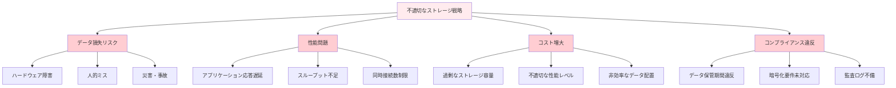

#### ストレージの分類

ストレージは、アクセス方法と用途によって以下のように分類されます：

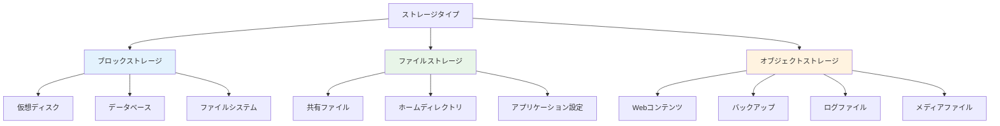

### 3.1 Block Storage（ブロックストレージ）

#### ブロックストレージとは

ブロックストレージは、データを固定サイズのブロック単位で管理するストレージ方式です。従来のハードディスクやSSDと同様の動作をし、オペレーティングシステムからは通常のディスクとして認識されます。

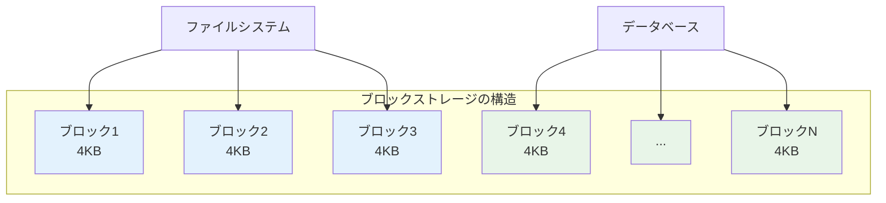

#### OCIブロックストレージの特徴

**1. 高性能**
- NVMe SSDベースの高速ストレージ
- 最大32,000 IOPS（Input/Output Operations Per Second）
- 低レイテンシ（1ms以下）

**2. 高可用性**
- 自動的な3重レプリケーション
- 99.95%の可用性SLA
- 自動障害復旧

**3. 柔軟性**
- 1GB〜32TBまでの容量
- オンラインでの容量拡張
- 性能レベルの動的変更

#### ブロックストレージの性能レベル

OCIでは、用途に応じて3つの性能レベルを提供しています：

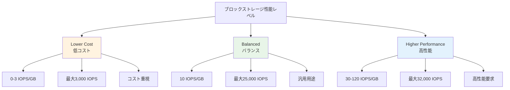

#### 性能レベル詳細比較

| 性能レベル | IOPS/GB | 最大IOPS | 最大スループット | 用途例 |
|-----------|---------|----------|----------------|--------|
| **Lower Cost** | 0-3 | 3,000 | 480 MB/s | ログ保存、アーカイブ |
| **Balanced** | 10 | 25,000 | 480 MB/s | 一般的なアプリケーション |
| **Higher Performance** | 30-120 | 32,000 | 480 MB/s | データベース、高負荷アプリ |

#### ブロックストレージの設計パターン

**1. 単一インスタンス構成**

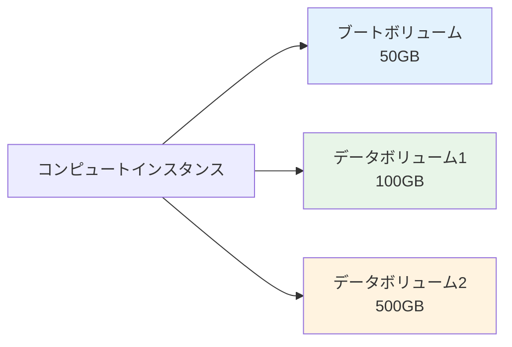

**2. 高可用性構成**

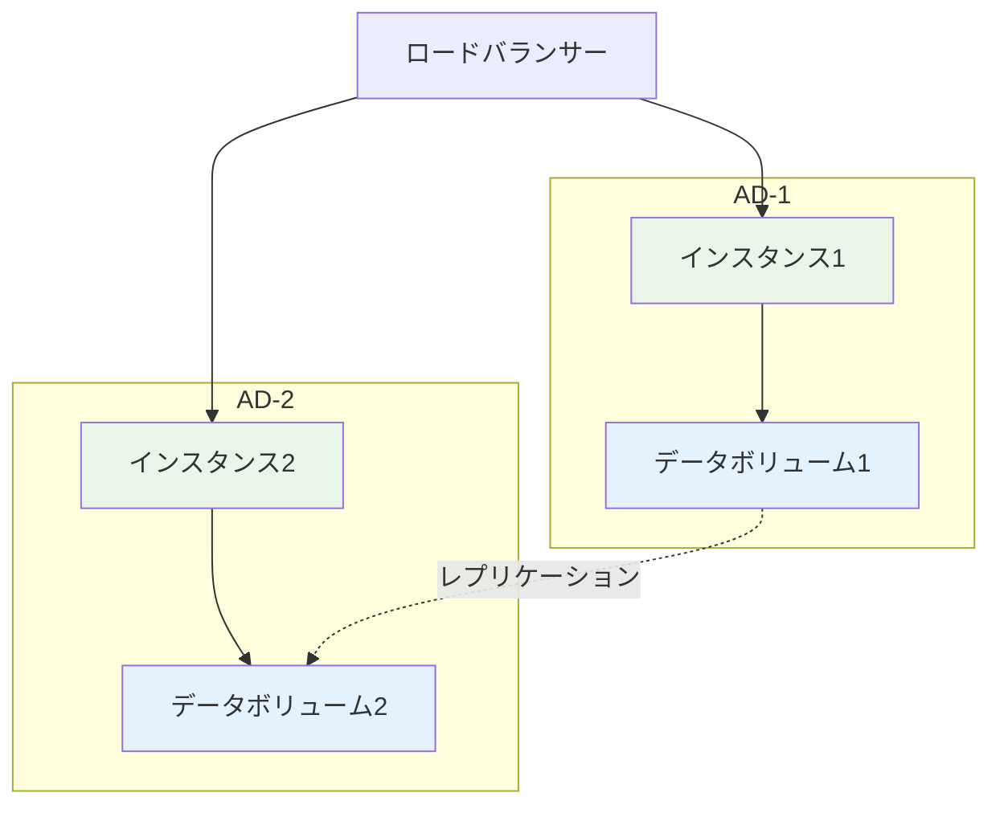

#### バックアップとスナップショット

**スナップショット機能**

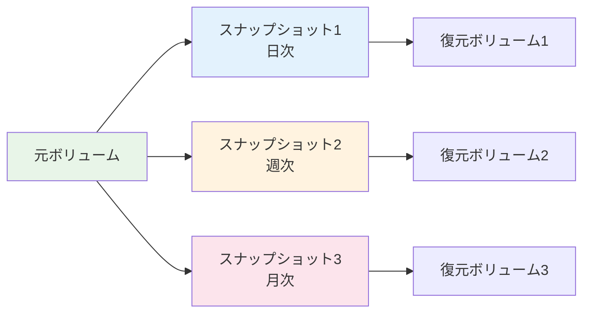

**主要パラメータ：**
- **スナップショット頻度**: 手動、日次、週次、月次
- **保持期間**: 7日〜無制限
- **増分バックアップ**: 変更分のみ保存
- **クロスリージョンコピー**: 災害復旧対応

#### 暗号化とセキュリティ

**暗号化オプション：**

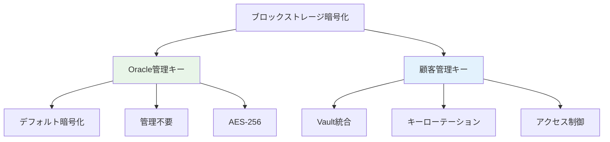

#### 使用例とベストプラクティス

**1. データベース用途**
```bash
# 高性能ブロックストレージの作成例
oci bv volume create \
  --compartment-id <compartment-id> \
  --display-name "database-volume" \
  --size-in-gbs 1000 \
  --vpus-per-gb 30 \
  --availability-domain <ad-name>
```

**2. ファイルシステム構成**
```bash
# ボリュームのアタッチ後
sudo mkfs.ext4 /dev/sdb
sudo mkdir /data
sudo mount /dev/sdb /data
echo '/dev/sdb /data ext4 defaults 0 2' >> /etc/fstab
```

### 3.2 Object Storage（オブジェクトストレージ）

#### オブジェクトストレージとは

オブジェクトストレージは、データをオブジェクトとして管理するストレージ方式です。各オブジェクトには、データ本体、メタデータ、一意のIDが含まれ、フラットな名前空間で管理されます。

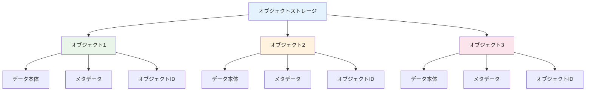

#### OCIオブジェクトストレージの特徴

**1. 無制限スケーラビリティ**
- 容量制限なし
- 単一オブジェクト最大10TB
- 自動的な負荷分散

**2. 高耐久性**
- 99.999999999%（11 9's）の耐久性
- 複数のアベイラビリティドメインでレプリケーション
- 自動的なデータ整合性チェック

**3. 豊富なアクセス方法**
- REST API
- SDK（Java、Python、.NET等）
- CLI（Command Line Interface）
- Webコンソール

#### ストレージクラス

OCIオブジェクトストレージでは、アクセス頻度に応じて3つのストレージクラスを提供：

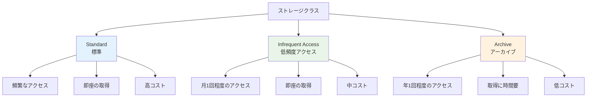

#### ストレージクラス詳細比較

| 項目 | Standard | Infrequent Access | Archive |
|------|----------|-------------------|---------|
| **用途** | 頻繁アクセス | 月次アクセス | 年次アクセス |
| **取得時間** | 即座 | 即座 | 1-4時間 |
| **最小保存期間** | なし | 31日 | 90日 |
| **ストレージ料金** | 高 | 中 | 低 |
| **取得料金** | 無料 | 有料 | 有料 |

#### バケット設計とネーミング

**バケット構成例：**

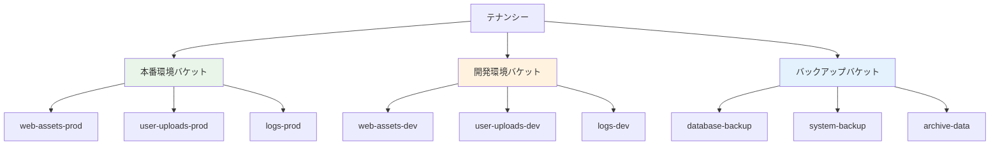

**ネーミング規則例：**
- `{環境}-{用途}-{リージョン}-{年月}`
- `prod-web-assets-tokyo-202312`
- `dev-user-data-osaka-202312`

#### ライフサイクル管理

オブジェクトのライフサイクルを自動化することで、コストを最適化できます：

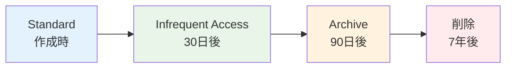

**ライフサイクルポリシー例：**
```json
{
  "rules": [
    {
      "name": "transition-to-ia",
      "action": "TRANSITION",
      "target": "InfrequentAccess",
      "timeAmount": 30,
      "timeUnit": "DAYS"
    },
    {
      "name": "transition-to-archive",
      "action": "TRANSITION", 
      "target": "Archive",
      "timeAmount": 90,
      "timeUnit": "DAYS"
    },
    {
      "name": "delete-old-objects",
      "action": "DELETE",
      "timeAmount": 7,
      "timeUnit": "YEARS"
    }
  ]
}
```

#### セキュリティ機能

**1. アクセス制御**

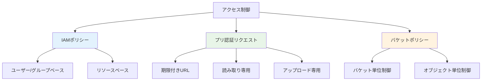

**2. 暗号化**
- **転送時暗号化**: HTTPS/TLS
- **保存時暗号化**: AES-256
- **キー管理**: Oracle管理 or 顧客管理

#### 使用例

**1. 静的Webサイトホスティング**
```bash
# バケット作成
oci os bucket create \
  --name my-website \
  --compartment-id <compartment-id>

# 静的ウェブサイト設定
oci os bucket update \
  --bucket-name my-website \
  --public-access-type ObjectRead
```

**2. データレイク構築**
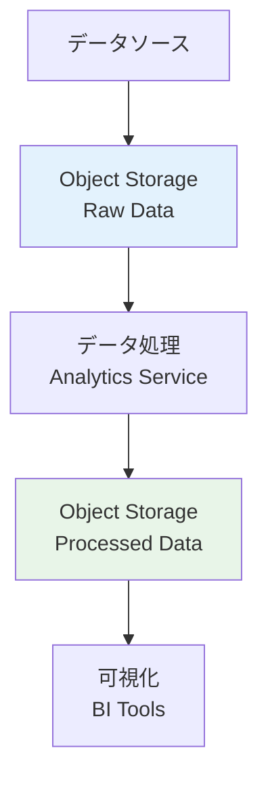

### 3.3 File Storage（ファイルストレージ）

#### ファイルストレージとは

ファイルストレージは、NFSv3プロトコルを使用した共有ファイルシステムサービスです。複数のコンピュートインスタンスから同時にアクセス可能で、従来のNASと同様の使用感を提供します。

```mermaid
graph TB
    A[File Storage] --> B[インスタンス1]
    A --> C[インスタンス2]
    A --> D[インスタンス3]
    
    B --> B1[/mnt/shared]
    C --> C1[/mnt/shared]
    D --> D1[/mnt/shared]
    
    E[共有データ] --> A
    
    style A fill:#e3f2fd
    style E fill:#e8f5e8
```

#### OCIファイルストレージの特徴

**1. 高可用性**
- 99.95%の可用性SLA
- 自動的な冗長化
- 複数ADでのレプリケーション

**2. 高性能**
- 最大2.3GB/sのスループット
- 低レイテンシアクセス
- 同時接続数制限なし

**3. 柔軟性**
- 8EB（エクサバイト）までの容量
- 動的な容量拡張
- スナップショット機能

#### ファイルシステム構成要素

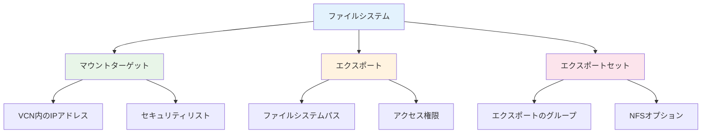

#### 設計パターン

**1. 共有アプリケーションデータ**

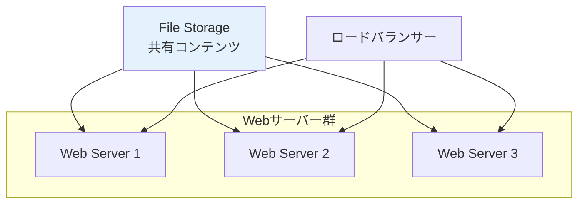

**2. 開発環境での共有**

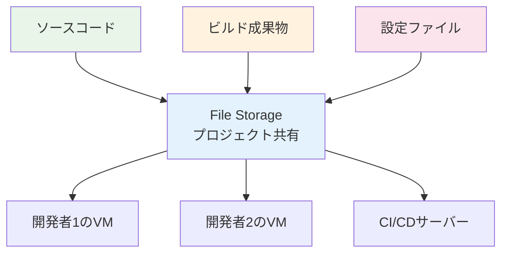

#### セキュリティ設定

**1. ネットワークセキュリティ**
```bash
# セキュリティリストでNFS通信を許可
# TCP 111, 2048-2050 (NFS)
# UDP 111, 2048 (NFS)
```

**2. エクスポートオプション**
- **root_squash**: rootユーザーのアクセス制限
- **all_squash**: 全ユーザーのアクセス制限
- **anonuid/anongid**: 匿名ユーザーのUID/GID設定

#### 使用例

**マウント設定例：**
```bash
# マウントポイント作成
sudo mkdir /mnt/shared

# NFSマウント
sudo mount -t nfs -o vers=3 \
  <mount-target-ip>:/<export-path> /mnt/shared

# 永続化設定
echo '<mount-target-ip>:/<export-path> /mnt/shared nfs vers=3,defaults 0 0' \
  | sudo tee -a /etc/fstab
```

### 3.4 Archive Storage（アーカイブストレージ）

#### アーカイブストレージとは

アーカイブストレージは、長期保存とコンプライアンス要件に特化した超低コストストレージサービスです。頻繁にアクセスしないデータの長期保管に最適です。

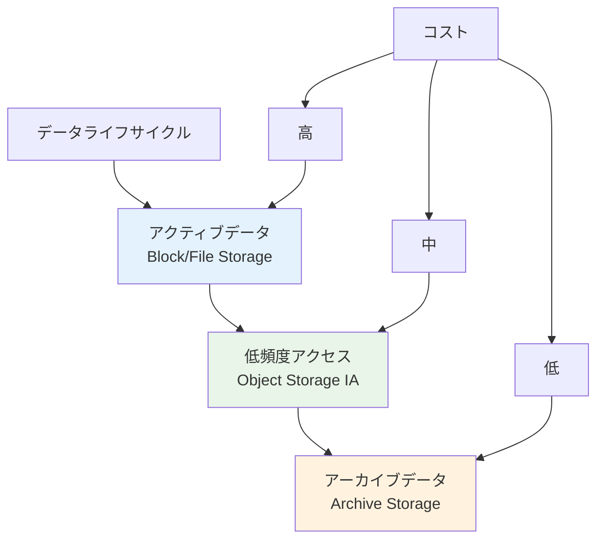

#### アーカイブストレージの特徴

**1. 超低コスト**
- 標準ストレージの1/10のコスト
- 長期保存に最適化
- 最小保存期間90日

**2. 高耐久性**
- 99.999999999%（11 9's）の耐久性
- 地理的分散レプリケーション
- 自動データ整合性チェック

**3. コンプライアンス対応**
- WORM（Write Once Read Many）
- 法的保持要件対応
- 監査ログ

#### 取得プロセス

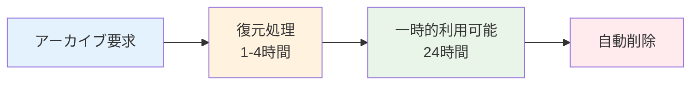

#### 使用例

**1. 法的要件対応**
- 財務記録の7年保存
- 医療記録の長期保存
- 監査ログの保管

**2. バックアップ戦略**
```mermaid
graph TB
    A[日次バックアップ] --> B[Block Storage<br/>7日保持]
    B --> C[Object Storage<br/>30日保持]
    C --> D[Archive Storage<br/>7年保持]
    
    style B fill:#e3f2fd
    style C fill:#e8f5e8
    style D fill:#fff3e0
```

### 3.5 データ移行サービス

#### データ移行の課題

大容量データのクラウド移行には、以下のような課題があります：

```mermaid
graph TB
    A[データ移行の課題] --> B[ネットワーク帯域制限]
    A --> C[移行時間の長期化]
    A --> D[セキュリティリスク]
    A --> E[コスト増大]
    
    B --> B1[インターネット回線の制限]
    B --> B2[帯域幅の競合]
    
    C --> C1[業務への影響]
    C --> C2[ダウンタイム]
    
    D --> D1[データ漏洩リスク]
    D --> D2[転送中の暗号化]
    
    E --> E1[データ転送料金]
    E --> E2[時間コスト]
    
    style A fill:#ffebee
```

#### OCIデータ移行サービス

**1. Data Transfer Service**

```mermaid
graph LR
    A[オンプレミス] --> B[データ転送アプライアンス]
    B --> C[物理輸送]
    C --> D[OCIデータセンター]
    D --> E[Object Storage]
    
    style B fill:#e3f2fd
    style C fill:#fff3e0
    style E fill:#e8f5e8
```

**特徴：**
- 150TB/480TBアプライアンス
- 暗号化された物理輸送
- ペタバイト規模の移行対応

**2. Storage Gateway**

```mermaid
graph TB
    A[オンプレミス] --> B[Storage Gateway]
    B --> C[インターネット/専用線]
    C --> D[Object Storage]
    
    E[既存アプリケーション] --> B
    F[NFS/SMBプロトコル] --> B
    
    style B fill:#e3f2fd
    style D fill:#e8f5e8
```

**3. Database Migration Service**
- Oracle Database専用移行ツール
- ゼロダウンタイム移行
- 自動データ同期

#### 移行戦略の選択

| データ量 | 推奨方法 | 移行時間 | コスト |
|---------|----------|----------|--------|
| ~1TB | インターネット | 数時間-1日 | 低 |
| 1-10TB | 専用線 | 1-3日 | 中 |
| 10-100TB | Data Transfer Service | 1-2週間 | 中 |
| 100TB+ | Data Transfer Service | 2-4週間 | 高 |

### 3.6 パフォーマンス特性と選定指針

#### ストレージ性能比較

```mermaid
graph TB
    A[性能要件] --> B[レイテンシ]
    A --> C[スループット]
    A --> D[IOPS]
    A --> E[同時接続数]
    
    B --> B1[Block: <1ms]
    B --> B2[File: 1-5ms]
    B --> B3[Object: 10-100ms]
    
    C --> C1[Block: 480MB/s]
    C --> C2[File: 2.3GB/s]
    C --> C3[Object: 無制限]
    
    D --> D1[Block: 32,000]
    D --> D2[File: 7,000]
    D --> D3[Object: N/A]
    
    E --> E1[Block: 1]
    E --> E2[File: 無制限]
    E --> E3[Object: 無制限]
    
    style B1 fill:#e8f5e8
    style C2 fill:#e8f5e8
    style C3 fill:#e8f5e8
    style E2 fill:#e8f5e8
    style E3 fill:#e8f5e8
```

#### 用途別推奨ストレージ

**1. データベース**
```mermaid
graph LR
    A[データベース要件] --> B[Block Storage<br/>Higher Performance]
    B --> C[30-120 IOPS/GB]
    B --> D[低レイテンシ]
    B --> E[高可用性]
```

**2. Webアプリケーション**
```mermaid
graph TB
    A[Webアプリケーション] --> B[静的コンテンツ]
    A --> C[アプリケーションファイル]
    A --> D[ユーザーアップロード]
    A --> E[ログファイル]
    
    B --> F[Object Storage]
    C --> G[File Storage]
    D --> H[Object Storage]
    E --> I[Object Storage IA]
    
    style F fill:#e3f2fd
    style G fill:#e8f5e8
    style H fill:#e3f2fd
    style I fill:#fff3e0
```

**3. ビッグデータ分析**
```mermaid
graph LR
    A[Raw Data] --> B[Object Storage<br/>Standard]
    B --> C[処理エンジン]
    C --> D[Object Storage<br/>結果データ]
    D --> E[Archive Storage<br/>長期保存]
    
    style B fill:#e3f2fd
    style D fill:#e8f5e8
    style E fill:#fff3e0
```

#### コスト最適化戦略

**1. ストレージクラス最適化**

```mermaid
graph TB
    A[コスト最適化] --> B[ライフサイクル管理]
    A --> C[重複排除]
    A --> D[圧縮]
    A --> E[適切なサイジング]
    
    B --> B1[自動階層化]
    B --> B2[古いデータの削除]
    
    C --> C1[同一データの統合]
    
    D --> D1[データ圧縮]
    D --> D2[転送量削減]
    
    E --> E1[使用量監視]
    E --> E2[容量計画]
    
    style A fill:#e8f5e8
```

**2. 監視とアラート**
- 使用量の定期監視
- 閾値アラートの設定
- コスト分析レポート

### まとめ

第3章では、OCIのストレージサービスについて詳しく解説しました。各ストレージサービスの特徴を理解し、用途に応じた適切な選択が重要です。

**重要ポイント：**
1. **Block Storage**: 高性能が必要なデータベースやアプリケーション
2. **Object Storage**: スケーラブルで耐久性の高いデータ保存
3. **File Storage**: 複数インスタンスでの共有ファイルシステム
4. **Archive Storage**: 長期保存とコンプライアンス対応
5. **適切な選択**: 性能、コスト、可用性要件のバランス

次章では、これらのストレージサービスを含むシステム全体を支えるネットワーキングサービスについて学習します。