# Oracle Cloud Infrastructure (OCI) 学習ガイドブック

## 第4章 ネットワーキングサービス

### はじめに

第3章でストレージサービスについて学習しました。本章では、OCIの基盤となるネットワーキングサービスについて詳しく解説します。ネットワークは、クラウドインフラストラクチャの神経系とも言える重要な要素で、セキュリティ、性能、可用性のすべてに影響を与えます。

### ネットワーキングの基本概念

#### なぜクラウドネットワーキングが重要なのか

従来のオンプレミス環境では、物理的なネットワーク機器（スイッチ、ルーター、ファイアウォール）を購入・設置・設定する必要がありました。しかし、クラウド環境では、これらがすべてソフトウェアで定義され、APIやコンソールから管理できます。

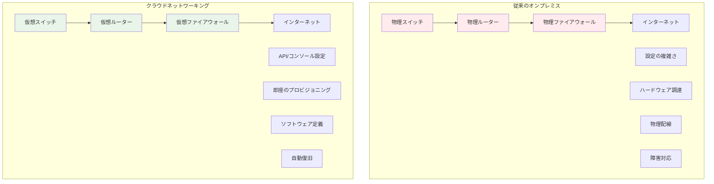

#### ネットワーキングの基本要素

クラウドネットワーキングを理解するために、まず基本的な概念を整理しましょう：

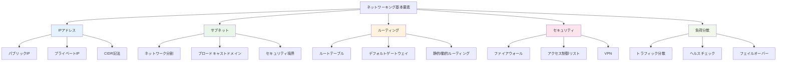

#### IPアドレスとCIDR記法の詳細解説

**IPアドレスの基本：**

IPアドレスは、ネットワーク上のデバイスを識別するための32ビット（IPv4）の数値です。通常は4つのオクテット（8ビットずつ）に分けて表記されます。

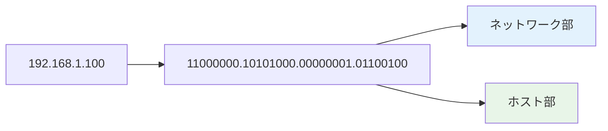

**CIDR記法の理解：**

CIDR（Classless Inter-Domain Routing）記法は、ネットワークアドレスとサブネットマスクを組み合わせた表記法です。

| CIDR | サブネットマスク | 利用可能IP数 | 用途例 |
|------|----------------|-------------|--------|
| /8 | 255.0.0.0 | 16,777,214 | 大規模ネットワーク |
| /16 | 255.255.0.0 | 65,534 | 中規模ネットワーク |
| /24 | 255.255.255.0 | 254 | 小規模ネットワーク |
| /28 | 255.255.255.240 | 14 | 極小ネットワーク |

**サブネット設計例：**

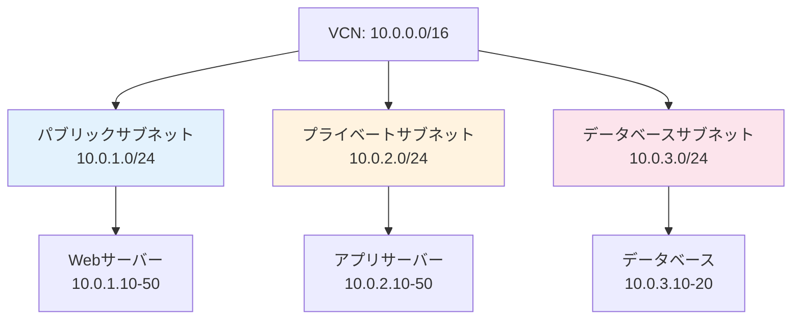

### 4.1 Virtual Cloud Networks (VCN)

#### VCNとは

Virtual Cloud Network（VCN）は、OCIにおける仮想ネットワークの基盤です。従来のデータセンターネットワークをクラウド上で再現し、完全に分離された専用ネットワーク環境を提供します。

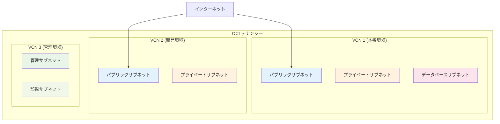

#### VCNの主要コンポーネント

**1. サブネット（Subnet）**

サブネットは、VCN内のIPアドレス範囲を分割したものです。セキュリティとトラフィック制御の基本単位となります。

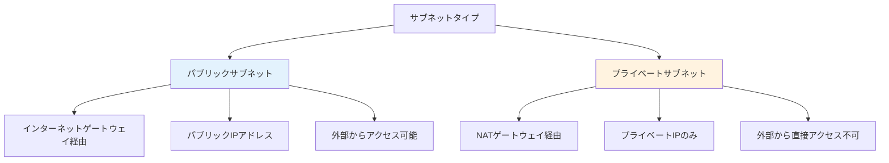

**サブネット設計のベストプラクティス：**

| 層 | サブネットタイプ | 用途 | セキュリティレベル |
|----|----------------|------|-------------------|
| Web層 | パブリック | ロードバランサー、Webサーバー | 中 |
| App層 | プライベート | アプリケーションサーバー | 高 |
| DB層 | プライベート | データベースサーバー | 最高 |
| 管理層 | プライベート | 踏み台サーバー、監視 | 高 |

**2. ルートテーブル（Route Table）**

ルートテーブルは、ネットワークトラフィックの経路を定義します。各サブネットには必ずルートテーブルが関連付けられます。

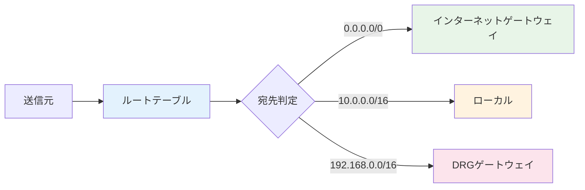

**ルートテーブル設定例：**

```bash
# パブリックサブネット用ルートテーブル
宛先CIDR: 0.0.0.0/0 → ターゲット: インターネットゲートウェイ
宛先CIDR: 10.0.0.0/16 → ターゲット: ローカル

# プライベートサブネット用ルートテーブル
宛先CIDR: 0.0.0.0/0 → ターゲット: NATゲートウェイ
宛先CIDR: 10.0.0.0/16 → ターゲット: ローカル
宛先CIDR: 192.168.0.0/16 → ターゲット: DRG
```

**3. セキュリティリスト（Security List）**

セキュリティリストは、サブネットレベルでのファイアウォール機能を提供します。インバウンド（受信）とアウトバウンド（送信）のトラフィックを制御できます。

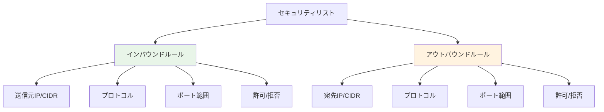

**セキュリティリスト設定例：**

| 方向 | プロトコル | 送信元/宛先 | ポート | 用途 |
|------|-----------|------------|--------|------|
| インバウンド | TCP | 0.0.0.0/0 | 80 | HTTP |
| インバウンド | TCP | 0.0.0.0/0 | 443 | HTTPS |
| インバウンド | TCP | 10.0.0.0/16 | 22 | SSH（内部のみ） |
| アウトバウンド | TCP | 0.0.0.0/0 | 80,443 | HTTP/HTTPS |
| アウトバウンド | TCP | 10.0.2.0/24 | 3306 | MySQL |

#### VCN設計パターン

**1. 単一VCN構成（小規模）**

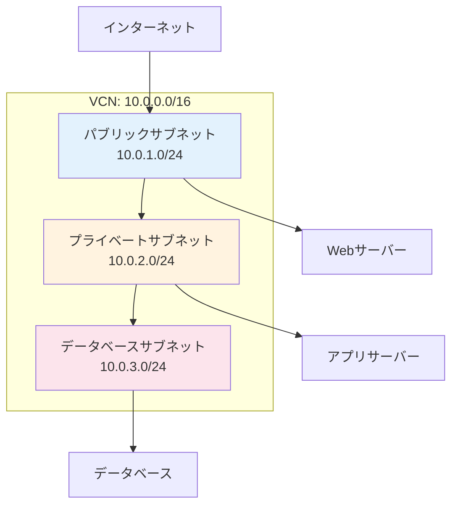

**2. 複数VCN構成（大規模）**

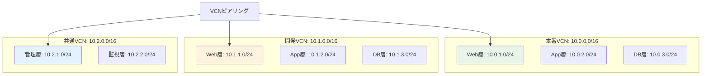

#### ゲートウェイの詳細

**1. インターネットゲートウェイ（Internet Gateway）**

インターネットゲートウェイは、VCNとインターネット間の通信を可能にします。


**特徴：**
- VCNあたり1つまで
- パブリックIPアドレスが必要
- ステートフル通信

**2. NATゲートウェイ（NAT Gateway）**

NATゲートウェイは、プライベートサブネットからインターネットへの一方向通信を可能にします。


**用途：**
- ソフトウェア更新
- 外部APIアクセス
- ログ送信

**3. サービスゲートウェイ（Service Gateway）**

サービスゲートウェイは、OCIサービスへのプライベート接続を提供します。

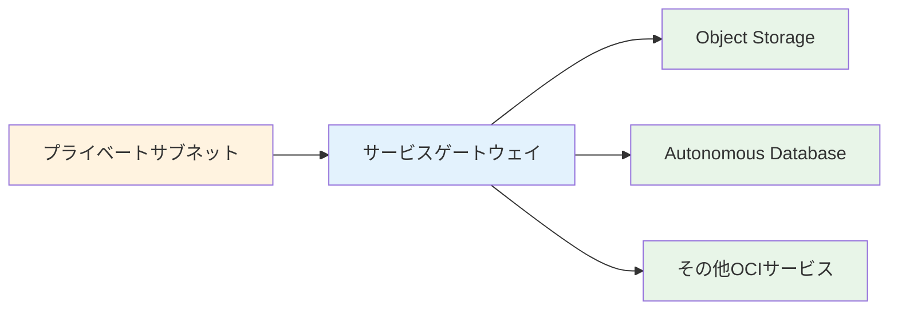

**利点：**
- インターネット経由不要
- 高速・低レイテンシ
- データ転送料金なし

#### VCN作成の実践例

**1. VCN作成（CLI）**

```bash
# VCN作成
oci network vcn create \
  --compartment-id <compartment-id> \
  --display-name "production-vcn" \
  --cidr-block "10.0.0.0/16" \
  --dns-label "prodvcn"

# インターネットゲートウェイ作成
oci network internet-gateway create \
  --compartment-id <compartment-id> \
  --vcn-id <vcn-id> \
  --display-name "production-igw" \
  --is-enabled true

# パブリックサブネット作成
oci network subnet create \
  --compartment-id <compartment-id> \
  --vcn-id <vcn-id> \
  --display-name "public-subnet" \
  --cidr-block "10.0.1.0/24" \
  --route-table-id <route-table-id> \
  --security-list-ids '["<security-list-id>"]' \
  --dns-label "public"
```

**2. セキュリティリスト設定**

```bash
# HTTPアクセス許可ルール追加
oci network security-list update \
  --security-list-id <security-list-id> \
  --ingress-security-rules '[
    {
      "protocol": "6",
      "source": "0.0.0.0/0",
      "tcpOptions": {
        "destinationPortRange": {
          "min": 80,
          "max": 80
        }
      }
    }
  ]'
```

### 4.2 Load Balancer（ロードバランサー）

#### ロードバランサーとは

ロードバランサーは、複数のサーバーに対してトラフィックを分散し、システムの可用性と性能を向上させるサービスです。単一障害点を排除し、スケーラビリティを実現します。

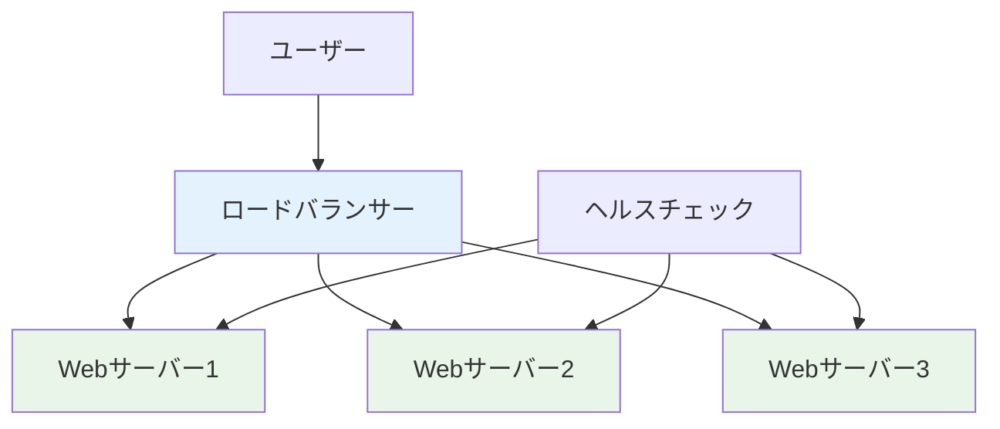

#### ロードバランサーの必要性

**従来の単一サーバー構成の問題：**

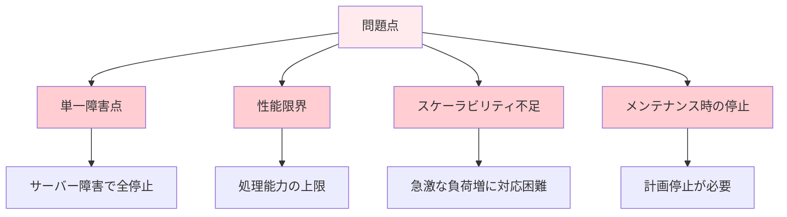

**ロードバランサーによる解決：**

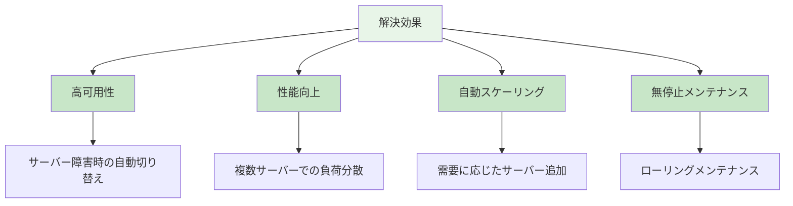

#### OCIロードバランサーの種類

**1. Network Load Balancer（Layer 4）**

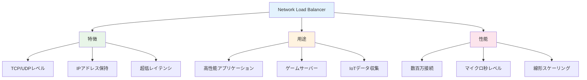

**2. Application Load Balancer（Layer 7）**

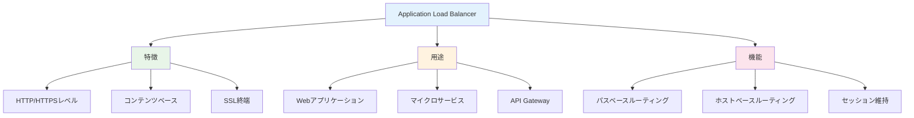

#### ロードバランシングアルゴリズム

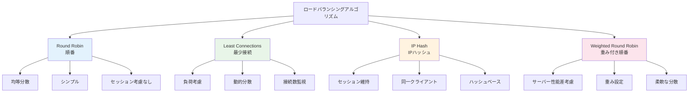

#### ヘルスチェック機能

ヘルスチェックは、バックエンドサーバーの健全性を監視し、障害サーバーを自動的に切り離す機能です。

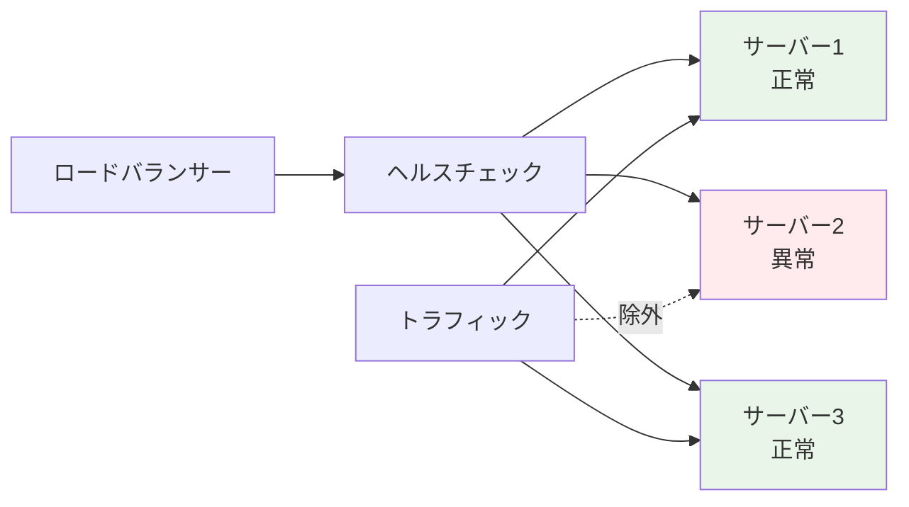

**ヘルスチェック設定パラメータ：**

| パラメータ | 説明 | 推奨値 |
|-----------|------|--------|
| **プロトコル** | HTTP/HTTPS/TCP | HTTP |
| **ポート** | チェック対象ポート | 80/443 |
| **パス** | チェック対象URL | /health |
| **間隔** | チェック間隔（秒） | 30 |
| **タイムアウト** | 応答待ち時間（秒） | 5 |
| **再試行回数** | 失敗判定までの回数 | 3 |
| **成功回数** | 復旧判定までの回数 | 2 |

#### SSL/TLS終端

ロードバランサーでSSL/TLS終端を行うことで、バックエンドサーバーの負荷を軽減できます。

```mermaid
graph LR
    A[クライアント] -->|HTTPS| B[ロードバランサー]
    B -->|HTTP| C[サーバー1]
    B -->|HTTP| D[サーバー2]
    B -->|HTTP| E[サーバー3]
    
    F[SSL証明書] --> B
    
    style B fill:#e3f2fd
    style F fill:#e8f5e8
```

**SSL設定の利点：**
1. **サーバー負荷軽減**: SSL処理をロードバランサーで実行
2. **証明書管理の簡素化**: 1箇所での証明書管理
3. **セキュリティ強化**: 最新のTLSプロトコル対応

#### 実装例

**1. Application Load Balancer作成**

```bash
# ロードバランサー作成
oci lb load-balancer create \
  --compartment-id <compartment-id> \
  --display-name "web-app-lb" \
  --shape-name "100Mbps" \
  --subnet-ids '["<subnet-id-1>", "<subnet-id-2>"]' \
  --is-private false

# バックエンドセット作成
oci lb backend-set create \
  --load-balancer-id <lb-id> \
  --name "web-backend-set" \
  --policy "ROUND_ROBIN" \
  --health-checker-protocol "HTTP" \
  --health-checker-port 80 \
  --health-checker-url-path "/health"

# バックエンド追加
oci lb backend create \
  --load-balancer-id <lb-id> \
  --backend-set-name "web-backend-set" \
  --ip-address "10.0.1.10" \
  --port 80 \
  --weight 1
```

**2. リスナー設定**

```bash
# HTTPリスナー作成
oci lb listener create \
  --load-balancer-id <lb-id> \
  --name "http-listener" \
  --default-backend-set-name "web-backend-set" \
  --port 80 \
  --protocol "HTTP"

# HTTPSリスナー作成（SSL証明書必要）
oci lb listener create \
  --load-balancer-id <lb-id> \
  --name "https-listener" \
  --default-backend-set-name "web-backend-set" \
  --port 443 \
  --protocol "HTTP" \
  --ssl-certificate-name "my-ssl-cert"
```

### 4.3 DNS Management（DNS管理）

#### DNSとは

DNS（Domain Name System）は、人間が理解しやすいドメイン名（例：www.example.com）をコンピューターが理解できるIPアドレス（例：192.168.1.100）に変換するシステムです。

```mermaid
graph LR
    A[ユーザー] -->|www.example.com| B[DNSリゾルバー]
    B -->|DNS問い合わせ| C[DNSサーバー]
    C -->|192.168.1.100| B
    B -->|IPアドレス| A
    A -->|HTTP接続| D[Webサーバー<br/>192.168.1.100]
    
    style B fill:#e3f2fd
    style C fill:#e8f5e8
    style D fill:#fff3e0
```

#### DNS階層構造

DNSは階層構造になっており、効率的な名前解決を実現しています：

```mermaid
graph TB
    A["ルートドメイン ."] --> B["トップレベルドメイン .com"]
    A --> C["トップレベルドメイン .org"]
    A --> D["トップレベルドメイン .jp"]
    
    B --> E["セカンドレベルドメイン example.com"]
    D --> F["セカンドレベルドメイン example.co.jp"]
    
    E --> G["サブドメイン www.example.com"]
    E --> H["サブドメイン mail.example.com"]
    E --> I["サブドメイン api.example.com"]
    
    style A fill:#e3f2fd
    style B fill:#e8f5e8
    style E fill:#fff3e0
    style G fill:#fce4ec
```

#### OCIのDNS管理機能

**1. パブリックDNS**

```mermaid
graph TB
    A[OCI DNS Management] --> B[ゾーン管理]
    A --> C[レコード管理]
    A --> D[トラフィック管理]
    
    B --> B1[プライマリゾーン]
    B --> B2[セカンダリゾーン]
    
    C --> C1[Aレコード]
    C --> C2[CNAMEレコード]
    C --> C3[MXレコード]
    C --> C4[TXTレコード]
    
    D --> D1[地理的ルーティング]
    D --> D2[重み付きルーティング]
    D --> D3[ヘルスチェック]
    
    style B fill:#e3f2fd
    style C fill:#e8f5e8
    style D fill:#fff3e0
```

**2. プライベートDNS**

```mermaid
graph TB
    A[プライベートDNS] --> B[VCN内名前解決]
    A --> C[カスタムドメイン]
    A --> D[内部サービス発見]
    
    B --> B1[インスタンス名]
    B --> B2[サービス名]
    
    C --> C1[internal.company.com]
    C --> C2[dev.internal.com]
    
    D --> D1[マイクロサービス]
    D --> D2[データベース接続]
    
    style A fill:#e3f2fd
    style B fill:#e8f5e8
    style C fill:#fff3e0
    style D fill:#fce4ec
```

#### DNSレコードタイプ

| レコードタイプ | 用途 | 例 |
|---------------|------|-----|
| **A** | IPv4アドレス | www.example.com → 192.168.1.100 |
| **AAAA** | IPv6アドレス | www.example.com → 2001:db8::1 |
| **CNAME** | 別名 | blog.example.com → www.example.com |
| **MX** | メールサーバー | example.com → mail.example.com |
| **TXT** | テキスト情報 | SPF、DKIM設定 |
| **SRV** | サービス情報 | _http._tcp.example.com |

#### トラフィック管理

OCIのDNSトラフィック管理機能により、高度なルーティング制御が可能です：

**1. 地理的ルーティング**

```mermaid
graph TB
    A[グローバルユーザー] --> B[DNS問い合わせ]
    B --> C{地理的判定}
    
    C -->|日本| D[東京リージョン<br/>asia.example.com]
    C -->|アメリカ| E[アッシュバーンリージョン<br/>us.example.com]
    C -->|ヨーロッパ| F[フランクフルトリージョン<br/>eu.example.com]
    
    style C fill:#e3f2fd
    style D fill:#e8f5e8
    style E fill:#fff3e0
    style F fill:#fce4ec
```

**2. 重み付きルーティング**

```mermaid
graph LR
    A[DNS問い合わせ] --> B{重み付き分散}
    
    B -->|70%| C[メインサーバー]
    B -->|20%| D[サブサーバー1]
    B -->|10%| E[サブサーバー2]
    
    style B fill:#e3f2fd
    style C fill:#e8f5e8
    style D fill:#fff3e0
    style E fill:#fce4ec
```

#### DNS設定例

**1. ゾーン作成**

```bash
# DNSゾーン作成
oci dns zone create \
  --compartment-id <compartment-id> \
  --name "example.com" \
  --zone-type "PRIMARY"

# Aレコード追加
oci dns record update \
  --zone-name-or-id "example.com" \
  --domain "www.example.com" \
  --rtype "A" \
  --rdata "192.168.1.100" \
  --ttl 300
```

**2. ロードバランサーとの統合**

```bash
# ロードバランサーのIPアドレスをDNSに登録
oci dns record update \
  --zone-name-or-id "example.com" \
  --domain "app.example.com" \
  --rtype "A" \
  --rdata "<load-balancer-ip>" \
  --ttl 60
```

### 4.4 FastConnect（専用線接続）

#### FastConnectとは

FastConnectは、オンプレミス環境とOCI間を専用線で接続するサービスです。インターネットを経由しない安全で高速な接続を提供します。

```mermaid
graph LR
    A[オンプレミス] --> B[専用線]
    B --> C[FastConnect]
    C --> D[OCI VCN]
    
    E[インターネット] -.->|迂回| A
    E -.->|迂回| D
    
    style B fill:#e3f2fd
    style C fill:#e8f5e8
    style D fill:#fff3e0
```

#### FastConnectの利点

```mermaid
graph TB
    A[FastConnect利点] --> B[高速性]
    A --> C[安定性]
    A --> D[セキュリティ]
    A --> E[コスト効率]
    
    B --> B1[最大10Gbps]
    B --> B2[低レイテンシ]
    B --> B3[帯域保証]
    
    C --> C1[専用回線]
    C --> C2[SLA保証]
    C --> C3[冗長化対応]
    
    D --> D1[プライベート接続]
    D --> D2[暗号化不要]
    D --> D3[ネットワーク分離]
    
    E --> E1[データ転送料金削減]
    E --> E2[予測可能なコスト]
    
    style B fill:#e3f2fd
    style C fill:#e8f5e8
    style D fill:#fff3e0
    style E fill:#fce4ec
```

#### 接続オプション

**1. 専用ポート（Dedicated Port）**

```mermaid
graph LR
    A[顧客データセンター] --> B[通信事業者]
    B --> C[OCIデータセンター]
    C --> D[専用ポート]
    D --> E[VCN]
    
    style D fill:#e3f2fd
    style E fill:#e8f5e8
```

**2. 共有ポート（Shared Port）**

```mermaid
graph TB
    A[顧客A] --> B[パートナー]
    C[顧客B] --> B
    D[顧客C] --> B
    
    B --> E[共有ポート]
    E --> F[OCI]
    
    style B fill:#e3f2fd
    style E fill:#e8f5e8
    style F fill:#fff3e0
```

#### 冗長化設計

```mermaid
graph TB
    subgraph "オンプレミス"
        A1[ルーター1]
        A2[ルーター2]
    end
    
    subgraph "FastConnect"
        B1[接続1]
        B2[接続2]
    end
    
    subgraph "OCI"
        C1[DRG1]
        C2[DRG2]
        D[VCN]
    end
    
    A1 --> B1
    A2 --> B2
    B1 --> C1
    B2 --> C2
    C1 --> D
    C2 --> D
    
    style B1 fill:#e3f2fd
    style B2 fill:#e8f5e8
    style D fill:#fff3e0
```

### 4.5 VPN Connect（VPN接続）

#### VPN Connectとは

VPN Connectは、インターネット経由でオンプレミス環境とOCIを安全に接続するサービスです。IPsecプロトコルを使用して暗号化された通信を提供します。

```mermaid
graph LR
    A[オンプレミス] -->|暗号化トンネル| B[インターネット]
    B -->|IPsec VPN| C[OCI VPN Gateway]
    C --> D[VCN]
    
    style A fill:#e3f2fd
    style C fill:#e8f5e8
    style D fill:#fff3e0
```

#### VPNの種類

**1. Site-to-Site VPN**

```mermaid
graph LR
    A[本社ネットワーク] --> B[VPNゲートウェイ]
    B --> C[インターネット]
    C --> D[OCI VPN Gateway]
    D --> E[VCN]
    
    style B fill:#e3f2fd
    style D fill:#e8f5e8
```

**2. Client VPN（リモートアクセス）**

```mermaid
graph TB
    A[リモートワーカー] --> B[VPNクライアント]
    B --> C[インターネット]
    C --> D[OCI VPN Gateway]
    D --> E[VCN]
    
    style B fill:#e3f2fd
    style D fill:#e8f5e8
```

#### VPN設定パラメータ

| パラメータ | 説明 | 推奨値 |
|-----------|------|--------|
| **暗号化アルゴリズム** | データ暗号化方式 | AES-256 |
| **認証アルゴリズム** | データ整合性確認 | SHA-256 |
| **DH Group** | 鍵交換方式 | Group 14 |
| **PFS** | Perfect Forward Secrecy | 有効 |
| **Dead Peer Detection** | 接続監視 | 有効 |

#### VPN設定例

```bash
# VPN接続作成
oci network ip-sec-connection create \
  --compartment-id <compartment-id> \
  --cpe-id <cpe-id> \
  --drg-id <drg-id> \
  --display-name "office-vpn" \
  --static-routes '["192.168.0.0/16"]'

# トンネル設定確認
oci network ip-sec-connection-tunnel get \
  --ipsc-id <ipsec-connection-id> \
  --tunnel-id <tunnel-id>
```

### 4.6 ネットワーク設計パターン

#### 基本的な3層アーキテクチャ

```mermaid
graph TB
    subgraph "パブリックサブネット"
        A[ロードバランサー]
        B[Webサーバー]
    end
    
    subgraph "プライベートサブネット"
        C[アプリケーションサーバー]
    end
    
    subgraph "データベースサブネット"
        D[データベースサーバー]
    end
    
    E[インターネット] --> A
    A --> B
    B --> C
    C --> D
    
    style A fill:#e3f2fd
    style B fill:#e8f5e8
    style C fill:#fff3e0
    style D fill:#fce4ec
```

#### ハイブリッドクラウド構成

```mermaid
graph TB
    subgraph "オンプレミス"
        A[既存システム]
        B[データベース]
    end
    
    subgraph "OCI"
        C[新規アプリケーション]
        D[バックアップシステム]
    end
    
    A -.->|FastConnect/VPN| C
    B -.->|データ同期| D
    
    style A fill:#e3f2fd
    style C fill:#e8f5e8
    style D fill:#fff3e0
```

#### マルチリージョン構成

```mermaid
graph TB
    subgraph "東京リージョン"
        A1[プライマリシステム]
        A2[プライマリDB]
    end
    
    subgraph "大阪リージョン"
        B1[セカンダリシステム]
        B2[セカンダリDB]
    end
    
    C[グローバルロードバランサー] --> A1
    C --> B1
    A2 -.->|レプリケーション| B2
    
    style C fill:#e3f2fd
    style A1 fill:#e8f5e8
    style B1 fill:#fff3e0
```

### まとめ

第4章では、OCIのネットワーキングサービスについて詳しく解説しました。適切なネットワーク設計は、システムの性能、セキュリティ、可用性を決定する重要な要素です。

**重要ポイント：**
1. **VCN**: 仮想ネットワークの基盤設計
2. **Load Balancer**: 高可用性と性能向上
3. **DNS**: 名前解決とトラフィック制御
4. **FastConnect**: 高速・安全な専用線接続
5. **VPN**: インターネット経由の暗号化接続
6. **設計パターン**: 要件に応じた適切なアーキテクチャ選択

次章では、これらのネットワーク上で動作するデータベースサービスについて学習します。