# Oracle Cloud Infrastructure (OCI) 学習ガイドブック

## 第5章 データベースサービス

### はじめに

第4章でネットワーキングサービスについて学習しました。本章では、アプリケーションの心臓部とも言えるデータベースサービスについて詳しく解説します。データベースは、企業の重要な情報資産を格納・管理する基盤であり、適切な選択と設計が事業の成功を左右します。OCIでは、従来のリレーショナルデータベースから最新のNoSQLデータベースまで、幅広いデータベースサービスを提供しています。

### データベースの基本概念

#### なぜデータベースが重要なのか

現代のビジネスにおいて、データは石油に例えられるほど価値のある資産です。適切なデータベース戦略なしには、以下のようなリスクが発生します：

```mermaid
graph TB
    A[不適切なデータベース戦略] --> B[データ損失リスク]
    A --> C[性能問題]
    A --> D[スケーラビリティ限界]
    A --> E[セキュリティ脆弱性]
    A --> F[高運用コスト]
    
    B --> B1[ハードウェア障害]
    B --> B2[人的ミス]
    B --> B3[災害・事故]
    B --> B4[データ破損]
    
    C --> C1[応答時間の悪化]
    C --> C2[同時接続数制限]
    C --> C3[バッチ処理の遅延]
    C --> C4[ユーザー体験の悪化]
    
    D --> D1[データ量増加への対応困難]
    D --> D2[ユーザー数増加への対応困難]
    D --> D3[地理的拡張の困難]
    
    E --> E1[不正アクセス]
    E --> E2[データ漏洩]
    E --> E3[コンプライアンス違反]
    
    F --> F1[24/7運用体制]
    F --> F2[専門人材の確保]
    F --> F3[ライセンス費用]
    F --> F4[インフラ維持費用]
    
    style A fill:#ffebee
    style B fill:#ffcdd2
    style C fill:#ffcdd2
    style D fill:#ffcdd2
    style E fill:#ffcdd2
    style F fill:#ffcdd2
```

#### データベースの分類

データベースは、データモデルと用途によって以下のように分類されます：

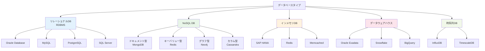

#### ACID特性とCAP定理

**ACID特性（リレーショナルDBの基本原則）：**

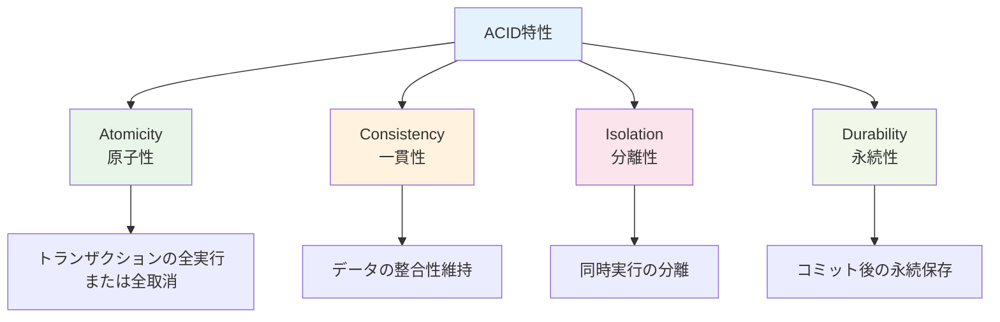

**CAP定理（分散システムの制約）：**

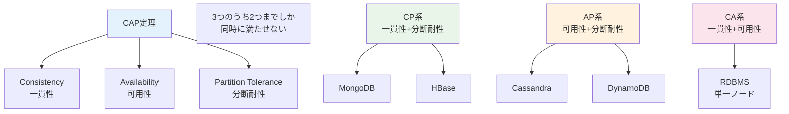

### 5.1 Autonomous Database（自律型データベース）

#### Autonomous Databaseとは

Autonomous Databaseは、機械学習を活用してデータベースの運用を自動化するOracleの革新的なサービスです。従来のデータベース管理で必要だった多くの作業を自動化し、人的ミスを排除しながら最適な性能を提供します。

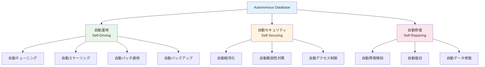

#### 従来のデータベース運用との比較

**従来のデータベース運用：**

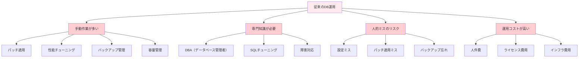

**Autonomous Databaseの運用：**

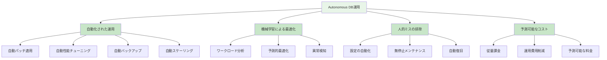

#### Autonomous Databaseの種類

**1. Autonomous Transaction Processing (ATP)**

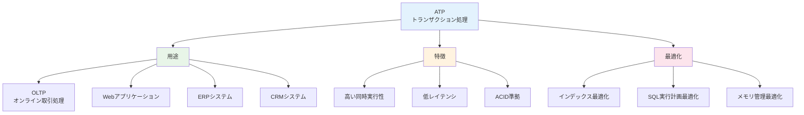

**2. Autonomous Data Warehouse (ADW)**

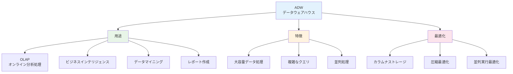

**3. Autonomous JSON Database (AJD)**

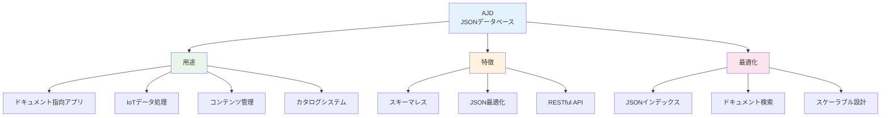

#### 主要機能の詳細

**1. 自動スケーリング**

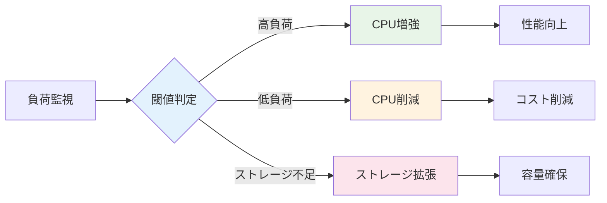

**スケーリングパラメータ：**

| パラメータ | 説明 | 設定範囲 | 自動調整 |
|-----------|------|----------|----------|
| **OCPU数** | CPU処理能力 | 1-128 OCPU | ○ |
| **ストレージ** | データ容量 | 20GB-128TB | ○ |
| **自動スケーリング** | 負荷に応じた調整 | ON/OFF | - |
| **最大OCPU** | スケーリング上限 | 1-128 OCPU | - |

**2. 自動バックアップ**

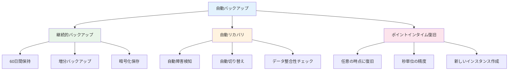

**3. 自動パッチ適用**

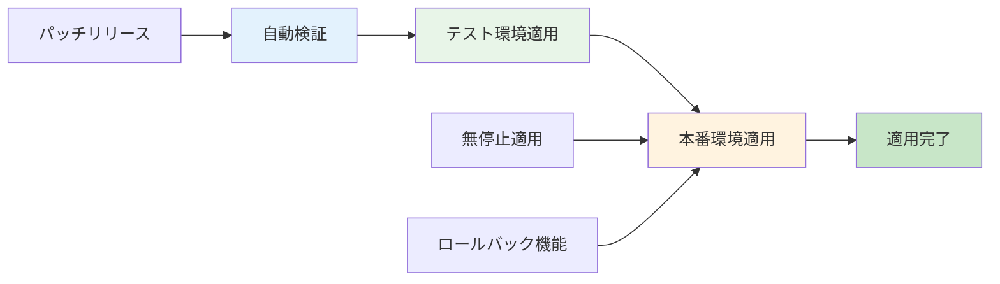

#### セキュリティ機能

**1. 多層防御アーキテクチャ**

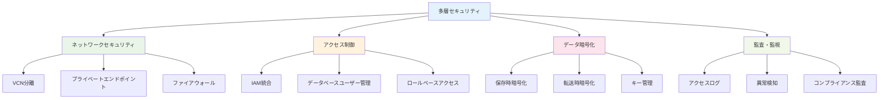

**2. Data Safe統合**

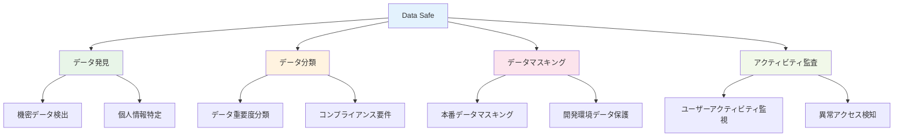

#### 実装例

**1. ATP作成**

```bash
# Autonomous Transaction Processing作成
oci db autonomous-database create \
  --compartment-id <compartment-id> \
  --db-name "myapp-atp" \
  --display-name "MyApp Production ATP" \
  --cpu-core-count 2 \
  --data-storage-size-in-tbs 1 \
  --admin-password "<strong-password>" \
  --db-workload "OLTP" \
  --is-auto-scaling-enabled true \
  --is-dedicated false
```

**2. 接続設定**

```python
import cx_Oracle

# 接続文字列設定
dsn = cx_Oracle.makedsn(
    host="<atp-hostname>",
    port=1522,
    service_name="<service-name>"
)

# SSL接続
connection = cx_Oracle.connect(
    user="admin",
    password="<password>",
    dsn=dsn,
    encoding="UTF-8"
)

# クエリ実行例
cursor = connection.cursor()
cursor.execute("SELECT * FROM employees WHERE department_id = :dept_id", 
               dept_id=10)
results = cursor.fetchall()
```

**3. 自動スケーリング設定**

```bash
# 自動スケーリング有効化
oci db autonomous-database update \
  --autonomous-database-id <adb-id> \
  --is-auto-scaling-enabled true \
  --cpu-core-count 4

# スケーリング履歴確認
oci db autonomous-database list-autonomous-database-clones \
  --autonomous-database-id <adb-id>
```

### 5.2 Database Cloud Service（従来型データベース）

#### Database Cloud Serviceとは

Database Cloud Serviceは、従来のOracle Databaseをクラウド環境で提供するサービスです。オンプレミスのOracle Databaseと完全な互換性を持ちながら、クラウドの利点を活用できます。

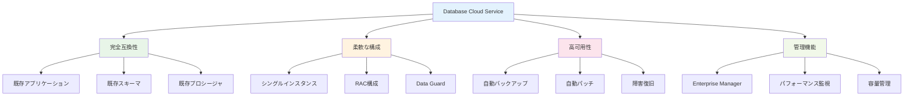

#### デプロイメントオプション

**1. Virtual Machine (VM)**

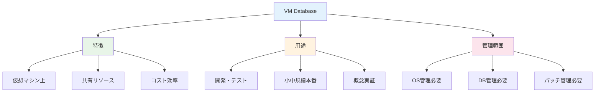

**2. Bare Metal**

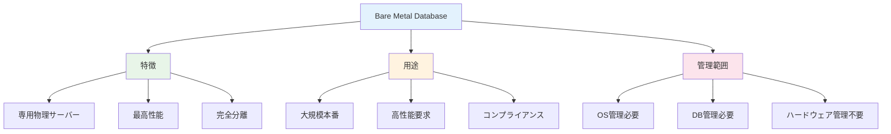

**3. Exadata Cloud Service**

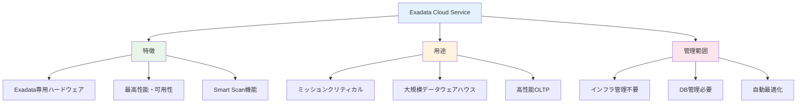

#### 高可用性構成

**1. Oracle Real Application Clusters (RAC)**

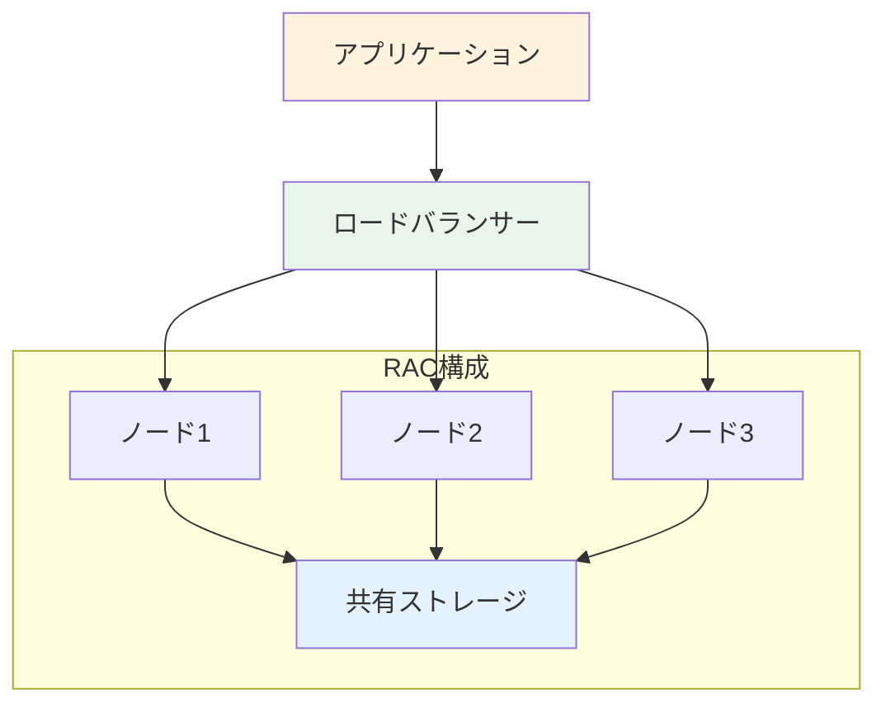

**RACの利点：**
- **高可用性**: ノード障害時の自動フェイルオーバー
- **スケーラビリティ**: ノード追加による性能向上
- **負荷分散**: 複数ノードでの処理分散

**2. Oracle Data Guard**

```mermaid
graph LR
    A[プライマリDB<br/>東京] --> B[スタンバイDB<br/>大阪]
    B -.->|フェイルオーバー| A
    
    C[アプリケーション] --> A
    C -.->|災害時| B
    
    style A fill:#e8f5e8
    style B fill:#fff3e0
    style C fill:#e3f2fd
```

**Data Guardの機能：**
- **自動同期**: リアルタイムデータ同期
- **自動フェイルオーバー**: 障害時の自動切り替え
- **読み取り専用アクセス**: スタンバイでの読み取り処理

#### パフォーマンスチューニング

**1. 自動ワークロード管理**

```mermaid
graph TB
    A[AWR<br/>Automatic Workload Repository] --> B[統計情報収集]
    A --> C[性能分析]
    A --> D[推奨事項生成]
    
    B --> B1[SQL実行統計]
    B --> B2[システムリソース使用率]
    B --> B3[待機イベント]
    
    C --> C1[ボトルネック特定]
    C --> C2[トレンド分析]
    C --> C3[比較分析]
    
    D --> D1[SQLチューニング]
    D --> D2[インデックス推奨]
    D --> D3[パラメータ調整]
    
    style A fill:#e3f2fd
    style B fill:#e8f5e8
    style C fill:#fff3e0
    style D fill:#fce4ec
```

**2. SQL Performance Analyzer**

```mermaid
graph LR
    A[本番SQL] --> B[キャプチャ]
    B --> C[テスト環境実行]
    C --> D[性能比較]
    D --> E[推奨事項]
    
    style B fill:#e3f2fd
    style C fill:#e8f5e8
    style D fill:#fff3e0
    style E fill:#c8e6c8
```

#### 移行戦略

**1. リフト&シフト移行**

```mermaid
graph LR
    A[オンプレミス<br/>Oracle DB] --> B[データエクスポート]
    B --> C[OCI DB作成]
    C --> D[データインポート]
    D --> E[アプリケーション接続]
    
    style A fill:#ffebee
    style E fill:#e8f5e8
```

**2. ハイブリッド移行**

```mermaid
graph TB
    A[段階的移行] --> B[フェーズ1<br/>読み取り専用]
    A --> C[フェーズ2<br/>一部機能]
    A --> D[フェーズ3<br/>完全移行]
    
    B --> B1[レポート機能]
    C --> C1[新機能]
    D --> D1[全機能]
    
    style B fill:#fff3e0
    style C fill:#e8f5e8
    style D fill:#c8e6c8
```

#### 実装例

**1. Database作成**

```bash
# VM Database作成
oci db database create \
  --db-home-id <db-home-id> \
  --database '{
    "adminPassword": "<password>",
    "dbName": "PRODDB",
    "characterSet": "AL32UTF8",
    "ncharacterSet": "AL16UTF16",
    "dbWorkload": "OLTP"
  }'
```

**2. バックアップ設定**

```bash
# 自動バックアップ有効化
oci db database update \
  --database-id <database-id> \
  --db-backup-config '{
    "autoBackupEnabled": true,
    "recoveryWindowInDays": 30,
    "autoBackupWindow": "SLOT_TWO"
  }'
```

### 5.3 MySQL Database Service

#### MySQL Database Serviceとは

MySQL Database Serviceは、世界で最も人気のあるオープンソースデータベースであるMySQLをクラウドで提供するフルマネージドサービスです。HeatWave統合により、OLTP（トランザクション処理）とOLAP（分析処理）を単一のサービスで実現できます。

```mermaid
graph TB
    A[MySQL Database Service] --> B[フルマネージド]
    A --> C[HeatWave統合]
    A --> D[高性能]
    A --> E[MySQL互換]
    
    B --> B1[自動バックアップ]
    B --> B2[自動パッチ]
    B --> B3[自動監視]
    B --> B4[自動スケーリング]
    
    C --> C1[リアルタイム分析]
    C --> C2[機械学習]
    C --> C3[単一データベース]
    
    D --> D1[インメモリ処理]
    D --> D2[並列処理]
    D --> D3[カラムナストレージ]
    
    E --> E1[既存アプリケーション]
    E --> E2[標準SQL]
    E --> E3[豊富なエコシステム]
    
    style A fill:#e3f2fd
    style B fill:#e8f5e8
    style C fill:#fff3e0
    style D fill:#fce4ec
    style E fill:#f1f8e9
```

#### HeatWaveエンジンの革新性

**従来のアーキテクチャ：**

```mermaid
graph TB
    A[アプリケーション] --> B[OLTP Database<br/>MySQL]
    A --> C[ETL処理]
    C --> D[OLAP Database<br/>Data Warehouse]
    
    E[データ複製] --> C
    F[データ遅延] --> D
    G[複雑な管理] --> B
    G --> D
    
    style E fill:#ffebee
    style F fill:#ffebee
    style G fill:#ffebee
```

**HeatWave統合アーキテクチャ：**

```mermaid
graph TB
    A[アプリケーション] --> B[MySQL + HeatWave]
    B --> C[OLTP処理]
    B --> D[OLAP処理]
    B --> E[機械学習]
    
    F[リアルタイム分析] --> D
    G[単一データベース] --> B
    H[シンプル管理] --> B
    
    style F fill:#e8f5e8
    style G fill:#e8f5e8
    style H fill:#e8f5e8
```

#### HeatWaveの技術的特徴

**1. インメモリカラムナストレージ**

```mermaid
graph TB
    A[HeatWave技術] --> B[カラムナストレージ]
    A --> C[インメモリ処理]
    A --> D[並列処理]
    A --> E[圧縮技術]
    
    B --> B1[列指向データ配置]
    B --> B2[分析クエリ最適化]
    B --> B3[I/O削減]
    
    C --> C1[高速データアクセス]
    C --> C2[キャッシュ効率]
    C --> C3[レイテンシ削減]
    
    D --> D1[複数ノード処理]
    D --> D2[自動負荷分散]
    D --> D3[スケールアウト]
    
    E --> E1[データ圧縮]
    E --> E2[メモリ効率]
    E --> E3[転送量削減]
    
    style A fill:#e3f2fd
    style B fill:#e8f5e8
    style C fill:#fff3e0
    style D fill:#fce4ec
    style E fill:#f1f8e9
```

**2. 自動機械学習（AutoML）**

```mermaid
graph LR
    A[データ] --> B[HeatWave AutoML]
    B --> C[自動特徴選択]
    C --> D[自動モデル選択]
    D --> E[自動ハイパーパラメータ調整]
    E --> F[予測モデル]
    
    style B fill:#e3f2fd
    style F fill:#e8f5e8
```

#### 構成オプション

**1. スタンドアロン構成**

```mermaid
graph TB
    A[MySQL単体] --> B[OLTP処理]
    A --> C[小中規模]
    A --> D[シンプル構成]
    
    style A fill:#e3f2fd
    style B fill:#e8f5e8
```

**2. HeatWave統合構成**

```mermaid
graph TB
    A[MySQL + HeatWave] --> B[OLTP + OLAP]
    A --> C[大規模分析]
    A --> D[機械学習]
    
    E[MySQLノード] --> F[HeatWaveクラスター]
    F --> G[2-512ノード]
    
    style A fill:#e3f2fd
    style E fill:#e8f5e8
    style F fill:#fff3e0
```

#### 高可用性とバックアップ

**1. 高可用性構成**

```mermaid
graph TB
    subgraph "プライマリAD"
        A[MySQL Primary]
    end
    
    subgraph "セカンダリAD"
        B[MySQL Secondary]
    end
    
    A -.->|同期レプリケーション| B
    
    C[アプリケーション] --> A
    C -.->|フェイルオーバー| B
    
    style A fill:#e8f5e8
    style B fill:#fff3e0
```

**2. バックアップ戦略**

```mermaid
graph TB
    A[バックアップ戦略] --> B[自動バックアップ]
    A --> C[手動バックアップ]
    A --> D[ポイントインタイム復旧]
    
    B --> B1[日次フルバックアップ]
    B --> B2[継続的バイナリログ]
    B --> B3[35日間保持]
    
    C --> C1[オンデマンド実行]
    C --> C2[メンテナンス前]
    
    D --> D1[任意の時点復旧]
    D --> D2[秒単位精度]
    
    style A fill:#e3f2fd
    style B fill:#e8f5e8
    style C fill:#fff3e0
    style D fill:#fce4ec
```

#### 性能最適化

**1. 自動チューニング**

```mermaid
graph TB
    A[自動チューニング] --> B[クエリ最適化]
    A --> C[インデックス推奨]
    A --> D[パラメータ調整]
    
    B --> B1[実行計画最適化]
    B --> B2[統計情報更新]
    
    C --> C1[使用パターン分析]
    C --> C2[自動インデックス作成]
    
    D --> D1[ワークロード分析]
    D --> D2[動的パラメータ調整]
    
    style A fill:#e3f2fd
    style B fill:#e8f5e8
    style C fill:#fff3e0
    style D fill:#fce4ec
```

#### 実装例

**1. MySQL Database Service作成**

```bash
# MySQL DB System作成
oci mysql db-system create \
  --compartment-id <compartment-id> \
  --display-name "production-mysql" \
  --shape-name "MySQL.VM.Standard.E3.1.8GB" \
  --subnet-id <subnet-id> \
  --admin-username "admin" \
  --admin-password "<password>" \
  --data-storage-size-in-gbs 100 \
  --mysql-version "8.0.32"
```

**2. HeatWave追加**

```bash
# HeatWaveクラスター追加
oci mysql heat-wave-cluster create \
  --db-system-id <db-system-id> \
  --cluster-size 2 \
  --shape-name "MySQL.HeatWave.VM.Standard.E3"
```

**3. 接続とクエリ例**

```python
import mysql.connector

# 接続設定
config = {
    'user': 'admin',
    'password': '<password>',
    'host': '<mysql-endpoint>',
    'port': 3306,
    'database': 'myapp',
    'ssl_disabled': False
}

# 接続
connection = mysql.connector.connect(**config)
cursor = connection.cursor()

# HeatWaveでの分析クエリ
query = """
SELECT 
    region,
    SUM(sales_amount) as total_sales,
    AVG(sales_amount) as avg_sales
FROM sales_data 
WHERE sale_date >= '2023-01-01'
GROUP BY region
ORDER BY total_sales DESC
"""

cursor.execute(query)
results = cursor.fetchall()
```

### 5.4 NoSQL Database Service

#### NoSQL Database Serviceとは

NoSQL Database Serviceは、スキーマレスでスケーラブルなドキュメント指向データベースサービスです。JSON形式のドキュメントを格納し、柔軟なデータモデルと高いスケーラビリティを提供します。

```mermaid
graph TB
    A[NoSQL Database Service] --> B[ドキュメント指向]
    A --> C[スキーマレス]
    A --> D[高スケーラビリティ]
    A --> E[ACID準拠]
    
    B --> B1[JSON形式]
    B --> B2[ネストした構造]
    B --> B3[配列サポート]
    
    C --> C1[柔軟なデータ構造]
    C --> C2[動的スキーマ]
    C --> C3[迅速な開発]
    
    D --> D1[水平スケーリング]
    D --> D2[自動シャーディング]
    D --> D3[グローバル分散]
    
    E --> E1[トランザクション保証]
    E --> E2[一貫性保証]
    E --> E3[分離レベル]
    
    style A fill:#e3f2fd
    style B fill:#e8f5e8
    style C fill:#fff3e0
    style D fill:#fce4ec
    style E fill:#f1f8e9
```

#### NoSQLとRDBMSの比較

**データモデルの違い：**

```mermaid
graph TB
    subgraph "RDBMS（テーブル構造）"
        A1[ユーザーテーブル]
        A2[注文テーブル]
        A3[商品テーブル]
        
        A1 --> A4[user_id, name, email]
        A2 --> A5[order_id, user_id, product_id]
        A3 --> A6[product_id, name, price]
    end
    
    subgraph "NoSQL（ドキュメント構造）"
        B1[ユーザードキュメント]
        B1 --> B2["{
          'user_id': 123,
          'name': 'John',
          'email': 'john@example.com',
          'orders': [
            {
              'order_id': 456,
              'products': [
                {'name': 'Product A', 'price': 100}
              ]
            }
          ]
        }"]
    end
    
    style A1 fill:#e3f2fd
    style B1 fill:#e8f5e8
```

#### 主要機能

**1. 自動スケーリング**

```mermaid
graph LR
    A[負荷増加] --> B[自動検知]
    B --> C[容量拡張]
    C --> D[性能向上]
    
    E[負荷減少] --> F[自動検知]
    F --> G[容量縮小]
    G --> H[コスト削減]
    
    style C fill:#e8f5e8
    style G fill:#fff3e0
```

**2. グローバルテーブル**

```mermaid
graph TB
    A[グローバルテーブル] --> B[東京リージョン]
    A --> C[シンガポールリージョン]
    A --> D[フランクフルトリージョン]
    
    B -.->|自動同期| C
    C -.->|自動同期| D
    D -.->|自動同期| B
    
    style A fill:#e3f2fd
    style B fill:#e8f5e8
    style C fill:#fff3e0
    style D fill:#fce4ec
```

#### データモデリング

**1. ドキュメント設計**

```json
{
  "user_id": "user123",
  "profile": {
    "name": "John Doe",
    "email": "john@example.com",
    "preferences": {
      "language": "ja",
      "timezone": "Asia/Tokyo"
    }
  },
  "orders": [
    {
      "order_id": "order456",
      "date": "2023-12-01T10:00:00Z",
      "items": [
        {
          "product_id": "prod789",
          "name": "Product A",
          "quantity": 2,
          "price": 1000
        }
      ],
      "total": 2000
    }
  ],
  "created_at": "2023-01-01T00:00:00Z",
  "updated_at": "2023-12-01T10:00:00Z"
}
```

**2. インデックス戦略**

```mermaid
graph TB
    A[インデックス戦略] --> B[プライマリインデックス]
    A --> C[セカンダリインデックス]
    A --> D[複合インデックス]
    
    B --> B1[パーティションキー]
    B --> B2[ソートキー]
    
    C --> C1[属性ベース検索]
    C --> C2[範囲検索]
    
    D --> D1[複数属性組み合わせ]
    D --> D2[効率的なクエリ]
    
    style A fill:#e3f2fd
    style B fill:#e8f5e8
    style C fill:#fff3e0
    style D fill:#fce4ec
```

#### 実装例

**1. テーブル作成**

```bash
# NoSQLテーブル作成
oci nosql table create \
  --compartment-id <compartment-id> \
  --name "user_profiles" \
  --ddl-statement "CREATE TABLE user_profiles (
    user_id STRING,
    profile JSON,
    orders ARRAY(JSON),
    created_at TIMESTAMP(3),
    PRIMARY KEY(user_id)
  )" \
  --table-limits '{
    "maxReadUnits": 100,
    "maxWriteUnits": 100,
    "maxStorageInGBs": 25
  }'
```

**2. データ操作**

```python
import oci
from oci.nosql import NoSqlClient

# クライアント初期化
nosql_client = NoSqlClient(config)

# データ挿入
put_request = {
    "tableName": "user_profiles",
    "value": {
        "user_id": "user123",
        "profile": {
            "name": "John Doe",
            "email": "john@example.com"
        },
        "orders": [],
        "created_at": "2023-12-01T10:00:00.000Z"
    }
}

response = nosql_client.put_row(put_request)

# データ検索
get_request = {
    "tableName": "user_profiles",
    "key": {"user_id": "user123"}
}

response = nosql_client.get_row(get_request)
```

### 5.5 データベース選定とマイグレーション戦略

#### データベース選定フローチャート

```mermaid
graph TD
    A[要件分析] --> B{データ構造}
    
    B -->|構造化データ| C{ワークロード}
    B -->|半構造化/非構造化| D[NoSQL Database]
    
    C -->|OLTP| E{管理レベル}
    C -->|OLAP| F{データ量}
    C -->|混合| G[MySQL + HeatWave]
    
    E -->|フルマネージド| H[Autonomous Database]
    E -->|カスタマイズ必要| I[Database Cloud Service]
    
    F -->|大容量| J[Autonomous Data Warehouse]
    F -->|中容量| K[MySQL HeatWave]
    
    style H fill:#e8f5e8
    style I fill:#fff3e0
    style G fill:#e3f2fd
    style D fill:#fce4ec
    style J fill:#f1f8e9
    style K fill:#e3f2fd
```

#### 詳細選定基準

**1. データ特性による選定**

| データ特性 | 推奨データベース | 理由 |
|-----------|----------------|------|
| **構造化データ（固定スキーマ）** | Autonomous Database, MySQL | ACID特性、SQL標準 |
| **半構造化データ（JSON）** | Autonomous JSON, NoSQL | 柔軟なスキーマ |
| **大容量分析データ** | Autonomous Data Warehouse | カラムナストレージ、並列処理 |
| **リアルタイム分析** | MySQL HeatWave | OLTP+OLAP統合 |
| **グローバル分散** | NoSQL Database | 自動レプリケーション |

**2. 性能要件による選定**

```mermaid
graph TB
    A[性能要件] --> B[レイテンシ要件]
    A --> C[スループット要件]
    A --> D[同時接続数]
    
    B --> B1[<1ms: NoSQL]
    B --> B2[<10ms: Autonomous DB]
    B --> B3[<100ms: MySQL]
    
    C --> C1[高: Autonomous DB]
    C --> C2[中: MySQL]
    C --> C3[低: 任意]
    
    D --> D1[>10000: NoSQL]
    D --> D2[1000-10000: Autonomous DB]
    D --> D3[<1000: MySQL]
    
    style B1 fill:#e3f2fd
    style C1 fill:#e8f5e8
    style D1 fill:#fff3e0
```

**3. 運用要件による選定**

| 運用要件 | Autonomous DB | Database Cloud | MySQL | NoSQL |
|---------|---------------|----------------|-------|-------|
| **管理負荷** | 最小 | 中 | 中 | 最小 |
| **カスタマイズ性** | 低 | 高 | 中 | 低 |
| **既存システム互換** | 高（Oracle） | 高（Oracle） | 中 | 低 |
| **学習コスト** | 低 | 高 | 中 | 中 |
| **運用コスト** | 低 | 高 | 中 | 低 |

#### マイグレーション戦略

**1. アセスメントフェーズ**

```mermaid
graph TB
    A[現状分析] --> B[データ量調査]
    A --> C[性能要件調査]
    A --> D[アプリケーション依存調査]
    A --> E[運用要件調査]
    
    B --> F[移行計画策定]
    C --> F
    D --> F
    E --> F
    
    F --> G[移行方式選定]
    
    style A fill:#e3f2fd
    style F fill:#e8f5e8
    style G fill:#fff3e0
```

**2. 移行方式の選択**

**一括移行（Big Bang）**

```mermaid
graph LR
    A[旧システム停止] --> B[データ移行]
    B --> C[新システム開始]
    
    D[短期間] --> A
    E[高リスク] --> A
    F[シンプル] --> A
    
    style A fill:#ffebee
    style C fill:#e8f5e8
```

**段階的移行（Phased）**

```mermaid
graph TB
    A[フェーズ1] --> B[読み取り専用機能]
    A --> C[フェーズ2] --> D[一部書き込み機能]
    C --> E[フェーズ3] --> F[全機能移行]
    
    style B fill:#fff3e0
    style D fill:#e8f5e8
    style F fill:#c8e6c8
```

**並行運用（Parallel）**

```mermaid
graph TB
    A[旧システム] --> C[データ同期]
    B[新システム] --> C
    
    D[検証期間] --> E[切り替え]
    
    style C fill:#e3f2fd
    style E fill:#e8f5e8
```

#### 移行ツールと手法

**1. Oracle Database移行**

```mermaid
graph TB
    A[Oracle移行ツール] --> B[Data Pump]
    A --> C[GoldenGate]
    A --> D[RMAN]
    A --> E[Database Migration Service]
    
    B --> B1[論理バックアップ/復元]
    C --> C1[リアルタイム同期]
    D --> D1[物理バックアップ/復元]
    E --> E1[自動化移行]
    
    style A fill:#e3f2fd
    style B fill:#e8f5e8
    style C fill:#fff3e0
    style D fill:#fce4ec
    style E fill:#f1f8e9
```

**2. MySQL移行**

```bash
# mysqldumpを使用した移行
mysqldump -h source-host -u username -p \
  --single-transaction \
  --routines \
  --triggers \
  database_name > backup.sql

# OCI MySQL Database Serviceへの復元
mysql -h oci-mysql-host -u admin -p \
  database_name < backup.sql
```

**3. NoSQL移行**

```python
# 既存データベースからNoSQLへの移行例
import json
import mysql.connector
from oci.nosql import NoSqlClient

# 既存MySQLからデータ取得
mysql_conn = mysql.connector.connect(
    host='source-host',
    user='username',
    password='password',
    database='source_db'
)

cursor = mysql_conn.cursor(dictionary=True)
cursor.execute("SELECT * FROM users")
users = cursor.fetchall()

# NoSQLへデータ挿入
nosql_client = NoSqlClient(config)

for user in users:
    # データ変換
    document = {
        "user_id": str(user['id']),
        "profile": {
            "name": user['name'],
            "email": user['email']
        },
        "created_at": user['created_at'].isoformat()
    }
    
    # NoSQLに挿入
    put_request = {
        "tableName": "user_profiles",
        "value": document
    }
    
    nosql_client.put_row(put_request)
```

#### 移行後の検証

**1. データ整合性チェック**

```mermaid
graph TB
    A[データ検証] --> B[件数チェック]
    A --> C[サンプルデータ比較]
    A --> D[チェックサム比較]
    A --> E[業務ロジック検証]
    
    B --> F[移行完了判定]
    C --> F
    D --> F
    E --> F
    
    style A fill:#e3f2fd
    style F fill:#e8f5e8
```

**2. 性能検証**

```bash
# 性能テスト例
# 応答時間測定
time mysql -h oci-mysql-host -u admin -p -e "
SELECT COUNT(*) FROM large_table WHERE condition = 'value'
"

# 同時接続テスト
for i in {1..100}; do
  mysql -h oci-mysql-host -u admin -p -e "SELECT 1" &
done
wait
```

### まとめ

第5章では、OCIのデータベースサービスについて詳しく解説しました。適切なデータベース選択は、システムの性能、可用性、運用効率に大きく影響します。

**重要ポイント：**
1. **Autonomous Database**: 自動化された運用で管理負荷を最小化
2. **Database Cloud Service**: 既存Oracleシステムとの完全互換性
3. **MySQL Database Service**: HeatWaveによるOLTP+OLAP統合
4. **NoSQL Database Service**: 柔軟なスキーマと高スケーラビリティ
5. **適切な選定**: 要件に応じたデータベースサービスの選択
6. **計画的移行**: リスクを最小化した移行戦略の実行

次章では、これらのデータベースを含むシステム全体を保護するセキュリティサービスについて学習します。