# Oracle Cloud Infrastructure (OCI) 学習ガイドブック

## 第6章 セキュリティサービス

### はじめに

第5章でデータベースサービスについて学習しました。本章では、OCIの包括的なセキュリティサービスについて詳しく解説します。クラウド環境におけるセキュリティは、従来のオンプレミス環境とは異なる考え方とアプローチが必要です。OCIでは、多層防御の概念に基づいた包括的なセキュリティサービスを提供し、企業の重要な資産を保護します。

### セキュリティの基本概念

#### クラウドセキュリティの重要性

現代のサイバー脅威は日々進化し、企業にとって深刻なリスクとなっています。適切なセキュリティ対策なしには、以下のような重大な被害が発生する可能性があります：

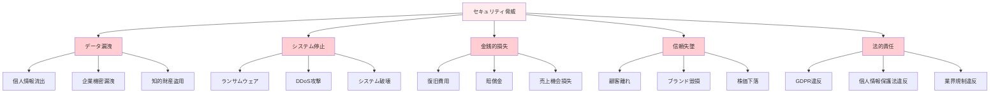

#### 責任共有モデル

クラウドセキュリティでは、クラウドプロバイダーと顧客の間で責任を分担する「責任共有モデル」が基本となります：

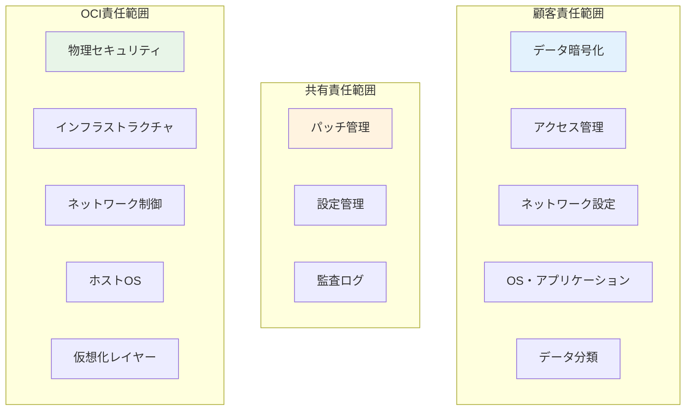

#### セキュリティフレームワーク

OCIのセキュリティは、業界標準のフレームワークに基づいて設計されています：

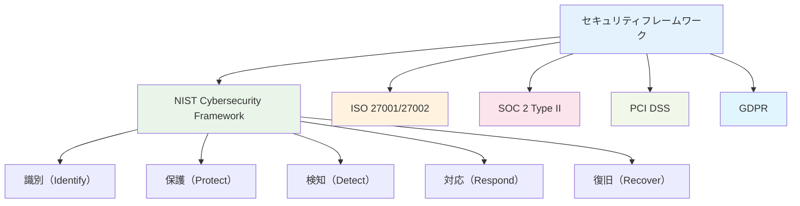

### 6.1 Web Application Firewall (WAF)

#### WAFとは

Web Application Firewall（WAF）は、Webアプリケーションを標的とした攻撃からシステムを保護するセキュリティサービスです。従来のネットワークファイアウォールがネットワーク層での保護を行うのに対し、WAFはアプリケーション層（Layer 7）での保護を提供します。

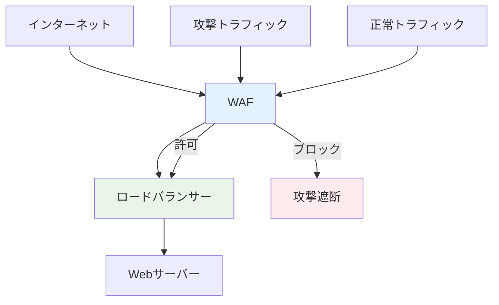

#### WAFが防御する攻撃

**1. OWASP Top 10攻撃**

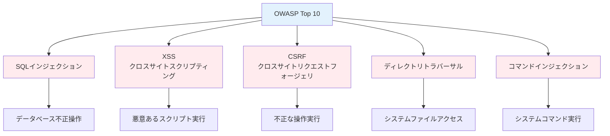

**2. DDoS攻撃**

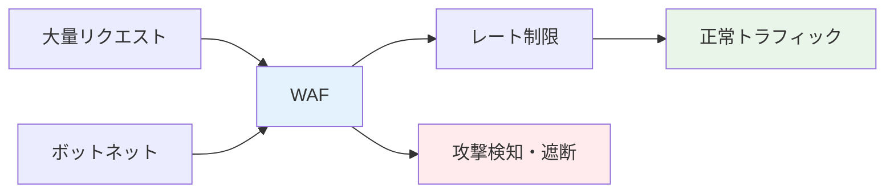

#### OCI WAFの特徴

**1. 多層防御アーキテクチャ**

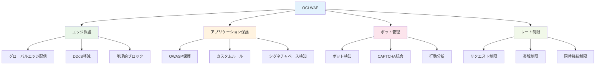

**2. 機械学習による脅威検知**

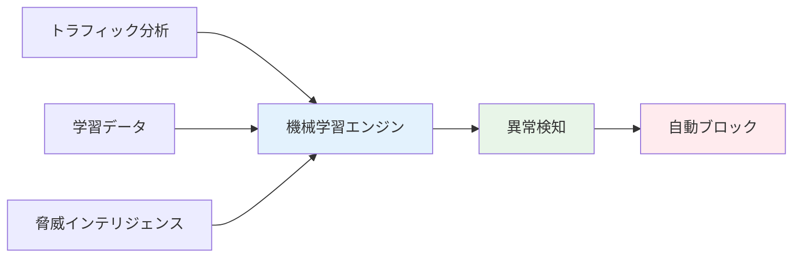

#### WAF保護ルール

**1. 事前定義ルール**

| カテゴリ | 保護対象 | 例 |
|---------|----------|-----|
| **SQLインジェクション** | データベース攻撃 | `' OR 1=1 --` |
| **XSS** | スクリプト攻撃 | `<script>alert('xss')</script>` |
| **ディレクトリトラバーサル** | ファイルアクセス攻撃 | `../../../etc/passwd` |
| **コマンドインジェクション** | システム攻撃 | `; rm -rf /` |
| **プロトコル攻撃** | HTTP異常 | 不正なHTTPヘッダー |

**2. カスタムルール**

```bash
# カスタムルール例：特定IPからのアクセス制限
{
  "name": "block-suspicious-ip",
  "conditions": [
    {
      "field": "source_ip",
      "operator": "equals",
      "value": "192.168.1.100"
    }
  ],
  "action": "BLOCK"
}

# カスタムルール例：特定パターンのブロック
{
  "name": "block-admin-access",
  "conditions": [
    {
      "field": "request_uri",
      "operator": "contains",
      "value": "/admin"
    },
    {
      "field": "source_country",
      "operator": "not_equals",
      "value": "JP"
    }
  ],
  "action": "BLOCK"
}
```

#### ボット管理

**1. ボット分類**

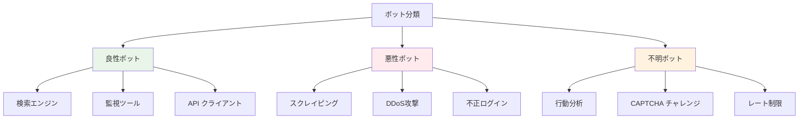

**2. ボット検知技術**

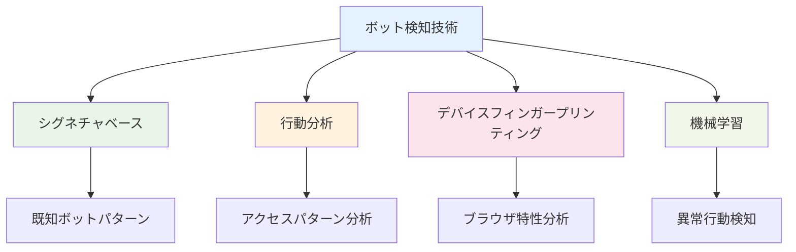

#### 実装例

**1. WAFポリシー作成**

```bash
# WAFポリシー作成
oci waas waas-policy create \
  --compartment-id <compartment-id> \
  --display-name "production-waf" \
  --domain "example.com" \
  --origins '[{
    "label": "primary",
    "uri": "https://backend.example.com"
  }]'

# 保護ルール設定
oci waas protection-rule update \
  --waas-policy-id <policy-id> \
  --key "981176" \
  --action "BLOCK" \
  --exclusions '[]'
```

**2. カスタムルール設定**

```json
{
  "customProtectionRules": [
    {
      "displayName": "Block Admin Access from Outside Japan",
      "description": "Block access to admin pages from non-Japanese IPs",
      "template": "SecRule REQUEST_URI \"@contains /admin\" \"id:1001,phase:1,block,msg:'Admin access blocked',logdata:'Blocked admin access from %{REMOTE_ADDR}'\""
    }
  ]
}
```

### 6.2 Vault（キー管理）

#### Vaultとは

Vaultは、暗号化キー、シークレット、証明書などの機密情報を安全に管理するサービスです。ハードウェアセキュリティモジュール（HSM）を使用して、最高レベルのセキュリティを提供します。

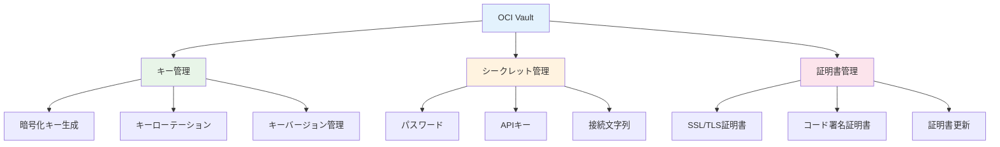

#### 暗号化の基本概念

**1. 対称暗号化と非対称暗号化**

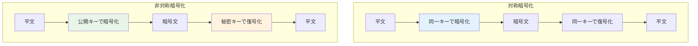

**2. 暗号化アルゴリズム**

| アルゴリズム | タイプ | キー長 | 用途 |
|-------------|--------|--------|------|
| **AES** | 対称 | 128/192/256 bit | データ暗号化 |
| **RSA** | 非対称 | 2048/3072/4096 bit | キー交換、デジタル署名 |
| **ECDSA** | 非対称 | 256/384/521 bit | デジタル署名 |
| **SHA-256** | ハッシュ | 256 bit | データ整合性 |

#### HSM（Hardware Security Module）

**1. HSMの利点**

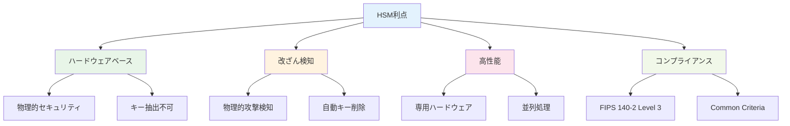

**2. HSMアーキテクチャ**

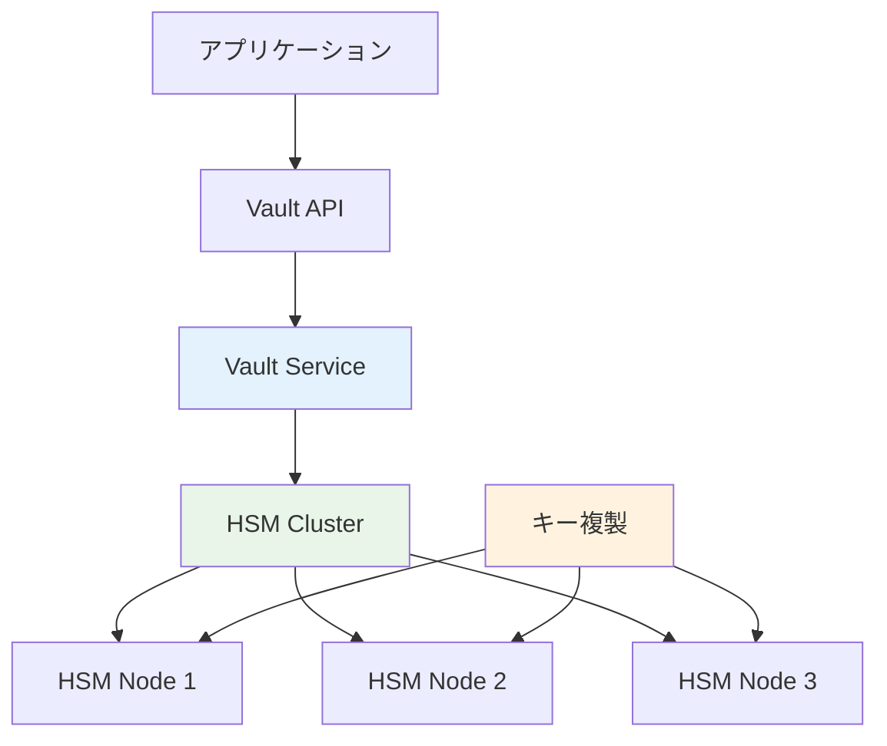

#### キー管理ライフサイクル

**1. キーライフサイクル**

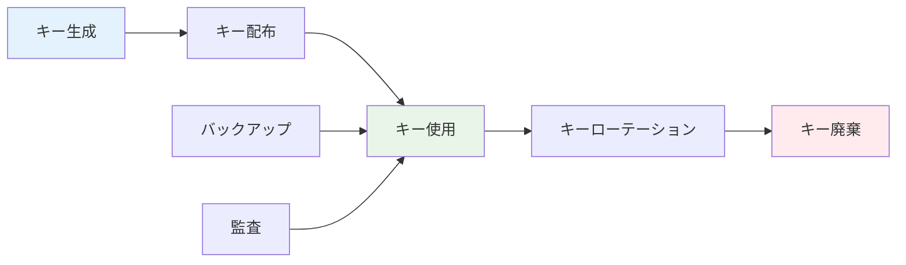

**2. キーローテーション**

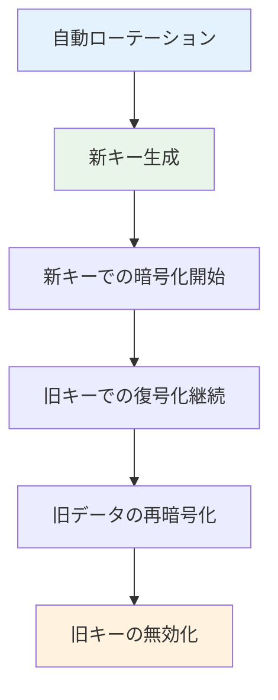

#### 実装例

**1. Vault作成**

```bash
# Vault作成
oci kms vault create \
  --compartment-id <compartment-id> \
  --display-name "production-vault" \
  --vault-type "DEFAULT"

# マスターキー作成
oci kms key create \
  --compartment-id <compartment-id> \
  --display-name "database-encryption-key" \
  --key-shape '{
    "algorithm": "AES",
    "length": 256
  }' \
  --management-endpoint <vault-endpoint>
```

**2. データ暗号化**

```python
import oci
import base64

# Vault クライアント初期化
kms_vault_client = oci.key_management.KmsVaultClient(config)
kms_crypto_client = oci.key_management.KmsCryptoClient(
    config, 
    service_endpoint=vault_endpoint
)

# データ暗号化
plaintext = "機密データ"
plaintext_bytes = plaintext.encode('utf-8')
plaintext_b64 = base64.b64encode(plaintext_bytes).decode('utf-8')

encrypt_response = kms_crypto_client.encrypt(
    encrypt_data_details=oci.key_management.models.EncryptDataDetails(
        key_id=key_id,
        plaintext=plaintext_b64
    )
)

ciphertext = encrypt_response.data.ciphertext

# データ復号化
decrypt_response = kms_crypto_client.decrypt(
    decrypt_data_details=oci.key_management.models.DecryptDataDetails(
        key_id=key_id,
        ciphertext=ciphertext
    )
)

decrypted_b64 = decrypt_response.data.plaintext
decrypted_bytes = base64.b64decode(decrypted_b64)
decrypted_text = decrypted_bytes.decode('utf-8')
```

### 6.3 Security Zones（セキュリティゾーン）

#### Security Zonesとは

Security Zonesは、セキュリティベストプラクティスを自動的に適用し、設定ミスを防ぐサービスです。事前定義されたセキュリティポリシーに基づいて、リソースの作成・変更を制御します。

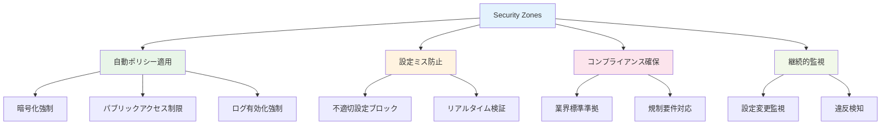

#### セキュリティポリシー

**1. 暗号化ポリシー**

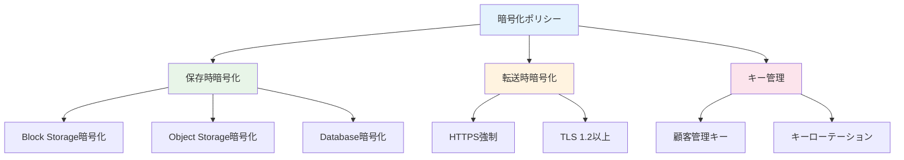

**2. ネットワークセキュリティポリシー**

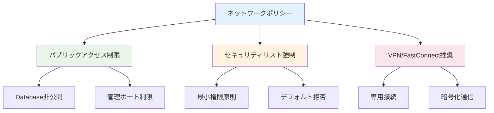

#### 実装例

**1. Security Zone作成**

```bash
# Security Zone作成
oci cloud-guard security-zone create \
  --compartment-id <compartment-id> \
  --display-name "production-security-zone" \
  --security-zone-recipe-id <recipe-id>

# セキュリティポリシー確認
oci cloud-guard security-zone-recipe get \
  --security-zone-recipe-id <recipe-id>
```

### 6.4 Cloud Guard（クラウド監視）

#### Cloud Guardとは

Cloud Guardは、OCIリソースの設定とアクティビティを継続的に監視し、セキュリティ脅威を検知・対応するサービスです。機械学習を活用して異常を検知し、自動的な修復アクションを実行できます。

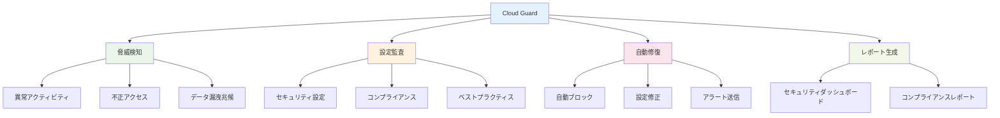

#### 検知ルール

**1. アクティビティ検知**

| 検知項目 | 説明 | 重要度 |
|---------|------|--------|
| **異常ログイン** | 通常と異なる場所・時間からのアクセス | 高 |
| **権限昇格** | 管理者権限の不正取得 | 最高 |
| **大量データアクセス** | 通常を超えるデータアクセス | 中 |
| **設定変更** | 重要なセキュリティ設定の変更 | 高 |
| **リソース削除** | 重要リソースの削除 | 最高 |

**2. 設定監査**

```mermaid
graph TB
    A[設定監査] --> B[IAM設定]
    A --> C[ネットワーク設定]
    A --> D[ストレージ設定]
    A --> E[データベース設定]
    
    B --> B1[過度な権限]
    B --> B2[未使用ユーザー]
    B --> B3[MFA未設定]
    
    C --> C1[パブリックアクセス]
    C --> C2[セキュリティリスト]
    C --> C3[暗号化設定]
    
    D --> D1[パブリックバケット]
    D --> D2[暗号化無効]
    
    E --> E1[パブリックアクセス]
    E --> E2[暗号化無効]
    
    style A fill:#e3f2fd
    style B fill:#e8f5e8
    style C fill:#fff3e0
    style D fill:#fce4ec
    style E fill:#f1f8e9
```

### 6.5 セキュリティベースライン

#### セキュリティベースラインとは

セキュリティベースラインは、組織が満たすべき最低限のセキュリティ要件を定義したものです。OCIでは、業界標準に基づいたセキュリティベースラインを提供し、継続的なセキュリティ向上を支援します。

```mermaid
graph TB
    A[セキュリティベースライン] --> B[アクセス制御]
    A --> C[データ保護]
    A --> D[ネットワークセキュリティ]
    A --> E[監視・ログ]
    A --> F[インシデント対応]
    
    B --> B1[最小権限原則]
    B --> B2[多要素認証]
    B --> B3[定期的権限見直し]
    
    C --> C1[保存時暗号化]
    C --> C2[転送時暗号化]
    C --> C3[データ分類]
    
    D --> D1[ネットワーク分離]
    D --> D2[ファイアウォール]
    D --> D3[侵入検知]
    
    E --> E1[包括的ログ]
    E --> E2[リアルタイム監視]
    E --> E3[異常検知]
    
    F --> F1[インシデント計画]
    F --> F2[対応手順]
    F --> F3[復旧計画]
    
    style A fill:#e3f2fd
    style B fill:#e8f5e8
    style C fill:#fff3e0
    style D fill:#fce4ec
    style E fill:#f1f8e9
    style F fill:#e1f5fe
```

#### 実装チェックリスト

**1. IAMセキュリティ**

- [ ] 管理者アカウントでのMFA有効化
- [ ] 最小権限の原則適用
- [ ] 定期的なアクセス権限見直し
- [ ] サービスアカウントの適切な管理
- [ ] パスワードポリシーの設定

**2. ネットワークセキュリティ**

- [ ] VCNでのネットワーク分離
- [ ] セキュリティリストの適切な設定
- [ ] パブリックサブネットの最小化
- [ ] WAFの導入
- [ ] DDoS保護の有効化

**3. データ保護**

- [ ] 保存時暗号化の有効化
- [ ] 転送時暗号化の強制
- [ ] バックアップの暗号化
- [ ] データ分類の実施
- [ ] アクセスログの記録

**4. 監視・ログ**

- [ ] Cloud Guardの有効化
- [ ] 包括的ログ収集
- [ ] リアルタイム監視
- [ ] アラート設定
- [ ] インシデント対応計画

### まとめ

第6章では、OCIの包括的なセキュリティサービスについて詳しく解説しました。多層防御の概念に基づいた包括的なセキュリティ対策が重要です。

**重要ポイント：**
1. **WAF**: Webアプリケーションレベルでの攻撃防御
2. **Vault**: 暗号化キーとシークレットの安全な管理
3. **Security Zones**: 自動的なセキュリティポリシー適用
4. **Cloud Guard**: 継続的な監視と脅威検知
5. **セキュリティベースライン**: 組織全体でのセキュリティ標準化
6. **責任共有モデル**: クラウドプロバイダーと顧客の責任分担理解

次章では、これらのセキュリティ対策を含むシステム全体の監視・運用サービスについて学習します。