# Oracle Cloud Infrastructure (OCI) 学習ガイドブック

## 第7章 監視・運用サービス

### はじめに

第6章でセキュリティサービスについて学習しました。本章では、OCIシステムの安定運用に不可欠な監視・運用サービスについて詳しく解説します。現代のクラウドシステムでは、リアルタイムでの監視、迅速な問題検知、自動化された対応が求められます。OCIでは、包括的な監視・運用ツールを提供し、システムの可視性向上と運用効率化を実現します。

### 監視・運用の基本概念

#### なぜ監視・運用が重要なのか

現代のITシステムは複雑化・大規模化しており、適切な監視・運用なしには以下のような問題が発生します：

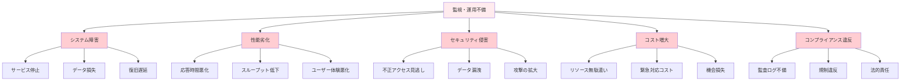

#### 監視・運用のフレームワーク

**1. SRE（Site Reliability Engineering）の概念**

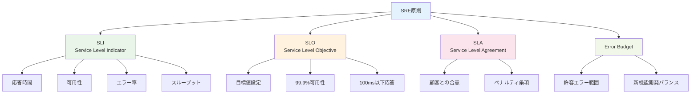

**2. 可観測性（Observability）の3つの柱**

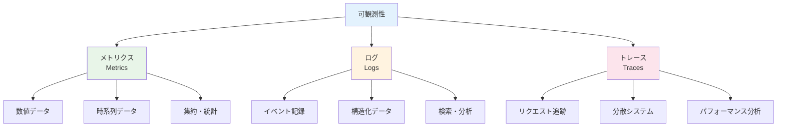

### 7.1 Monitoring Service（監視サービス）

#### Monitoring Serviceとは

OCI Monitoring Serviceは、OCIリソースのメトリクスを収集・可視化・アラート通知するサービスです。リアルタイムでシステムの状態を監視し、問題の早期発見と迅速な対応を可能にします。

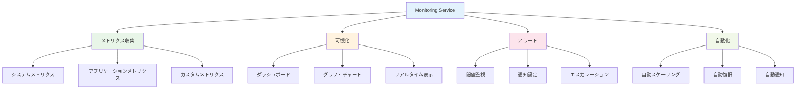

#### 主要メトリクス

**1. コンピュートメトリクス**

| メトリクス | 説明 | 単位 | 推奨閾値 |
|-----------|------|------|----------|
| **CPU使用率** | プロセッサ使用率 | % | >80% |
| **メモリ使用率** | メモリ使用率 | % | >85% |
| **ディスクI/O** | ディスク読み書き | IOPS | 設計値の80% |
| **ネットワークI/O** | ネットワーク送受信 | Mbps | 設計値の80% |
| **ロードアベレージ** | システム負荷 | 数値 | CPU数×1.5 |

**2. データベースメトリクス**

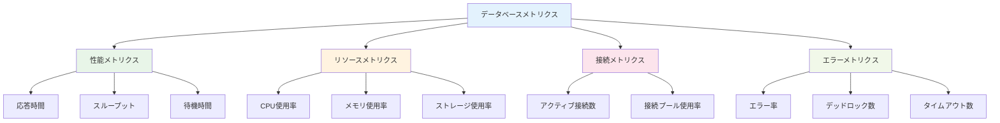

**3. ネットワークメトリクス**

| メトリクス | 説明 | 監視ポイント |
|-----------|------|-------------|
| **帯域使用率** | ネットワーク帯域の使用状況 | >70%で注意 |
| **パケット損失率** | パケットドロップ率 | >0.1%で警告 |
| **レイテンシ** | ネットワーク遅延 | 設計値の150% |
| **接続数** | 同時接続数 | 上限の80% |

#### ダッシュボード設計

**1. 階層化ダッシュボード**

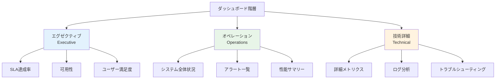

**2. ダッシュボード設計原則**

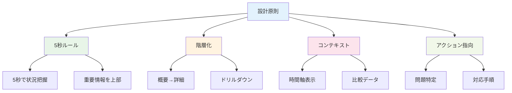

#### アラート設定

**1. アラート設計パターン**

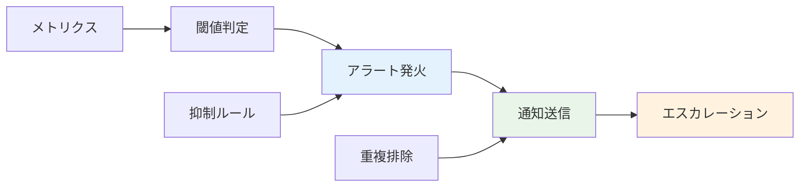

**2. アラート重要度分類**

| 重要度 | 説明 | 対応時間 | 通知方法 |
|--------|------|----------|----------|
| **Critical** | サービス停止 | 即座 | 電話、SMS、メール |
| **Warning** | 性能劣化 | 30分以内 | メール、Slack |
| **Info** | 情報通知 | 営業時間内 | メール |

#### 実装例

**1. カスタムメトリクス送信**

```python
import oci
from datetime import datetime

# Monitoring クライアント初期化
monitoring_client = oci.monitoring.MonitoringClient(config)

# カスタムメトリクス送信
def send_custom_metric(metric_name, value, dimensions=None):
    if dimensions is None:
        dimensions = {}
    
    metric_data = oci.monitoring.models.PostMetricDataDetails(
        metric_data=[
            oci.monitoring.models.MetricDataDetails(
                namespace="custom_app",
                name=metric_name,
                dimensions=dimensions,
                datapoints=[
                    oci.monitoring.models.Datapoint(
                        timestamp=datetime.utcnow(),
                        value=float(value)
                    )
                ]
            )
        ]
    )
    
    response = monitoring_client.post_metric_data(
        post_metric_data_details=metric_data
    )
    return response

# 使用例
send_custom_metric(
    metric_name="active_users",
    value=1250,
    dimensions={
        "application": "web_app",
        "environment": "production"
    }
)
```

**2. アラーム作成**

```bash
# CPU使用率アラーム作成
oci monitoring alarm create \
  --compartment-id <compartment-id> \
  --display-name "High CPU Usage" \
  --metric-compartment-id <compartment-id> \
  --namespace "oci_computeagent" \
  --query "CpuUtilization[1m].mean() > 80" \
  --severity "WARNING" \
  --destinations '["<notification-topic-id>"]' \
  --is-enabled true
```

### 7.2 Logging Service（ログサービス）

#### Logging Serviceとは

OCI Logging Serviceは、OCIリソースとアプリケーションからのログを一元的に収集・保存・分析するサービスです。構造化ログと非構造化ログの両方をサポートし、高速検索と長期保存を提供します。

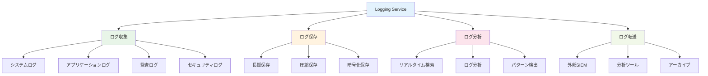

#### ログの種類と用途

**1. システムログ**

```mermaid
graph TB
    A[システムログ] --> B[OS ログ]
    A --> C[ミドルウェアログ]
    A --> D[インフラログ]
    
    B --> B1[/var/log/messages]
    B --> B2[/var/log/secure]
    B --> B3[/var/log/cron]
    
    C --> C1[Apache/Nginx]
    C --> C2[データベース]
    C --> C3[アプリケーションサーバー]
    
    D --> D1[ネットワーク機器]
    D --> D2[ロードバランサー]
    D --> D3[ファイアウォール]
    
    style A fill:#e3f2fd
    style B fill:#e8f5e8
    style C fill:#fff3e0
    style D fill:#fce4ec
```

**2. アプリケーションログ**

| ログレベル | 用途 | 例 |
|-----------|------|-----|
| **ERROR** | エラー情報 | 例外、システムエラー |
| **WARN** | 警告情報 | 非推奨API使用、リソース不足 |
| **INFO** | 一般情報 | 処理開始/終了、設定変更 |
| **DEBUG** | デバッグ情報 | 詳細な処理フロー |
| **TRACE** | トレース情報 | 関数呼び出し、変数値 |

#### 構造化ログ

**1. JSON形式ログ**

```json
{
  "timestamp": "2023-12-01T10:30:00.000Z",
  "level": "INFO",
  "service": "user-service",
  "version": "1.2.3",
  "trace_id": "abc123def456",
  "span_id": "789ghi012jkl",
  "user_id": "user123",
  "action": "login",
  "result": "success",
  "duration_ms": 150,
  "ip_address": "192.168.1.100",
  "user_agent": "Mozilla/5.0...",
  "message": "User login successful"
}
```

**2. 構造化ログの利点**

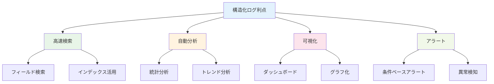

#### ログ分析パターン

**1. エラー分析**

```bash
# エラーログ検索例
search "level:ERROR" 
| stats count by service, error_type
| sort -count

# 特定期間のエラー率
search "service:user-service" 
| eval error_rate = if(level="ERROR", 1, 0)
| stats avg(error_rate) as error_rate by _time
| timechart span=1h avg(error_rate)
```

**2. パフォーマンス分析**

```bash
# 応答時間分析
search "action:api_call" 
| stats avg(duration_ms), p95(duration_ms), p99(duration_ms) by endpoint
| sort -avg(duration_ms)

# スループット分析
search "service:web-app" 
| stats count as requests by _time
| timechart span=1m count
```

#### 実装例

**1. カスタムログ送信**

```python
import oci
import json
from datetime import datetime

# Logging クライアント初期化
logging_client = oci.logging.LoggingManagementClient(config)
log_client = oci.loggingingestion.LoggingClient(config)

# 構造化ログ送信
def send_log(log_group_id, log_id, log_data):
    log_entry = oci.loggingingestion.models.LogEntry(
        data=json.dumps(log_data),
        id=str(uuid.uuid4()),
        time=datetime.utcnow()
    )
    
    put_logs_details = oci.loggingingestion.models.PutLogsDetails(
        specversion="1.0",
        log_entry_batches=[
            oci.loggingingestion.models.LogEntryBatch(
                entries=[log_entry],
                source="custom_application",
                type="application_log",
                defaultlogentrytime=datetime.utcnow()
            )
        ]
    )
    
    response = log_client.put_logs(
        log_id=log_id,
        put_logs_details=put_logs_details
    )
    return response

# 使用例
log_data = {
    "level": "INFO",
    "service": "user-service",
    "action": "user_registration",
    "user_id": "user123",
    "result": "success",
    "duration_ms": 250
}

send_log(log_group_id, log_id, log_data)
```

### 7.3 Application Performance Monitoring (APM)

#### APMとは

Application Performance Monitoring（APM）は、アプリケーションの性能を詳細に監視・分析するサービスです。分散トレーシング、エラー追跡、ユーザー体験監視を通じて、アプリケーションの問題を迅速に特定・解決できます。

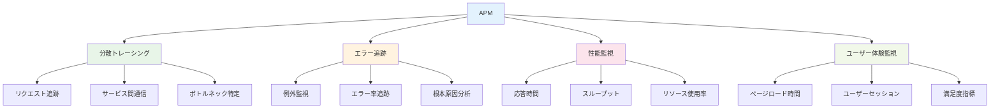

#### 分散トレーシング

**1. トレーシングの概念**

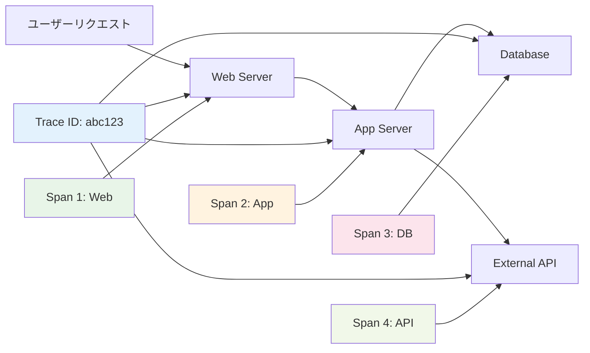

**2. トレースデータ構造**

```json
{
  "trace_id": "abc123def456ghi789",
  "spans": [
    {
      "span_id": "span001",
      "parent_span_id": null,
      "operation_name": "http_request",
      "service_name": "web-server",
      "start_time": "2023-12-01T10:30:00.000Z",
      "end_time": "2023-12-01T10:30:00.500Z",
      "duration_ms": 500,
      "tags": {
        "http.method": "GET",
        "http.url": "/api/users",
        "http.status_code": 200
      }
    },
    {
      "span_id": "span002",
      "parent_span_id": "span001",
      "operation_name": "database_query",
      "service_name": "user-service",
      "start_time": "2023-12-01T10:30:00.100Z",
      "end_time": "2023-12-01T10:30:00.300Z",
      "duration_ms": 200,
      "tags": {
        "db.statement": "SELECT * FROM users WHERE id = ?",
        "db.type": "mysql"
      }
    }
  ]
}
```

#### エラー追跡

**1. エラー分類**

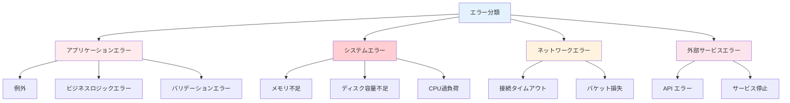

#### 実装例

**1. APMエージェント設定**

```java
// Java アプリケーションでのAPM設定
@RestController
public class UserController {
    
    @Autowired
    private UserService userService;
    
    @GetMapping("/users/{id}")
    @Traced(operationName = "get_user")
    public ResponseEntity<User> getUser(@PathVariable String id) {
        try {
            Span span = GlobalTracer.get().activeSpan();
            span.setTag("user.id", id);
            
            User user = userService.findById(id);
            
            span.setTag("user.found", user != null);
            return ResponseEntity.ok(user);
            
        } catch (Exception e) {
            Span span = GlobalTracer.get().activeSpan();
            span.setTag("error", true);
            span.log(Map.of("error.message", e.getMessage()));
            throw e;
        }
    }
}
```

### 7.4 Operations Insights（運用インサイト）

#### Operations Insightsとは

Operations Insightsは、機械学習を活用してシステムの性能を分析し、問題の予測と最適化の推奨を行うサービスです。過去のデータから学習し、将来の問題を予測して事前対応を可能にします。

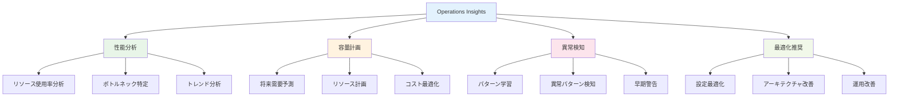

#### 機械学習による分析

**1. 異常検知アルゴリズム**

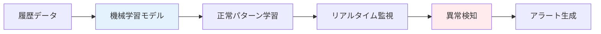

**2. 予測分析**

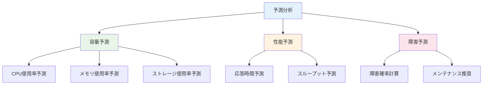

### 7.5 統合監視戦略とアラート設計

#### 統合監視アーキテクチャ

**1. 階層化監視**

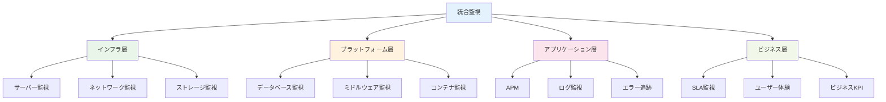

#### アラート設計ベストプラクティス

**1. アラート疲れ対策**

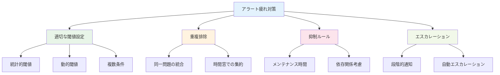

**2. 通知チャネル設計**

| 重要度 | 1次通知 | 2次通知 | 3次通知 |
|--------|---------|---------|---------|
| **Critical** | 電話 | SMS | メール |
| **High** | SMS | メール | Slack |
| **Medium** | メール | Slack | - |
| **Low** | Slack | - | - |

#### 運用自動化

**1. 自動修復（Auto-remediation）**

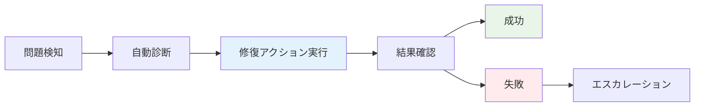

**2. 自動化シナリオ例**

| 問題 | 自動修復アクション |
|------|-------------------|
| **高CPU使用率** | インスタンス追加、プロセス再起動 |
| **メモリ不足** | メモリ増設、キャッシュクリア |
| **ディスク容量不足** | ログローテーション、一時ファイル削除 |
| **サービス停止** | サービス再起動、ヘルスチェック |

### まとめ

第7章では、OCIの包括的な監視・運用サービスについて詳しく解説しました。効果的な監視・運用は、システムの安定性と性能を確保する上で不可欠です。

**重要ポイント：**
1. **Monitoring Service**: リアルタイムメトリクス監視とアラート
2. **Logging Service**: 一元的なログ管理と分析
3. **APM**: アプリケーション性能の詳細監視
4. **Operations Insights**: 機械学習による予測分析
5. **統合監視**: 階層化された包括的監視戦略
6. **自動化**: 問題の自動検知と修復

次章では、これらの監視・運用を支える開発・運用の自動化（DevOps）について学習します。