# Oracle Cloud Infrastructure (OCI) 学習ガイドブック

## 第8章 DevOps・自動化

### はじめに

第7章で監視・運用サービスについて学習しました。本章では、現代のソフトウェア開発・運用に不可欠なDevOps・自動化について詳しく解説します。DevOpsは、開発（Development）と運用（Operations）を統合し、ソフトウェアの品質向上と迅速なデリバリーを実現する文化・プラクティス・ツールセットです。OCIでは、包括的なDevOpsサービスを提供し、CI/CDパイプラインの構築からInfrastructure as Codeまで、開発・運用の全工程を自動化できます。

### DevOpsの基本概念

#### なぜDevOpsが必要なのか

従来の開発・運用では、開発チームと運用チームが分離されており、以下のような問題が発生していました：

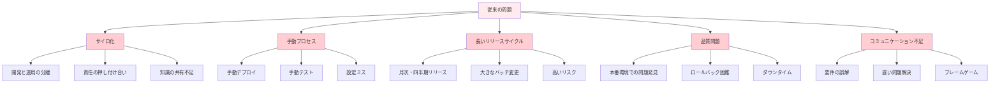

#### DevOpsによる解決

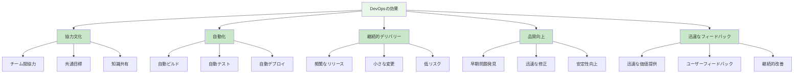

#### DevOpsの原則

**1. CALMS フレームワーク**

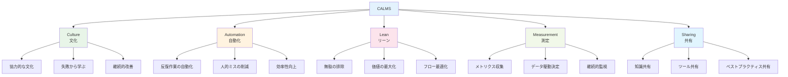

### 8.1 DevOps Service

#### OCI DevOps Serviceとは

OCI DevOps Serviceは、ソフトウェア開発ライフサイクル全体を自動化するフルマネージドサービスです。ソースコード管理からビルド、テスト、デプロイまでの一連のプロセスを統合し、継続的インテグレーション・継続的デリバリー（CI/CD）を実現します。

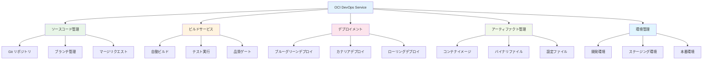

#### CI/CDパイプライン

**1. 継続的インテグレーション（CI）**

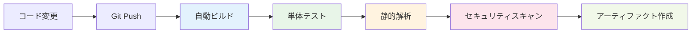

**2. 継続的デリバリー（CD）**


#### ビルドパイプライン設定

**1. buildspec.yaml例**

```yaml
version: 0.1
component: build
timeoutInSeconds: 6000
runAs: root

env:
  variables:
    JAVA_HOME: "/usr/lib/jvm/java-11-openjdk"
  
  exportedVariables:
    - BUILDRUN_HASH

steps:
  - type: Command
    name: "Install Dependencies"
    timeoutInSeconds: 300
    command: |
      echo "Installing dependencies..."
      mvn clean install -DskipTests

  - type: Command
    name: "Run Tests"
    timeoutInSeconds: 600
    command: |
      echo "Running tests..."
      mvn test
      mvn jacoco:report

  - type: Command
    name: "Build Application"
    timeoutInSeconds: 600
    command: |
      echo "Building application..."
      mvn package -DskipTests
      export BUILDRUN_HASH=`echo ${OCI_BUILD_RUN_ID} | rev | cut -c 1-7`

  - type: Command
    name: "Build Docker Image"
    timeoutInSeconds: 600
    command: |
      echo "Building Docker image..."
      docker build -t myapp:${BUILDRUN_HASH} .
      docker tag myapp:${BUILDRUN_HASH} ${CONTAINER_REGISTRY}/myapp:${BUILDRUN_HASH}

outputArtifacts:
  - name: app_jar
    type: BINARY
    location: target/myapp.jar
  
  - name: docker_image
    type: DOCKER_IMAGE
    location: ${CONTAINER_REGISTRY}/myapp:${BUILDRUN_HASH}
```

#### デプロイメント戦略

**1. ブルーグリーンデプロイメント**

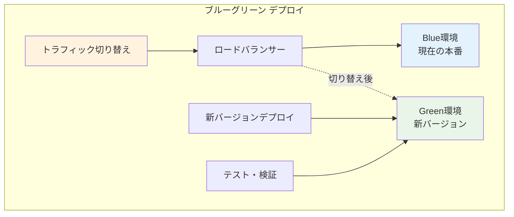

**利点：**
- ゼロダウンタイムデプロイ
- 即座のロールバック
- 本番環境での事前テスト

**2. カナリアデプロイメント**

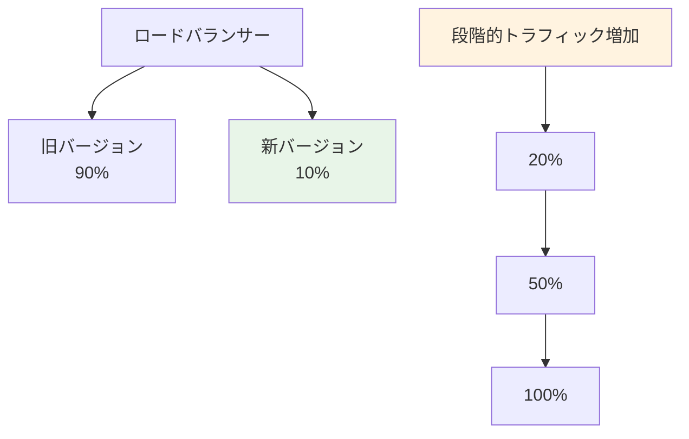

**利点：**
- 段階的リスク軽減
- リアルユーザーでのテスト
- 問題の早期発見

#### 実装例

**1. DevOpsプロジェクト作成**

```bash
# DevOpsプロジェクト作成
oci devops project create \
  --compartment-id <compartment-id> \
  --name "myapp-devops" \
  --description "MyApp DevOps Project"

# ビルドパイプライン作成
oci devops build-pipeline create \
  --project-id <project-id> \
  --display-name "myapp-build-pipeline" \
  --description "Build pipeline for MyApp"
```

**2. デプロイメントパイプライン作成**

```bash
# デプロイメントパイプライン作成
oci devops deploy-pipeline create \
  --project-id <project-id> \
  --display-name "myapp-deploy-pipeline" \
  --description "Deployment pipeline for MyApp"

# デプロイメント環境作成
oci devops deploy-environment create-oke-cluster-environment \
  --project-id <project-id> \
  --display-name "production-oke" \
  --cluster-id <oke-cluster-id>
```

### 8.2 Resource Manager（Terraform）

#### Resource Managerとは

Resource Managerは、Terraformを使用してOCIリソースをコードで管理するサービスです。Infrastructure as Code（IaC）の概念に基づき、インフラストラクチャの定義、プロビジョニング、管理を自動化します。

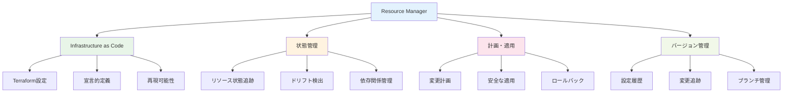

#### Infrastructure as Codeの利点

**1. 従来のインフラ管理 vs IaC**

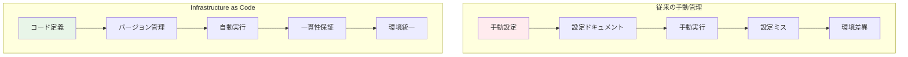

**2. IaCの利点**

| 項目 | 従来手法 | Infrastructure as Code |
|------|---------|----------------------|
| **再現性** | 低（手動設定） | 高（コード実行） |
| **一貫性** | 環境差異あり | 環境統一 |
| **変更管理** | ドキュメント | バージョン管理 |
| **監査** | 困難 | 完全な履歴 |
| **スケーラビリティ** | 手動作業増加 | 自動化 |

#### Terraform基本概念

**1. Terraformの構成要素**

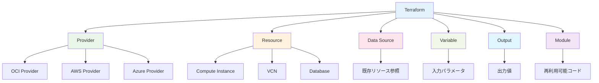

#### Terraform設定例

**1. プロバイダー設定**

```hcl
# provider.tf
terraform {
  required_providers {
    oci = {
      source  = "oracle/oci"
      version = "~> 4.0"
    }
  }
  required_version = ">= 1.0"
}

provider "oci" {
  tenancy_ocid     = var.tenancy_ocid
  user_ocid        = var.user_ocid
  fingerprint      = var.fingerprint
  private_key_path = var.private_key_path
  region           = var.region
}
```

**2. 変数定義**

```hcl
# variables.tf
variable "tenancy_ocid" {
  description = "OCID of the tenancy"
  type        = string
}

variable "compartment_ocid" {
  description = "OCID of the compartment"
  type        = string
}

variable "region" {
  description = "OCI region"
  type        = string
  default     = "ap-tokyo-1"
}

variable "availability_domain" {
  description = "Availability domain"
  type        = string
}

variable "instance_shape" {
  description = "Instance shape"
  type        = string
  default     = "VM.Standard3.Flex"
}

variable "instance_ocpus" {
  description = "Number of OCPUs"
  type        = number
  default     = 2
}

variable "instance_memory_in_gbs" {
  description = "Memory in GBs"
  type        = number
  default     = 16
}
```

**3. VCN作成**

```hcl
# vcn.tf
resource "oci_core_vcn" "main" {
  compartment_id = var.compartment_ocid
  display_name   = "main-vcn"
  cidr_blocks    = ["10.0.0.0/16"]
  dns_label      = "mainvcn"
}

resource "oci_core_internet_gateway" "main" {
  compartment_id = var.compartment_ocid
  vcn_id         = oci_core_vcn.main.id
  display_name   = "main-igw"
  enabled        = true
}

resource "oci_core_route_table" "public" {
  compartment_id = var.compartment_ocid
  vcn_id         = oci_core_vcn.main.id
  display_name   = "public-route-table"

  route_rules {
    destination       = "0.0.0.0/0"
    destination_type  = "CIDR_BLOCK"
    network_entity_id = oci_core_internet_gateway.main.id
  }
}

resource "oci_core_security_list" "public" {
  compartment_id = var.compartment_ocid
  vcn_id         = oci_core_vcn.main.id
  display_name   = "public-security-list"

  egress_security_rules {
    destination = "0.0.0.0/0"
    protocol    = "all"
  }

  ingress_security_rules {
    protocol = "6" # TCP
    source   = "0.0.0.0/0"

    tcp_options {
      min = 80
      max = 80
    }
  }

  ingress_security_rules {
    protocol = "6" # TCP
    source   = "0.0.0.0/0"

    tcp_options {
      min = 443
      max = 443
    }
  }

  ingress_security_rules {
    protocol = "6" # TCP
    source   = "10.0.0.0/16"

    tcp_options {
      min = 22
      max = 22
    }
  }
}

resource "oci_core_subnet" "public" {
  compartment_id      = var.compartment_ocid
  vcn_id              = oci_core_vcn.main.id
  display_name        = "public-subnet"
  cidr_block          = "10.0.1.0/24"
  route_table_id      = oci_core_route_table.public.id
  security_list_ids   = [oci_core_security_list.public.id]
  dns_label           = "public"
  prohibit_public_ip_on_vnic = false
}
```

**4. コンピュートインスタンス作成**

```hcl
# compute.tf
data "oci_identity_availability_domains" "ads" {
  compartment_id = var.tenancy_ocid
}

data "oci_core_images" "oracle_linux" {
  compartment_id           = var.compartment_ocid
  operating_system         = "Oracle Linux"
  operating_system_version = "8"
  shape                    = var.instance_shape
  sort_by                  = "TIMECREATED"
  sort_order               = "DESC"
}

resource "oci_core_instance" "web_server" {
  availability_domain = data.oci_identity_availability_domains.ads.availability_domains[0].name
  compartment_id      = var.compartment_ocid
  display_name        = "web-server"
  shape               = var.instance_shape

  shape_config {
    ocpus         = var.instance_ocpus
    memory_in_gbs = var.instance_memory_in_gbs
  }

  create_vnic_details {
    subnet_id                 = oci_core_subnet.public.id
    display_name              = "web-server-vnic"
    assign_public_ip          = true
    assign_private_dns_record = true
    hostname_label            = "webserver"
  }

  source_details {
    source_type = "image"
    source_id   = data.oci_core_images.oracle_linux.images[0].id
  }

  metadata = {
    ssh_authorized_keys = file("~/.ssh/id_rsa.pub")
    user_data = base64encode(templatefile("${path.module}/cloud-init.yaml", {
      hostname = "web-server"
    }))
  }
}
```

**5. 出力値定義**

```hcl
# outputs.tf
output "vcn_id" {
  description = "OCID of the VCN"
  value       = oci_core_vcn.main.id
}

output "public_subnet_id" {
  description = "OCID of the public subnet"
  value       = oci_core_subnet.public.id
}

output "web_server_public_ip" {
  description = "Public IP of the web server"
  value       = oci_core_instance.web_server.public_ip
}

output "web_server_private_ip" {
  description = "Private IP of the web server"
  value       = oci_core_instance.web_server.private_ip
}
```

#### Resource Managerスタック管理

**1. スタック作成**

```bash
# Terraformファイルをzipに圧縮
zip -r infrastructure.zip *.tf

# Resource Managerスタック作成
oci resource-manager stack create \
  --compartment-id <compartment-id> \
  --display-name "web-app-infrastructure" \
  --description "Web application infrastructure" \
  --config-source-zip-file-path infrastructure.zip \
  --variables '{
    "compartment_ocid": "<compartment-id>",
    "availability_domain": "AD-1"
  }'
```

**2. 計画・適用**

```bash
# 計画ジョブ実行
oci resource-manager job create-plan-job \
  --stack-id <stack-id> \
  --display-name "infrastructure-plan"

# 適用ジョブ実行
oci resource-manager job create-apply-job \
  --stack-id <stack-id> \
  --display-name "infrastructure-apply" \
  --execution-plan-strategy "FROM_PLAN_JOB_ID" \
  --execution-plan-job-id <plan-job-id>
```

### 8.3 Ansible Collections

#### Ansible for OCIとは

Ansible for OCIは、AnsibleからOCIリソースを管理するためのコレクションです。宣言的な設定管理とオーケストレーションを通じて、インフラストラクチャとアプリケーションの自動化を実現します。

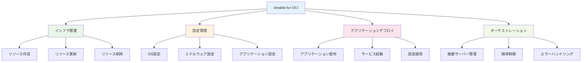

#### Ansibleプレイブック例

**1. インベントリファイル**

```ini
# inventory/hosts
[web_servers]
web1 ansible_host=10.0.1.10 ansible_user=opc
web2 ansible_host=10.0.1.11 ansible_user=opc

[db_servers]
db1 ansible_host=10.0.2.10 ansible_user=opc

[all:vars]
ansible_ssh_private_key_file=~/.ssh/id_rsa
ansible_ssh_common_args='-o StrictHostKeyChecking=no'
```

**2. Webサーバー設定プレイブック**

```yaml
# playbooks/web_server.yml
---
- name: Configure Web Servers
  hosts: web_servers
  become: yes
  vars:
    app_name: myapp
    app_version: "1.0.0"
    app_port: 8080

  tasks:
    - name: Update system packages
      yum:
        name: "*"
        state: latest

    - name: Install required packages
      yum:
        name:
          - java-11-openjdk
          - nginx
          - firewalld
        state: present

    - name: Start and enable firewalld
      systemd:
        name: firewalld
        state: started
        enabled: yes

    - name: Configure firewall for HTTP
      firewalld:
        service: http
        permanent: yes
        state: enabled
        immediate: yes

    - name: Configure firewall for HTTPS
      firewalld:
        service: https
        permanent: yes
        state: enabled
        immediate: yes

    - name: Configure firewall for application port
      firewalld:
        port: "{{ app_port }}/tcp"
        permanent: yes
        state: enabled
        immediate: yes

    - name: Create application user
      user:
        name: "{{ app_name }}"
        system: yes
        shell: /bin/false
        home: "/opt/{{ app_name }}"
        create_home: yes

    - name: Create application directories
      file:
        path: "{{ item }}"
        state: directory
        owner: "{{ app_name }}"
        group: "{{ app_name }}"
        mode: '0755'
      loop:
        - "/opt/{{ app_name }}/bin"
        - "/opt/{{ app_name }}/config"
        - "/opt/{{ app_name }}/logs"

    - name: Download application JAR
      get_url:
        url: "https://releases.example.com/{{ app_name }}-{{ app_version }}.jar"
        dest: "/opt/{{ app_name }}/bin/{{ app_name }}.jar"
        owner: "{{ app_name }}"
        group: "{{ app_name }}"
        mode: '0644'

    - name: Create application configuration
      template:
        src: application.properties.j2
        dest: "/opt/{{ app_name }}/config/application.properties"
        owner: "{{ app_name }}"
        group: "{{ app_name }}"
        mode: '0644'
      notify: restart application

    - name: Create systemd service file
      template:
        src: myapp.service.j2
        dest: "/etc/systemd/system/{{ app_name }}.service"
        mode: '0644'
      notify:
        - reload systemd
        - restart application

    - name: Configure Nginx
      template:
        src: nginx.conf.j2
        dest: /etc/nginx/nginx.conf
        backup: yes
      notify: restart nginx

    - name: Start and enable services
      systemd:
        name: "{{ item }}"
        state: started
        enabled: yes
      loop:
        - "{{ app_name }}"
        - nginx

  handlers:
    - name: reload systemd
      systemd:
        daemon_reload: yes

    - name: restart application
      systemd:
        name: "{{ app_name }}"
        state: restarted

    - name: restart nginx
      systemd:
        name: nginx
        state: restarted
```

**3. テンプレートファイル**

```jinja2
# templates/application.properties.j2
server.port={{ app_port }}
server.servlet.context-path=/{{ app_name }}

# Database configuration
spring.datasource.url=jdbc:mysql://{{ hostvars[groups['db_servers'][0]]['ansible_host'] }}:3306/{{ app_name }}
spring.datasource.username={{ db_username }}
spring.datasource.password={{ db_password }}

# Logging configuration
logging.level.com.example={{ log_level | default('INFO') }}
logging.file.name=/opt/{{ app_name }}/logs/application.log
logging.file.max-size=100MB
logging.file.max-history=30
```

### 8.4 CI/CDパイプライン構築

#### パイプライン設計原則

**1. パイプライン段階**

```mermaid
graph LR
    A[Source] --> B[Build]
    B --> C[Test]
    C --> D[Security Scan]
    D --> E[Package]
    E --> F[Deploy Dev]
    F --> G[Integration Test]
    G --> H[Deploy Staging]
    H --> I[Acceptance Test]
    I --> J[Deploy Production]
    
    style A fill:#e3f2fd
    style C fill:#e8f5e8
    style D fill:#fff3e0
    style G fill:#fce4ec
    style I fill:#f1f8e9
    style J fill:#e1f5fe
```

**2. 品質ゲート**

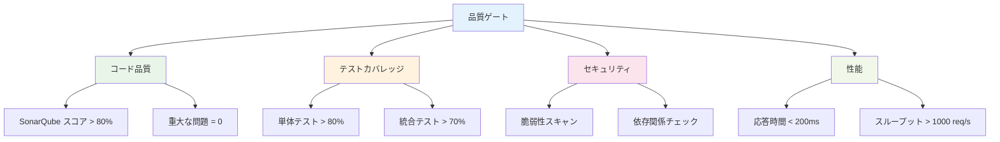

#### GitOps実装

**1. GitOpsワークフロー**

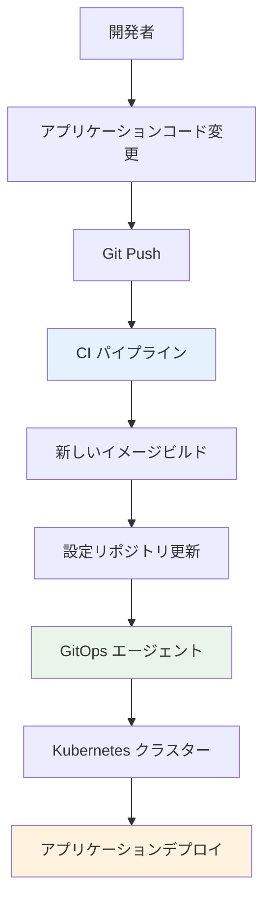

**2. GitOps設定例**

```yaml
# k8s-manifests/application.yaml
apiVersion: apps/v1
kind: Deployment
metadata:
  name: myapp
  namespace: production
spec:
  replicas: 3
  selector:
    matchLabels:
      app: myapp
  template:
    metadata:
      labels:
        app: myapp
    spec:
      containers:
      - name: myapp
        image: myregistry.com/myapp:v1.2.3
        ports:
        - containerPort: 8080
        env:
        - name: DATABASE_URL
          valueFrom:
            secretKeyRef:
              name: db-secret
              key: url
        resources:
          requests:
            memory: "256Mi"
            cpu: "250m"
          limits:
            memory: "512Mi"
            cpu: "500m"
        livenessProbe:
          httpGet:
            path: /health
            port: 8080
          initialDelaySeconds: 30
          periodSeconds: 10
        readinessProbe:
          httpGet:
            path: /ready
            port: 8080
          initialDelaySeconds: 5
          periodSeconds: 5
---
apiVersion: v1
kind: Service
metadata:
  name: myapp-service
  namespace: production
spec:
  selector:
    app: myapp
  ports:
  - protocol: TCP
    port: 80
    targetPort: 8080
  type: ClusterIP
```

### 8.5 Infrastructure as Code実践

#### IaCのベストプラクティス

**1. ディレクトリ構造**

```
terraform/
├── environments/
│   ├── dev/
│   │   ├── main.tf
│   │   ├── variables.tf
│   │   ├── terraform.tfvars
│   │   └── outputs.tf
│   ├── staging/
│   │   ├── main.tf
│   │   ├── variables.tf
│   │   ├── terraform.tfvars
│   │   └── outputs.tf
│   └── production/
│       ├── main.tf
│       ├── variables.tf
│       ├── terraform.tfvars
│       └── outputs.tf
├── modules/
│   ├── compute/
│   │   ├── main.tf
│   │   ├── variables.tf
│   │   └── outputs.tf
│   ├── networking/
│   │   ├── main.tf
│   │   ├── variables.tf
│   │   └── outputs.tf
│   └── database/
│       ├── main.tf
│       ├── variables.tf
│       └── outputs.tf
└── shared/
    ├── provider.tf
    └── backend.tf
```

**2. モジュール設計**

```hcl
# modules/compute/main.tf
variable "compartment_id" {
  description = "Compartment OCID"
  type        = string
}

variable "subnet_id" {
  description = "Subnet OCID"
  type        = string
}

variable "instance_count" {
  description = "Number of instances"
  type        = number
  default     = 1
}

variable "instance_shape" {
  description = "Instance shape"
  type        = string
  default     = "VM.Standard3.Flex"
}

variable "instance_config" {
  description = "Instance configuration"
  type = object({
    ocpus         = number
    memory_in_gbs = number
  })
  default = {
    ocpus         = 2
    memory_in_gbs = 16
  }
}

variable "tags" {
  description = "Resource tags"
  type        = map(string)
  default     = {}
}

resource "oci_core_instance" "this" {
  count               = var.instance_count
  availability_domain = data.oci_identity_availability_domains.ads.availability_domains[count.index % length(data.oci_identity_availability_domains.ads.availability_domains)].name
  compartment_id      = var.compartment_id
  display_name        = "instance-${count.index + 1}"
  shape               = var.instance_shape

  shape_config {
    ocpus         = var.instance_config.ocpus
    memory_in_gbs = var.instance_config.memory_in_gbs
  }

  create_vnic_details {
    subnet_id                 = var.subnet_id
    display_name              = "instance-${count.index + 1}-vnic"
    assign_public_ip          = false
    assign_private_dns_record = true
  }

  source_details {
    source_type = "image"
    source_id   = data.oci_core_images.oracle_linux.images[0].id
  }

  freeform_tags = var.tags
}

output "instance_ids" {
  description = "Instance OCIDs"
  value       = oci_core_instance.this[*].id
}

output "private_ips" {
  description = "Private IP addresses"
  value       = oci_core_instance.this[*].private_ip
}
```

#### 状態管理とセキュリティ

**1. リモート状態管理**

```hcl
# backend.tf
terraform {
  backend "http" {
    address        = "https://objectstorage.ap-tokyo-1.oraclecloud.com/n/namespace/b/terraform-state/o/production.tfstate"
    update_method  = "PUT"
    lock_address   = "https://objectstorage.ap-tokyo-1.oraclecloud.com/n/namespace/b/terraform-state/o/production.tfstate.lock"
    lock_method    = "PUT"
    unlock_address = "https://objectstorage.ap-tokyo-1.oraclecloud.com/n/namespace/b/terraform-state/o/production.tfstate.lock"
    unlock_method  = "DELETE"
  }
}
```

**2. シークレット管理**

```hcl
# secrets.tf
data "oci_vault_secrets" "db_password" {
  compartment_id = var.compartment_id
  vault_id       = var.vault_id
  name           = "database-password"
}

resource "oci_database_autonomous_database" "main" {
  compartment_id           = var.compartment_id
  db_name                  = "myappdb"
  display_name             = "MyApp Database"
  admin_password           = data.oci_vault_secrets.db_password.secret_bundle_content[0].content
  cpu_core_count           = 2
  data_storage_size_in_tbs = 1
  db_workload              = "OLTP"
}
```

### まとめ

第8章では、OCIのDevOps・自動化サービスについて詳しく解説しました。現代のソフトウェア開発・運用において、自動化は必須の要素です。

**重要ポイント：**
1. **DevOps Service**: 包括的なCI/CDパイプライン構築
2. **Resource Manager**: Terraformを使用したInfrastructure as Code
3. **Ansible Collections**: 設定管理とオーケストレーション
4. **CI/CDパイプライン**: 品質ゲートと自動化された配信
5. **GitOps**: Git中心の運用モデル
6. **ベストプラクティス**: セキュリティと保守性を考慮した設計

次章では、データ分析とAI/MLサービスについて学習します。