# Oracle Cloud Infrastructure (OCI) 学習ガイドブック

## 第9章 分析・AI/MLサービス

### はじめに

第8章でDevOps・自動化について学習しました。本章では、現代のデジタル変革において重要な役割を果たす分析・AI/MLサービスについて詳しく解説します。データは「21世紀の石油」と呼ばれ、適切に分析・活用することで企業の競争優位性を生み出します。OCIでは、データの収集から分析、機械学習モデルの構築・運用まで、包括的なデータ活用プラットフォームを提供しています。

### データ分析・AI/MLの基本概念

#### なぜデータ分析・AI/MLが重要なのか

現代のビジネス環境では、データ駆動型の意思決定が競争優位の源泉となっています。適切なデータ分析・AI/ML活用なしには、以下のような機会損失が発生します：

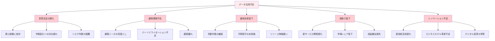

#### データ分析・AI/MLによる価値創造

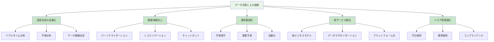

#### データ分析の段階

**1. データ成熟度モデル**

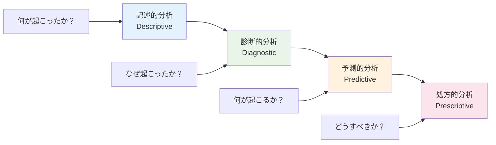

**2. AI/ML技術の分類**

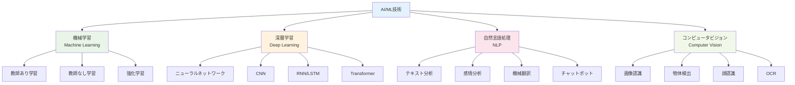

### 9.1 Analytics Service（分析サービス）

#### OCI Analytics Serviceとは

OCI Analytics Serviceは、セルフサービス型のビジネスインテリジェンス（BI）プラットフォームです。データの可視化、分析、レポート作成を統合的に提供し、ビジネスユーザーでも簡単にデータ分析を行えます。

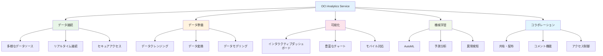

#### データソース統合

**1. 対応データソース**

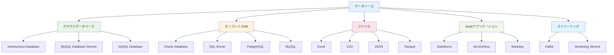

**2. データ接続設定例**

```json
{
  "connectionType": "AUTONOMOUS_DATABASE",
  "connectionName": "sales_data_connection",
  "description": "Sales data from Autonomous Database",
  "connectionDetails": {
    "host": "sales-adb.adb.ap-tokyo-1.oraclecloud.com",
    "port": 1522,
    "serviceName": "sales_high",
    "username": "analytics_user",
    "walletLocation": "/path/to/wallet.zip"
  },
  "testConnection": true
}
```

#### データ準備とモデリング

**1. データフロー設計**

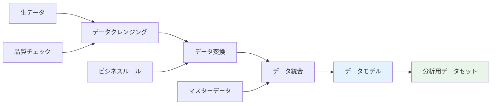

**2. データ変換例**

```sql
-- 売上データの集計と変換
SELECT 
    DATE_TRUNC('month', order_date) as month,
    product_category,
    region,
    SUM(order_amount) as total_sales,
    COUNT(DISTINCT customer_id) as unique_customers,
    AVG(order_amount) as avg_order_value,
    SUM(order_amount) / LAG(SUM(order_amount)) OVER (
        PARTITION BY product_category, region 
        ORDER BY DATE_TRUNC('month', order_date)
    ) - 1 as growth_rate
FROM sales_orders 
WHERE order_date >= DATE_SUB(CURRENT_DATE, INTERVAL 24 MONTH)
GROUP BY 
    DATE_TRUNC('month', order_date),
    product_category,
    region
ORDER BY month, product_category, region;
```

#### 可視化とダッシュボード

**1. ダッシュボード設計原則**

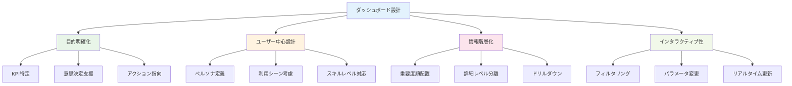

**2. 効果的な可視化パターン**

| データタイプ | 推奨チャート | 用途 |
|-------------|-------------|------|
| **時系列データ** | 線グラフ、エリアチャート | トレンド分析 |
| **カテゴリ比較** | 棒グラフ、円グラフ | 構成比、ランキング |
| **相関関係** | 散布図、バブルチャート | 関係性分析 |
| **地理データ** | マップ、ヒートマップ | 地域分析 |
| **階層データ** | ツリーマップ、サンバースト | 階層構造分析 |

#### 機械学習統合

**1. AutoML機能**

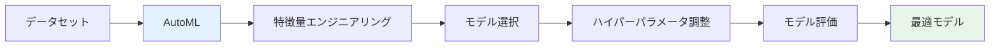

**2. 予測分析例**

```python
# Analytics Service Python SDK使用例
import oci
from oci.analytics import AnalyticsClient

# クライアント初期化
analytics_client = AnalyticsClient(config)

# 予測モデル作成
create_model_request = {
    "displayName": "sales_forecast_model",
    "description": "Monthly sales forecasting model",
    "modelType": "TIME_SERIES_FORECAST",
    "datasetId": "dataset_ocid",
    "targetColumn": "total_sales",
    "timeColumn": "month",
    "forecastHorizon": 12,
    "confidence_interval": 0.95
}

response = analytics_client.create_ml_model(
    create_ml_model_details=create_model_request
)

# 予測実行
forecast_request = {
    "modelId": response.data.id,
    "inputData": {
        "datasetId": "new_dataset_ocid"
    }
}

forecast_response = analytics_client.generate_forecast(
    generate_forecast_details=forecast_request
)
```

### 9.2 Data Science Service

#### Data Science Serviceとは

OCI Data Science Serviceは、データサイエンティスト向けの包括的な機械学習プラットフォームです。Jupyter Notebook環境、豊富なライブラリ、モデル管理機能を提供し、機械学習プロジェクトのライフサイクル全体をサポートします。

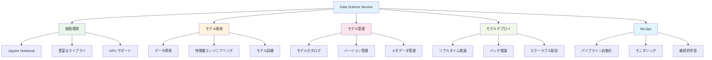

#### 機械学習開発ライフサイクル

**1. MLライフサイクル**

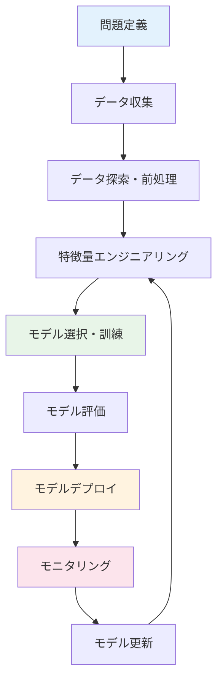

**2. データサイエンスプロジェクト構造**

```
data-science-project/
├── data/
│   ├── raw/                 # 生データ
│   ├── processed/           # 前処理済みデータ
│   └── external/            # 外部データ
├── notebooks/
│   ├── 01_data_exploration.ipynb
│   ├── 02_feature_engineering.ipynb
│   ├── 03_model_training.ipynb
│   └── 04_model_evaluation.ipynb
├── src/
│   ├── data/
│   │   ├── __init__.py
│   │   └── preprocessing.py
│   ├── features/
│   │   ├── __init__.py
│   │   └── feature_engineering.py
│   ├── models/
│   │   ├── __init__.py
│   │   ├── train_model.py
│   │   └── predict_model.py
│   └── visualization/
│       ├── __init__.py
│       └── visualize.py
├── models/                  # 訓練済みモデル
├── reports/                 # 分析レポート
├── requirements.txt
└── README.md
```

#### 実装例：予測モデル開発

**1. データ探索**

```python
import pandas as pd
import numpy as np
import matplotlib.pyplot as plt
import seaborn as sns
from sklearn.model_selection import train_test_split
from sklearn.ensemble import RandomForestRegressor
from sklearn.metrics import mean_squared_error, r2_score
import joblib

# データ読み込み
df = pd.read_csv('sales_data.csv')

# 基本統計
print("データ形状:", df.shape)
print("\n基本統計:")
print(df.describe())

# 欠損値確認
print("\n欠損値:")
print(df.isnull().sum())

# 相関分析
correlation_matrix = df.corr()
plt.figure(figsize=(12, 8))
sns.heatmap(correlation_matrix, annot=True, cmap='coolwarm')
plt.title('特徴量間の相関')
plt.show()
```

**2. 特徴量エンジニアリング**

```python
def feature_engineering(df):
    """特徴量エンジニアリング"""
    
    # 日付特徴量
    df['date'] = pd.to_datetime(df['date'])
    df['year'] = df['date'].dt.year
    df['month'] = df['date'].dt.month
    df['day_of_week'] = df['date'].dt.dayofweek
    df['quarter'] = df['date'].dt.quarter
    
    # 季節性特徴量
    df['is_weekend'] = df['day_of_week'].isin([5, 6]).astype(int)
    df['is_holiday'] = df['date'].isin(holiday_dates).astype(int)
    
    # ラグ特徴量
    df['sales_lag_1'] = df['sales'].shift(1)
    df['sales_lag_7'] = df['sales'].shift(7)
    df['sales_lag_30'] = df['sales'].shift(30)
    
    # 移動平均特徴量
    df['sales_ma_7'] = df['sales'].rolling(window=7).mean()
    df['sales_ma_30'] = df['sales'].rolling(window=30).mean()
    
    # 比率特徴量
    df['sales_to_ma_ratio'] = df['sales'] / df['sales_ma_30']
    
    # カテゴリカル変数のエンコーディング
    df = pd.get_dummies(df, columns=['product_category', 'region'])
    
    return df

# 特徴量エンジニアリング実行
df_engineered = feature_engineering(df)
```

**3. モデル訓練**

```python
def train_model(df, target_column, test_size=0.2):
    """モデル訓練"""
    
    # 特徴量とターゲットの分離
    feature_columns = [col for col in df.columns if col != target_column and col != 'date']
    X = df[feature_columns].fillna(0)
    y = df[target_column]
    
    # 訓練・テストデータ分割
    X_train, X_test, y_train, y_test = train_test_split(
        X, y, test_size=test_size, random_state=42, shuffle=False
    )
    
    # モデル訓練
    model = RandomForestRegressor(
        n_estimators=100,
        max_depth=10,
        random_state=42,
        n_jobs=-1
    )
    
    model.fit(X_train, y_train)
    
    # 予測
    y_pred_train = model.predict(X_train)
    y_pred_test = model.predict(X_test)
    
    # 評価
    train_rmse = np.sqrt(mean_squared_error(y_train, y_pred_train))
    test_rmse = np.sqrt(mean_squared_error(y_test, y_pred_test))
    train_r2 = r2_score(y_train, y_pred_train)
    test_r2 = r2_score(y_test, y_pred_test)
    
    print(f"訓練RMSE: {train_rmse:.4f}")
    print(f"テストRMSE: {test_rmse:.4f}")
    print(f"訓練R²: {train_r2:.4f}")
    print(f"テストR²: {test_r2:.4f}")
    
    # 特徴量重要度
    feature_importance = pd.DataFrame({
        'feature': feature_columns,
        'importance': model.feature_importances_
    }).sort_values('importance', ascending=False)
    
    print("\n特徴量重要度 Top 10:")
    print(feature_importance.head(10))
    
    return model, X_test, y_test, y_pred_test

# モデル訓練実行
model, X_test, y_test, y_pred_test = train_model(df_engineered, 'sales')
```

**4. モデル保存とデプロイ**

```python
# モデル保存
model_artifacts = {
    'model': model,
    'feature_columns': X_test.columns.tolist(),
    'preprocessing_params': {
        'fill_na_value': 0
    }
}

joblib.dump(model_artifacts, 'sales_forecast_model.pkl')

# OCI Data Science Model Catalog に登録
import oci
from oci.data_science import DataScienceClient

data_science_client = DataScienceClient(config)

# モデル作成
create_model_details = oci.data_science.models.CreateModelDetails(
    compartment_id=compartment_id,
    project_id=project_id,
    display_name="Sales Forecast Model",
    description="Random Forest model for sales forecasting",
    freeform_tags={"environment": "production", "version": "1.0"}
)

model_response = data_science_client.create_model(create_model_details)
model_id = model_response.data.id

# モデルアーティファクト アップロード
with open('sales_forecast_model.pkl', 'rb') as model_file:
    data_science_client.create_model_artifact(
        model_id=model_id,
        model_artifact=model_file.read(),
        content_disposition="attachment; filename=sales_forecast_model.pkl"
    )
```

### 9.3 AI Services

#### OCI AI Servicesとは

OCI AI Servicesは、事前訓練済みのAIモデルをAPIとして提供するサービス群です。機械学習の専門知識がなくても、高度なAI機能をアプリケーションに組み込むことができます。

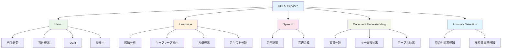

#### Vision Service

**1. 画像分析機能**

```python
import oci
import base64

# Vision クライアント初期化
vision_client = oci.ai_vision.AIServiceVisionClient(config)

# 画像読み込み
with open('product_image.jpg', 'rb') as image_file:
    image_data = image_file.read()
    image_base64 = base64.b64encode(image_data).decode('utf-8')

# 画像分類
classify_image_details = oci.ai_vision.models.AnalyzeImageDetails(
    image=oci.ai_vision.models.InlineImageDetails(
        data=image_base64
    ),
    features=[
        oci.ai_vision.models.ImageClassificationFeature(
            feature_type="IMAGE_CLASSIFICATION",
            max_results=5
        )
    ]
)

classify_response = vision_client.analyze_image(classify_image_details)

print("画像分類結果:")
for label in classify_response.data.image_classification_result.labels:
    print(f"- {label.name}: {label.confidence:.3f}")

# 物体検出
detect_objects_details = oci.ai_vision.models.AnalyzeImageDetails(
    image=oci.ai_vision.models.InlineImageDetails(
        data=image_base64
    ),
    features=[
        oci.ai_vision.models.ObjectDetectionFeature(
            feature_type="OBJECT_DETECTION",
            max_results=10
        )
    ]
)

detect_response = vision_client.analyze_image(detect_objects_details)

print("\n物体検出結果:")
for obj in detect_response.data.object_detection_result.objects:
    print(f"- {obj.name}: {obj.confidence:.3f} at ({obj.bounding_polygon.normalized_vertices})")
```

**2. OCR（光学文字認識）**

```python
# OCR実行
ocr_details = oci.ai_vision.models.AnalyzeDocumentDetails(
    document=oci.ai_vision.models.InlineDocumentDetails(
        data=image_base64
    ),
    features=[
        oci.ai_vision.models.DocumentTextDetectionFeature(
            feature_type="TEXT_DETECTION"
        )
    ]
)

ocr_response = vision_client.analyze_document(ocr_details)

print("OCR結果:")
for page in ocr_response.data.pages:
    for line in page.lines:
        print(f"- {line.text} (信頼度: {line.confidence:.3f})")
```

#### Language Service

**1. 感情分析**

```python
import oci

# Language クライアント初期化
language_client = oci.ai_language.AIServiceLanguageClient(config)

# 感情分析
text = "この商品は本当に素晴らしいです。品質も良く、価格も手頃で大満足です。"

sentiment_details = oci.ai_language.models.BatchDetectLanguageSentimentsDetails(
    documents=[
        oci.ai_language.models.TextDocument(
            key="doc1",
            text=text,
            language_code="ja"
        )
    ]
)

sentiment_response = language_client.batch_detect_language_sentiments(sentiment_details)

print("感情分析結果:")
for document in sentiment_response.data.documents:
    print(f"全体的感情: {document.document_sentiment}")
    print(f"信頼度: {document.document_scores}")
    
    print("\n文レベル感情:")
    for aspect in document.aspects:
        print(f"- {aspect.text}: {aspect.sentiment} (信頼度: {aspect.scores})")
```

**2. キーフレーズ抽出**

```python
# キーフレーズ抽出
keyphrases_details = oci.ai_language.models.BatchDetectLanguageKeyPhrasesDetails(
    documents=[
        oci.ai_language.models.TextDocument(
            key="doc1",
            text="Oracle Cloud Infrastructureは、高性能で安全なクラウドサービスを提供します。機械学習、データベース、コンピュートサービスが統合されています。",
            language_code="ja"
        )
    ]
)

keyphrases_response = language_client.batch_detect_language_key_phrases(keyphrases_details)

print("キーフレーズ抽出結果:")
for document in keyphrases_response.data.documents:
    for keyphrase in document.key_phrases:
        print(f"- {keyphrase.text} (信頼度: {keyphrase.score:.3f})")
```

#### Speech Service

**1. 音声認識**

```python
import oci

# Speech クライアント初期化
speech_client = oci.ai_speech.AIServiceSpeechClient(config)

# 音声ファイルをObject Storageにアップロード
object_storage_client = oci.object_storage.ObjectStorageClient(config)

with open('audio_file.wav', 'rb') as audio_file:
    object_storage_client.put_object(
        namespace_name=namespace,
        bucket_name=bucket_name,
        object_name='audio_file.wav',
        put_object_body=audio_file
    )

# 音声認識ジョブ作成
transcription_job_details = oci.ai_speech.models.CreateTranscriptionJobDetails(
    display_name="Audio Transcription Job",
    compartment_id=compartment_id,
    input_location=oci.ai_speech.models.ObjectListInlineInputLocation(
        location_type="OBJECT_LIST_INLINE_INPUT_LOCATION",
        object_locations=[
            oci.ai_speech.models.ObjectLocation(
                namespace_name=namespace,
                bucket_name=bucket_name,
                object_names=["audio_file.wav"]
            )
        ]
    ),
    output_location=oci.ai_speech.models.OutputLocation(
        namespace_name=namespace,
        bucket_name=bucket_name,
        prefix="transcription_output/"
    ),
    model_details=oci.ai_speech.models.TranscriptionModelDetails(
        domain="GENERIC",
        language_code="ja-JP"
    )
)

transcription_response = speech_client.create_transcription_job(transcription_job_details)
job_id = transcription_response.data.id

print(f"音声認識ジョブ作成: {job_id}")
```

### 9.4 Big Data Service

#### Big Data Serviceとは

OCI Big Data Serviceは、Apache Hadoop、Apache Spark、Apache Kafkaなどのオープンソースビッグデータツールを統合したマネージドサービスです。大規模データの処理・分析を効率的に実行できます。

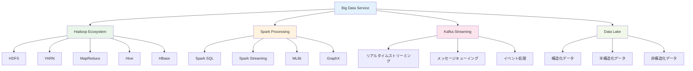

#### Spark処理例

**1. データ処理パイプライン**

```python
from pyspark.sql import SparkSession
from pyspark.sql.functions import *
from pyspark.sql.types import *

# Sparkセッション作成
spark = SparkSession.builder \
    .appName("SalesDataAnalysis") \
    .config("spark.sql.adaptive.enabled", "true") \
    .config("spark.sql.adaptive.coalescePartitions.enabled", "true") \
    .getOrCreate()

# データ読み込み
sales_df = spark.read \
    .option("header", "true") \
    .option("inferSchema", "true") \
    .csv("oci://bucket@namespace/sales_data/*.csv")

customers_df = spark.read \
    .option("header", "true") \
    .option("inferSchema", "true") \
    .csv("oci://bucket@namespace/customer_data/*.csv")

# データクレンジング
sales_clean = sales_df \
    .filter(col("order_amount") > 0) \
    .filter(col("order_date").isNotNull()) \
    .withColumn("order_date", to_date(col("order_date"), "yyyy-MM-dd"))

# データ統合
sales_with_customer = sales_clean \
    .join(customers_df, "customer_id", "left") \
    .select(
        "order_id",
        "customer_id",
        "order_date",
        "order_amount",
        "product_category",
        "customer_segment",
        "region"
    )

# 集計分析
monthly_sales = sales_with_customer \
    .withColumn("year_month", date_format(col("order_date"), "yyyy-MM")) \
    .groupBy("year_month", "product_category", "region") \
    .agg(
        sum("order_amount").alias("total_sales"),
        count("order_id").alias("order_count"),
        countDistinct("customer_id").alias("unique_customers"),
        avg("order_amount").alias("avg_order_value")
    ) \
    .orderBy("year_month", "product_category", "region")

# 結果保存
monthly_sales.write \
    .mode("overwrite") \
    .option("header", "true") \
    .csv("oci://bucket@namespace/output/monthly_sales/")

# 統計情報表示
print("月次売上統計:")
monthly_sales.show(20)

# Spark SQL使用例
sales_with_customer.createOrReplaceTempView("sales_data")

sql_result = spark.sql("""
    SELECT 
        customer_segment,
        region,
        SUM(order_amount) as total_revenue,
        COUNT(DISTINCT customer_id) as customer_count,
        AVG(order_amount) as avg_order_value,
        PERCENTILE_APPROX(order_amount, 0.5) as median_order_value
    FROM sales_data
    WHERE order_date >= '2023-01-01'
    GROUP BY customer_segment, region
    ORDER BY total_revenue DESC
""")

print("\n顧客セグメント別分析:")
sql_result.show()
```

### 9.5 データ活用アーキテクチャ

#### 現代的データアーキテクチャ

**1. データレイクハウス アーキテクチャ**

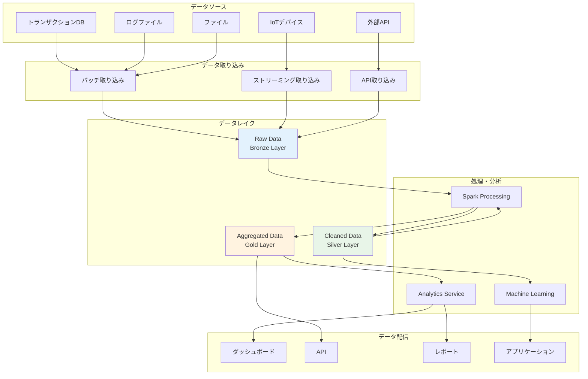

#### リアルタイム分析パイプライン

**1. ストリーミング処理アーキテクチャ**

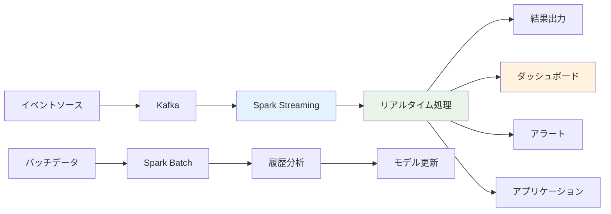

**2. ストリーミング処理実装例**

```python
from pyspark.sql import SparkSession
from pyspark.sql.functions import *
from pyspark.sql.types import *

# Sparkストリーミングセッション作成
spark = SparkSession.builder \
    .appName("RealTimeAnalytics") \
    .config("spark.sql.streaming.checkpointLocation", "/tmp/checkpoint") \
    .getOrCreate()

# Kafkaからストリーミングデータ読み込み
kafka_df = spark \
    .readStream \
    .format("kafka") \
    .option("kafka.bootstrap.servers", "kafka-server:9092") \
    .option("subscribe", "user-events") \
    .option("startingOffsets", "latest") \
    .load()

# JSONデータのパース
schema = StructType([
    StructField("user_id", StringType(), True),
    StructField("event_type", StringType(), True),
    StructField("timestamp", TimestampType(), True),
    StructField("page_url", StringType(), True),
    StructField("session_id", StringType(), True)
])

events_df = kafka_df \
    .select(from_json(col("value").cast("string"), schema).alias("data")) \
    .select("data.*")

# リアルタイム集計
page_views = events_df \
    .filter(col("event_type") == "page_view") \
    .withWatermark("timestamp", "10 minutes") \
    .groupBy(
        window(col("timestamp"), "1 minute"),
        col("page_url")
    ) \
    .count() \
    .select(
        col("window.start").alias("window_start"),
        col("window.end").alias("window_end"),
        col("page_url"),
        col("count").alias("page_views")
    )

# 結果出力
query = page_views \
    .writeStream \
    .outputMode("update") \
    .format("console") \
    .trigger(processingTime="30 seconds") \
    .start()

query.awaitTermination()
```

### まとめ

第9章では、OCIの包括的な分析・AI/MLサービスについて詳しく解説しました。データ駆動型の意思決定とAI活用は、現代企業の競争優位性の源泉です。

**重要ポイント：**
1. **Analytics Service**: セルフサービス型BI・分析プラットフォーム
2. **Data Science Service**: 包括的な機械学習開発環境
3. **AI Services**: 事前訓練済みAIモデルのAPI提供
4. **Big Data Service**: 大規模データ処理・分析基盤
5. **データアーキテクチャ**: 現代的なデータレイクハウス設計
6. **実装パターン**: バッチ・ストリーミング処理の統合

次章では、これまで学習した内容を統合したベストプラクティスについて学習します。